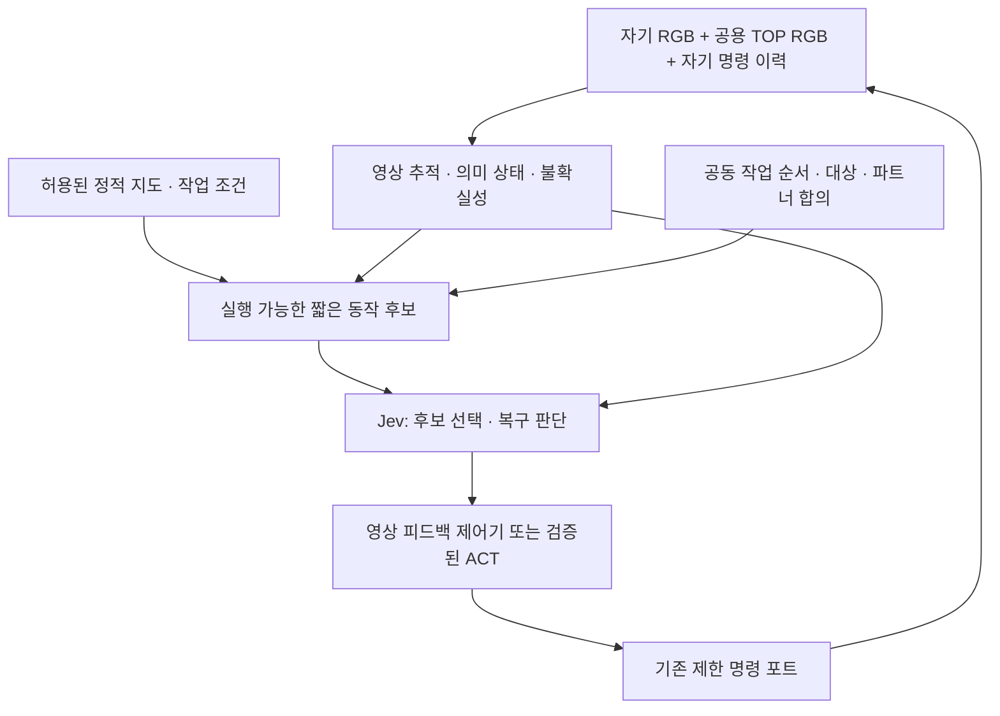

# Jev 제어 설계 검토 — 2026-09-21

현 단계 권고는 **RGB에서 얻은 의미 있는 상태와 실행 가능한 짧은 동작 후보를 Jev에 주고, 영상 피드백 제어기와 역할을 나누는 것**이다. 직접 이동 선택을 포기할 근거는 없지만, 일곱 방향 버튼을 매번 고르는 현재 구성을 최적이라고 볼 근거도 없다. 의미 상태는 후속 폐루프 195회에서 개선 효과를 확인했다. coarse/fine 동작·복구·협업 선택은 아직 후속 검증 후보다.

원래 [맵·ACT 계획의 보존본](https://github.com/kcm0127-dotcom/ugrp/blob/e64ef6c/docs/act_map_generalization_plan.md)은 물건 1·2·3·4·5·6·8개, 재적치, 파트너 변경과 새 지도 연결 구조를 구분한다. 해당 계획은 열린 작업의 내용이며 현재 base main의 완료 기능이 아니다. 이번 검토도 단일 접근 진단을 전체 운반·다중 작업 성공으로 확대하지 않는다.

## 1. 현재 하네스와 모델 문제를 분리하면

[실험 기록](../experiments/2026-09-21-jev-direct-motion/README.md)의 최종 비교는 같은 RGB 관측기·동작 후보·완료 기준으로 3개 시작 자세에서 각각 한 번 실행했다. 실행 SHA는 `4931196`이다.

| 정책 | 접근·정렬 완료 | API 중앙 지연 | 관찰된 실패 |
|---|---:|---:|---|
| 규칙 | 3/3 | 없음 | 최종 비교에서는 없음 |
| Gemini | 3/3 | 1.999초 | 최종 비교에서는 없음 |
| Jev | 0/3 | 0.551초 | 직선에서는 목표 밖 정지 반복, 좌우 조건에서는 반대 회전 등을 거쳐 RGB 관측기 중단 |

Gemini에만 정답이나 더 좋은 동작을 준 비교는 아니다. 하지만 **같은 입력을 주는 비교**와 **각 모델에 적합하게 설계한 시스템끼리의 비교**는 다른 질문이다. 전자는 모델 교체 효과를 보고, 후자는 각 모델의 실용적인 상한을 탐색한다. 둘 다 필요하다.

현재 구성에서 확인한 약점:

- Jev가 거리 `0.2832`와 목표 상한 `0.28`, 각도 부호와 허용 오차를 직접 해석해야 한다. 공식 [Jev 1.13 한계 문서](https://docs.typesafe.ai/model-jaggedness/jev-1.13)는 정밀 수치 판단에 약하며 산술은 코드로 처리하고 의미 있는 범주를 제공하라고 권고한다. 이는 현재 증상과 맞지만 문서만으로 개별 실패 원인을 증명하지는 않는다.
- `stop`은 일시 재관측·증거 부족·목표 완료를 한 후보에 섞었다. 직선에서는 39회 전진 뒤 31회 `stop`을 선택했다. 후반 RGB 거리는 0.2832m로 상한을 3.2mm 벗어났다. 사후 물리 거리 기준은 충족했지만 RGB 완료 조건을 충족하지 않아 실패로 유지한다.
- 동작 설명은 방향과 0.2초만 알려준다. 모터 명령 크기, 영상에서 관측한 이동 효과와 그 오차를 모델이 받지 못한다. 같은 전진이라도 먼 곳의 이동과 목표 직전의 미세 조정에 필요한 크기는 다를 수 있다.
- 첫 비교에서는 공통 바퀴 모양 검사의 픽셀 경계 오류로 규칙과 Gemini도 실패했다. 이를 보완한 뒤 같은 9조건을 모두 재실행했다. 그럼에도 관측기는 제한된 방향·단일 색 물체만 처리하며 일반적인 시각 추적기가 아니다.
- 최종 기록의 사후 RGB 거리 오차 최대는 약 16.9mm, 방위 오차 최대는 약 2.43도였다. 이 값은 평가 전용이며 제어에 사용하지 않았다. 폭 10mm인 RGB 목표와 비교하면 관측 불확실성을 생략한 판정이 취약하다. 성공률을 높이려고 결과를 본 뒤 목표 폭을 바꾸면 안 된다.

## 2. 같은 관측에서 표현만 달리해 실제 질의한 진단

소스 `aed309c`를 고정하고, 저장된 12개 관측 × 3개 입력 구성 × 2회 = 72개 실제 Jev API 응답을 기록했다. 로봇이나 시뮬레이터는 움직이지 않았다. 8개는 개발 자세에서, 4개는 이미 확인한 실패 장면에서 선택했다.

| 구성 | 기존 규칙과 일치 | 달라진 점 |
|---|---:|---|
| 원래 숫자 상태 | 13/24 | 기존 요청 형식 |
| 의미를 명시한 상태 | 24/24 | 같은 RGB 값에서 `too_far`, `right`, `outside_tolerance`, `goal_satisfied` 등을 계산하고 질문도 그 표현에 맞춤 |
| 의미 상태 + 명시적 동작 조건 | 24/24 | 각 선택지에 사용 조건까지 기술 |

동작 후보 일곱 개와 실행 계약은 동일하다. 알려진 음수 방위 장면의 `turn_left`가 `turn_right`로, 목표 바로 밖의 `stop`이 `forward`로 바뀌었다. **입력 구성에 따라 실패 장면의 판단이 달라진다는 증거**다.

이는 12개 서로 다른 관측에 대한 작은 진단이다. 24개 독립적인 새 상황이나 성공 주행이 아니다. 두 번째 구성은 상태 표현과 질문 문구를 함께 바꿨으므로 두 효과를 분리하지 못한다. 세 번째 구성에는 기준 제어기의 지식이 들어간다. 규칙 일치도는 유일한 최적 행동의 정답률도 아니다. 새로운 초기 조건에서 폐루프 실행해야 실제 개선을 판정할 수 있다.

## 2.1 후속 폐루프 검증: 의미 입력 효과 확인

[새 자세 비교 195회](../experiments/2026-09-21-jev-semantic-motion/README.md)를 실행 소스 `3d45a71`로 고정 완료했다. 같은 맵·같은 물체에서 새 시작 자세 12개 × API 3반복 × 5조건과 기존 3자세 회귀를 분리했다.

| 조건 | 새 자세 원판정 | 시간 수치 오차 검산 후 | 기존 회귀 |
|---|---:|---:|---:|
| 규칙 | 36/36 | 36/36 | 3/3 |
| Jev 숫자 | 5/36 | 5/36 | 0/3 |
| Jev 의미 | 33/36 | 35/36 | 3/3 |
| Gemini 숫자 | 32/36 | 32/36 | 3/3 |
| Gemini 의미 | 36/36 | 36/36 | 3/3 |

두 Jev 의미 실행은 0.35초의 물리 안정 시간이 `0.349999999999806`으로 저장돼 출력 평가기에서 실패했다. 실행 종료 뒤 1ns 절대 오차를 적용해 전체 195회를 재검산했고 원판정도 보존했다. 제어 입력·동작·거리/각도/안정 시간 기준은 변경하지 않았다.

Jev의 새 조건 반대 회전은 숫자 660/1,456개 행동에서 의미 46/1,684개로 줄었지만 사라지지는 않았다. `new12-r0`은 목표 부근에서 좌우/후진을 반복해 70단계 안에 완료하지 못했다. Gemini 숫자의 네 실패도 목표보다 1.6–2.4mm 가까운 RGB 거리에서 정지를 반복한 경우다. **의미 상태는 두 모델 모두에 도움이 됐고, Jev에서 개선 폭이 특히 컸다.** 표현과 질문을 함께 바꾼 효과이며 하네스만 또는 모델만의 원인으로 환원하지 않는다.

같은 RGB 관측기에서 산출한 상태를 제공했으며 원본 이미지를 모델이 직접 해석한 시험은 아니다. 공통 완료 게이트와 제한된 영상 추적기가 남아 있다. 9,115개 행동의 입력·응답·선택을 원본 영상에서 재구성했고 모든 195개 영상을 디코딩했다. 새 맵·파지·운반·다물체·실물·실시간 성능은 검증하지 않았다.

규칙도 36/36이므로 단순 접근을 Jev에 맡기는 실용적 이점은 아직 입증하지 못했다. 다음 비교는 같은 의미 상태에서 동작 구간의 크기·중단 방식만 바꾸고, 이어서 차단·가림·양보·복구처럼 산술을 넘는 선택에서 연구 기여를 확인하는 것이다.

## 3. 공개 사례에서 무엇을 가져올 수 있는가

2026-09-21 공식 문서와 아래 저장소의 실제 소스를 읽었다. 공개 Jev 사례는 주로 초기 데모·소수 시행이며, 이 조사에서 우리 조건에 대응하는 충분한 규모의 로봇 성능 연구는 찾지 못했다. 원저자 주장의 재실행은 하지 않았다. 읽은 파일의 commit·SHA256은 [출처 manifest](../experiments/2026-09-21-jev-direct-motion/reviewed-source-manifest.json)에 남겼다.

| 사례 | 실제 판단/행동 구성 | 연구에 적용할 부분과 경계 |
|---|---|---|
| [jev-drone](https://github.com/RomanSlack/jev-drone/tree/cbeb53ce4f17a06ea490ae43effcdad231143610) | 전술 Choice, 위험 Score, 목표 상실 Noul을 함께 질의. 빠른 비행 제어와 반사 제어는 코드가 수행 | 전술 선택·질문 분해·판단 유효기간·동작 유지 시간을 참고. [flight.py](https://github.com/RomanSlack/jev-drone/blob/cbeb53ce4f17a06ea490ae43effcdad231143610/flight.py)는 렌더러 깊이/분할과 비행 제어용 실제 속도·자세를 사용하므로 우리의 RGB 전용 학생과 동등하지 않다. README의 전술 입력 제한을 전체 시스템 제한으로 읽으면 안 된다. |
| [JevPilot](https://github.com/standardagents/jevpilot/tree/e1beeb13b9a928fb76f167f86af584f4ce9cf180) | 지역 코드가 조향·속도 경로 후보와 예측 효과를 만들고 Jev가 선택. 정지와 진행을 구분 | 가장 직접적인 이동 설계 참고다. [요청 코드](https://github.com/standardagents/jevpilot/blob/e1beeb13b9a928fb76f167f86af584f4ce9cf180/src/jev-request.js)는 후보의 진행·경로 오차·충돌 예측을 제공한다. 시뮬레이터에서 얻는 현재 차량/도로 상태와 예측기를 우리에게 그대로 옮길 수는 없다. |
| [jev-askable-arm](https://github.com/TarunTomar122/jev-askable-arm/tree/bef98b31a122a7033dd4bfb52867cd6ccb2d7e67) | 약 30개 동작에서 종류와 대상 물체를 선택. 명명된 접근/하강과 크기가 다른 작은 이동을 혼합 | 객체 조건부 동작과 크기 구분을 참고. 실제 입력은 시뮬레이터 xyz·관절 기반 집게 상태·파지 판정이고 실행기도 위치 피드백을 사용한다. RGB만으로 같은 결과를 냈다는 증거가 아니다. |
| [jev-libero](https://github.com/Dimweaker/jev-libero/tree/9b8098a2faccfb561c95ffb3d117ad1688f1c30f) | 의도→접촉/운동 유형→작은 운동 입력. 여러 이동 크기와 1·2단계 물리 미리보기 | 후보 결과를 보고 선택하는 구조와 실패 기록을 참고. [구조 문서](https://github.com/Dimweaker/jev-libero/blob/9b8098a2faccfb561c95ffb3d117ad1688f1c30f/docs/architecture.md)와 `measurements.py`는 실제 접촉·관절·물리 상태를 읽고 복원해 예측한다. 학생 실행에 쓰면 우리 입력 제약 위반이다. 교사/오프라인 상한 진단으로만 검토할 수 있다. |
| [snake-jev](https://github.com/siroccomask/snake-jev/tree/86f01b686df2e6d5b566b80d015de9b8b34450a8) | 좌·직진·우 각각의 위험·진행을 독립 질문으로 평가하고 코드가 조합 | 단일 Choice 안에 모든 판단을 숨기지 않는 패턴. 장기 계획 능력의 증거는 아니며 원저자도 한 기록에서 결국 몸에 갇힌 실패를 남겼다. |

기존 로봇 연구에서는 [SayCan](https://say-can.github.io/)이 언어적 적합성과 학습된 실행 가능성을 결합해 기술을 고른다. [ACT](https://tonyzhaozh.github.io/aloha/)와 [Diffusion Policy](https://diffusion-policy.cs.columbia.edu/)는 연속적인 행동 묶음을 예측하며 시간적 일관성과 피드백을 다룬다. **기술 선택·실행 가능성·세부 운동을 분리하는 설계 근거**로 참고하며, Jev의 성능 증거로 인용하지 않는다. 원래 ACT의 측정 관절 입력도 우리 학생에게 추가하지 않는다.

## 4. UGRP에 권하는 구성

**상위 계획:** 여러 물건의 순서, 파트너, 목적지, 선행 작업을 기존 계획/허가 계약으로 유지한다. 복잡한 장기 계획에는 현재 LLM 비교군을 남기고, Jev는 가능한 다음 작업 후보의 선택·점검을 맡길 수 있다. 전체 물건 수·작업 수·완료 수는 코드로 따로 센다. 상대 정보는 기존에 허용된 수신 메시지로만 받는다.

**이동 중 판단:** Jev는 `현재 접근 유지`, `미세 정렬`, `좌/우 우회`, `일단 후퇴`, `상대에게 양보`, `목표 재확인`처럼 실제 이동에 영향을 주는 선택을 한다. 상위 계획만 담당하는 구조로 제한하지 않는다. 다만 구현되지 않은 기술을 이름만 만들어 제공해서는 안 된다.

**세부 운동:** 고정 시간의 모터 버튼 대신 영상 피드백으로 중단 가능한 짧은 운동 구간을 후보로 만든다. 시작은 직선 접근·정렬에서 coarse/fine 두 크기를 비교한다. 이후 전진+완만한 회전 같은 결합 구간을 추가한다. 모든 조합을 무작정 나열하지 않고 현재 관측에서 실행 가능한 소수 후보를 제공한다. 크기·기간은 개발 데이터의 실제 영상 변화로 정하고 고정한다.

후보에는 동작 의미, 목표와의 관계, RGB로 추정한 효과 범위, 관측 품질과 불확실성, 중단 조건을 포함한다. 예측은 허용된 RGB·자기 명령 이력·정적 보정에서 만들어야 한다. 실행 시점의 실제 시뮬레이터를 복제해 미래를 미리 보는 방식은 금지한다. 교사 예측/라벨을 학습에 썼다면 그 출처와 학생 입력 경계를 분리한다.

`brake/hold`, `observe_again`, `finish_claim`은 의미를 분리한다. 완료는 영상 근거를 다시 확인하고, 같은 상태·같은 정지 질의가 반복되면 정해진 복구/중단 절차로 전환한다. 모든 반복을 막지는 않는다. 같은 방향으로 계속 이동해야 하는 정상 동작과 진전 없는 반복을 영상 변화로 구분한다.

Jev가 확률을 주더라도 그 값은 로봇의 물리적 성공·안전 확률이 아니다. 공식 [confidence 설명](https://docs.typesafe.ai/confidence)도 이를 선택지 분포에서 얻는 통계량으로 설명한다. 실제 실패 자료로 신뢰도를 검증한 뒤 재관측/재계획 판단에 사용한다. [공식 한계 문서](https://docs.typesafe.ai/model-jaggedness/jev-1.13)의 권고에 따라 Score 평균을 정확한 연속 조향량으로 바꾸는 방식은 우선 후보에서 제외한다. 좌/우가 섞인 분포의 평균인 직진이 안전하다는 보장도 없다.

실시간 검증에서는 SIM을 계속 진행시키고 API 응답의 관측 시각·도착 시각·사용 시각을 기록해야 한다. 오래된 판단은 폐기하고, 호출을 기다리는 동안의 동작도 제한 포트와 최신 영상으로 제어한다. 현재의 추론 중 SIM 정지 실험은 그 검증을 대신하지 않는다.

## 5. 다음 실험 순서와 결정 기준

| 단계 | 비교 | 알 수 있는 것 |
|---|---|---|
| 1: 표현 개선 폐루프 — 완료 | 기존 7동작 그대로, 원래 숫자 입력 vs 의미 상태; Jev와 Gemini 모두 제공, 규칙 유지 | 195회 실행에서 개선 확인. 새 자세 Jev 5/36 → 검산 35/36, Gemini 32/36 → 36/36 |
| 2: 행동 공간 비교 | 같은 의미 상태에서 고정 7동작 vs coarse/fine 구간 vs 짧은 결합 구간 | 효과가 모델 때문인지 동작 표현 때문인지 |
| 3: 상황 판단 | 차단·일시 가림·재관측·양보가 필요한 장면, 같은 후보를 가진 규칙 비교군 | 산술 이상의 판단에서 Jev가 도움이 되는지 |
| 4: 기존 연구 연결 | 파지·단독/공동 운반 기술이 검증된 뒤 1→3→5개 작업과 새 지도 연결 구조 | 계획·파트너 변경·복구가 전체 완료율에 주는 효과 |

1단계는 기존 3자세를 회귀로 남기고 새 시작 위치/방위 조합 12개를 고정해 조건당 3회, 같은 초기 상태를 비교군에 짝지어 순서를 섞어 완료했다. 관측 실패를 분모에서 제외하지 않았다. 이제 이 12개 자세는 회귀 자료로 두고 다음 행동 공간 비교에는 새 평가 조건을 고정한다. 별도 개발 조건에서만 문구·기간·임계값을 조정한다. 변경된 Jev 하네스를 Gemini에도 적용한 비교와 모델별 최적화 비교를 구분한다.

주 지표는 충돌·접촉 없이 완료한 비율이다. 관측 중단, 모델의 반대 방향 선택, 완료 직전 정지 반복, 행동 수, 실제 벽시계 시간, SIM 시간, 호출 수/토큰/비용을 함께 기록한다. 후보 하나만 남아 코드가 사실상 답을 정한 비율, 제어기 개입과 Jev의 실제 선택 비율도 공개한다. 규칙/ACT도 동일한 후보를 사용해야 하며, 기준 제어기에 필요한 동작을 빼서 Jev의 이점을 만들면 안 된다.

채택 조건은 개발 성능이 아니라 새 조건에서의 완료율·실패 유형·시간/비용을 함께 개선하는 것이다. 표현 변경만으로 규칙을 안정적으로 따라가는 수준이라면 단순 접근은 로컬 제어기에 맡기고, Jev의 연구 기여는 경로·복구·협업 판단에서 검증한다. 이 단계들을 거치기 전에는 어느 구성을 '최적'이라고 확정하지 않는다.
