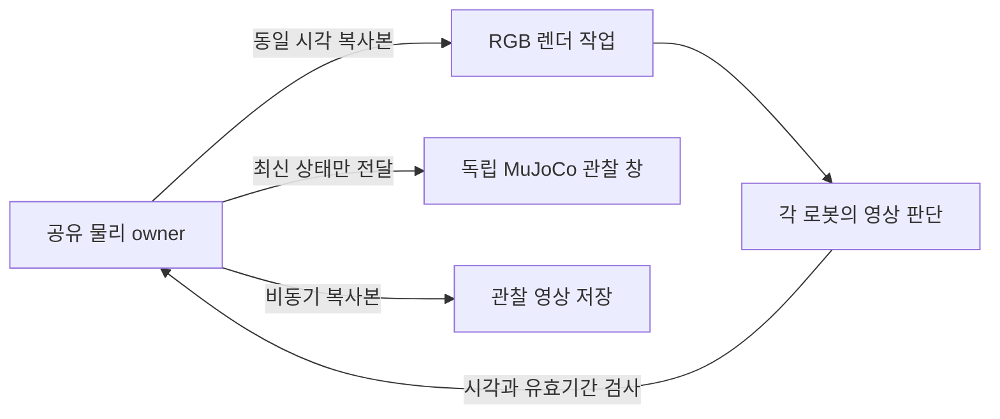

# MuJoCo 실시간 출하 실행

`dispatch --realtime-control`은 물리 계산이 화면 출력이나 RGB 판단을 기다리며 멈추지 않도록 하는 선택 옵션이다. 현재 검증 범위는 open 지도, 기존 RGB 스킬과 저장된 계획이다. 실제 완료 여부와 후보별 실패는 [실행 기록](../experiments/2026-09-23-realtime-dispatch/README.md)에 분리해 기록한다.

```sh
bash scripts/open_simulation.command dispatch --realtime-control \
  --plan-replay experiments/2026-09-22-parallel-transport/independent-plan.json \
  --variant open --seed 11 --contact-profile local_contact_fine \
  --realtime-factor 1 --max-wall-s 600 \
  --output outputs/realtime-open-NEW
```

기존 Mac 환경을 재사용한다. 물리 owner는 일반 Python으로 실행되고, 별도 `mjpython` 프로세스가 MuJoCo 기본 창을 표시한다. 새 LLM 요청 없이 저장된 계획을 재생하는 진단이며, 새 계획 합의나 ACT·회전 운반·다른 지도의 성공을 뜻하지 않는다. 실행 전 커밋하고 실행 중 소스를 고정한다. `Q` 또는 창 닫기는 이 실행을 종료한다.

## 시계와 움직임

물리 속도는 `SIM 경과 / 실제 경과`다. 1 SIM초가 실제 3초 걸리면 0.33배속이며, 로봇이 11cm/SIM초로 달려도 실제 화면에서는 약 3.7cm/초 진행한다. 녹화 파일이 SIM 시간을 기준으로 재생되면 라이브 창과 다르게 보일 수 있다.

물리 시계가 1배속이어도 로봇이 계속 움직이는 것은 아니다. 명령이 끝난 뒤 다음 RGB 판단을 기다리면 정지 감쇠와 재가속을 반복한다. 따라서 다음 두 조건을 함께 확인한다.

- `result.json`의 `timing`: 준비, 제어, 정리 시간과 motion SIM/wall. 정지 중인 시간도 SIM에 포함된다.
- `issued-commands.json`, `pair-decisions.json` 및 평가 출력: 명령 사이 공백, 관측 age, 실제 이동·도착·하역. 빠른 실패를 임무 속도 개선으로 비교하지 않는다.

## 실행 구조



물리 세계는 하나이며 모든 로봇은 같은 물리 step에서 갱신된다. 영상 처리 작업은 actuator를 직접 조작하지 않는다. owner가 새 판단을 받아 명령을 발행하고, 영상 처리 중에도 이전 명령은 제한된 유효기간 동안 유지된다. 공동 운반 명령은 두 로봇에 같은 시각과 만료 시각으로 발행한다. 원본 촬영 시각을 새 시각으로 바꾸지 않으며 오래된 영상에는 양쪽 HOLD를 적용한다.

같은 JPEG의 순수 계산 결과만 재사용하고 tracker의 이전 위치·선택 상태는 별도로 유지한다. 실제 카메라, 해상도, 입력 JPEG, 모델 지원 범위, 접촉 설정과 weld OFF는 유지한다. 복사한 시뮬레이터 상태는 렌더링에만 쓰며 제어기는 허용 RGB와 자기 발행 명령만 받는다. 평가의 정답 좌표·접촉·성공 판정은 별도 출력이다.

독립 작업은 동시 진행하지만 같은 빔의 정렬, 파지 확인과 공용 하역 구역은 협력 제약을 따른다. 이때 한 로봇이 기다리는 것은 화면 지연과 구분한다. 녹화가 밀린 프레임은 `REPEATED FRAME`으로 표시하고 `execution.frames.json`에 실제 촬영/반복 횟수와 시각을 기록한다. 녹화 프레임을 줄여 실행이 빨라진 것처럼 표시하지 않는다.
