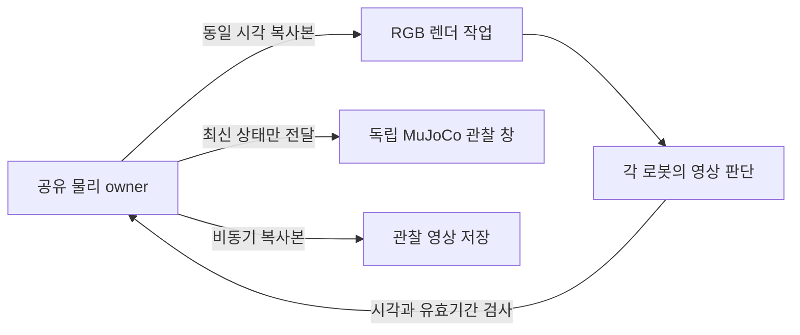

# MuJoCo 실시간 출하 실행

`dispatch --realtime-control`은 물리 계산이 화면 출력이나 RGB 판단을 기다리며 멈추지 않도록 하는 선택 옵션이다. 현재 검증 범위는 open 지도, 기존 RGB 스킬과 저장된 계획이다. 실제 완료 여부와 후보별 실패는 [실행 기록](../experiments/2026-09-23-realtime-dispatch/README.md)에 분리해 기록한다. v19 고정 소스 `51fb09c`의 같은 조건 native 실행 두 번은 두 화물 운반·방출과 프로토콜 종료까지 완료했다. 소요 시간은 207.95초와 223.06초, 이동 구간 SIM/wall 비율은 1.0000과 0.9874였다. 운반 관측부터 판단까지의 중앙 지연은 0.192/0.225초다. 기본 transit 진입 조건에서는 두 화물의 적재 운반 시간이 겹치지 않았다. 물리 시계 복구·판단 지연·실제 동시 운반을 각각 구분한다.

독립 north/south 경로의 알려진 open/seed11 조건에서 파지 시작도 겹치려면 다음과 같이 실행한다. `--overlap-start grasp`는 빔의 첫 파지 명령 이후 상자의 파지를 허용한다. 공용 하역장 사용 순서와 계획의 선후 의존성은 유지한다. 기본값 `transit`은 빔 운반 시작 후 허용하는 비교 조건으로 남아 있다.

```sh
bash scripts/open_simulation.command dispatch --realtime-control --overlap-start grasp \
  --plan-replay experiments/2026-09-22-parallel-transport/independent-plan.json \
  --variant open --seed 11 --contact-profile local_contact_fine \
  --realtime-factor 1 --max-wall-s 600 \
  --output outputs/realtime-open-NEW
```

검증된 v19 실행 코드와 입력을 고정하고 진입 옵션만 바꾼 결과는 다음과 같다. 시간은 한 번의 임무 전체 실제 시간이며, 동시 이동은 별도 사후 물리 평가다.

| 파지 진입 조건 | 완주 실제 시간(2회) | 이동 구간 SIM/wall | 두 화물 적재 구간 중첩 | 엄격한 실제 동시 적재 이동 |
|---|---|---|---|---|
| `transit` | 207.95 / 223.06초 | 1.0000 / 0.9874 | 0 / 0초 | 0 / 0초 |
| `grasp` | 200.93 / 196.10초 | 0.9946 / 0.9987 | 27.58 / 21.34초 | 7.0 / 3.5초 |

각 조건 2/2에서 두 화물의 배치·방출과 프로토콜 종료가 성공했다. `grasp` 두 실행의 평가 표본에서 로봇 간 접촉과 운반 중 화물 바닥 접촉은 0건이다. 샘플 사이 접촉까지 없었다고 단정하지 않는다. 진입 조건 비교의 실행 코드·모델·카메라 및 입력 변환·지도·시드·계획·명령 한도는 같으며, 커밋 `51fb09c`와 `1fed936` 사이에는 문서와 감사 기록만 추가됐다. 이 네 실행은 다른 지도·시드의 신뢰성이나 새로운 LLM 통신 효과를 측정하지 않는다. 원본 및 독립 감사는 [실행 기록](../experiments/2026-09-23-realtime-dispatch/README.md)에 있다.

기존 Mac 환경을 재사용한다. 물리 owner는 일반 Python으로 실행되고, 별도 `mjpython` 프로세스가 MuJoCo 기본 창을 표시한다. 새 LLM 요청 없이 저장된 계획을 재생하는 진단이며, 새 계획 합의나 ACT·회전 운반·다른 지도의 성공을 뜻하지 않는다. 실행 전 커밋하고 실행 중 소스를 고정한다. `Q` 또는 창 닫기는 이 실행을 종료한다.

## 시계와 움직임

물리 속도는 `SIM 경과 / 실제 경과`다. 1 SIM초가 실제 3초 걸리면 0.33배속이며, 로봇이 11cm/SIM초로 달려도 실제 화면에서는 약 3.7cm/초 진행한다. 녹화 파일이 SIM 시간을 기준으로 재생되면 라이브 창과 다르게 보일 수 있다.

물리 시계가 1배속이어도 로봇이 계속 움직이는 것은 아니다. 명령이 끝난 뒤 다음 RGB 판단을 기다리면 정지 감쇠와 재가속을 반복한다. 따라서 다음 두 조건을 함께 확인한다.

- `result.json`의 `timing`: 준비, 제어, 정리 시간과 motion SIM/wall. 정지 중인 시간도 SIM에 포함된다.
- `issued-commands.json`, `pair-decisions.json` 및 평가 출력: 명령 사이 공백, 관측 age, 실제 이동·도착·하역. 빠른 실패를 임무 속도 개선으로 비교하지 않는다.

## 실행 구조



물리 세계는 하나이며 모든 로봇은 같은 물리 step에서 갱신된다. 영상 처리 작업은 actuator를 직접 조작하지 않는다. owner가 새 판단의 시각과 자원 권한을 재검증해 예약과 명령을 확정하고, 영상 처리 중에도 이전 명령은 제한된 유효기간 동안 유지된다. 공동 운반 명령은 두 로봇에 같은 시각과 만료 시각으로 발행한다. 원본 촬영 시각을 새 시각으로 바꾸지 않으며 오래된 영상에는 양쪽 HOLD를 적용한다.

같은 JPEG의 순수 계산 결과만 재사용하고 tracker의 이전 위치·선택 상태는 별도로 유지한다. 실제 카메라, 해상도, 입력 JPEG, 모델 지원 범위, 접촉 설정과 weld OFF는 유지한다. 복사한 시뮬레이터 상태는 렌더링에만 쓰며 제어기는 허용 RGB와 자기 발행 명령만 받는다. 평가의 정답 좌표·접촉·성공 판정은 별도 출력이다.

공동 운반에서는 현재 영상 분석 중 다음 RGB 묶음을 하나만 미리 요청한다. Actor 영상은 렌더 작업 시작 시 같은 물리 순간을 복사해 렌더 대기열 때문에 오래된 영상이 생기는 것을 줄인다. 판단 작업은 하나씩 순서대로 적용하고, 선행 촬영된 영상도 실제 촬영 시각으로 유효기간을 검사한다. 대기 중에는 자원 잠금을 유지하며, 기존 부착 검사에 통과한 자기 영상의 연속 비교 상태만 갱신한다. 오래된 기준 영상을 새 영상처럼 취급하거나 판정 기준을 낮추지 않는다.

상자 운반과 양보 이동도 최대 0.25 SIM초의 명령을 발행하고 0.02 SIM초 뒤 다음 관측을 시작한다. 상자 운반의 새 이동 판단은 이전 명령의 원래0.2초 주기 이후 채택한다. 계산이 빨리 끝나도 판단 횟수만 먼저 소진하지 않으며, 자원 거절·정지·오래된 영상은 즉시 처리한다. 원본 RGB 촬영 시각 +0.6초를 넘어서 이동을 연장하지 않는다. 팔 자세와 정지 확인은 원래의 전체 대기 간격을 유지한다.

독립 작업은 동시 진행하지만 같은 빔의 정렬, 파지 확인과 공용 하역 구역은 협력 제약을 따른다. 이때 한 로봇이 기다리는 것은 화면 지연과 구분한다. 녹화가 밀린 프레임은 `REPEATED FRAME`으로 표시하고 `execution.frames.json`에 실제 촬영/반복 횟수와 시각을 기록한다. 녹화 프레임을 줄여 실행이 빨라진 것처럼 표시하지 않는다.

실시간 solo의300 SIM초 제한은 활동 시간에 적용한다. Owner가 실제 자원 권한 거절을 확인한 구간만 대기로 분류하며, `realtime_control_stats`의 `solo_total_sim_s`, `solo_active_sim_s`, `solo_resource_wait_sim_s`를 함께 보고한다. 오래된 영상·렌더 압력은 활동 시간에 포함하고 전체 실행의 `--max-wall-s` 제한은 유지한다.

MuJoCo 창의 동료 메시지 패널과 터미널에서 실제 자연어 전달을 확인한다. 원문은 `team/conversation.jsonl`에 저장하며 저장 계획 재생은 새 대화0건으로 표시한다. [대화 관찰 방법과 기록 구분](communication_observer.md)을 따른다.

공동 운반은 새 RGB 처리를 기다리는 동안 마지막으로 승인된 CRUISE 이동만 짧게 갱신한다. 매 갱신은 같은 원본 영상의 촬영 시각+0.6초보다 먼저 끝나고 최대0.25초다. 자원·계획 권한이 바뀌거나 만료하면 양쪽을 정지한다. 갱신은 새 RGB 판단으로 세지 않으며 별도 기록에 남긴다.

v18 후보는 open 공동 운반의 순수 RGB 분석을 지속 실행하는 spawn 프로세스로 옮긴다. 시작 확인을 기다리는 동안에도 owner는 물리를 진행하며 첫 운반 영상은 준비 이후 촬영한다. Worker에는 원본 RGB와 정적 지도·영상 추적 상태만 전달하고 명령·권한·유효기간 판단은 owner에 둔다. 동일 저장 영상 121개에서 기존 변환 이미지 해시·경로·파지 판단·비틀림 근거가 일치했다. v18 source81446dd의 실제 두 native 실행은 물리·프로토콜 완료, 256.40/204.85초였다. 이전 변동 범위와 겹치므로 CPU 분리만의 속도 효과는 확정하지 않는다. `spawn_cpu`의 `pair_bind` 시간은 child 계산만 포함하므로 이전 파일 기록 포함 수치와 직접 비교하지 않는다.

v19 후보는 같은 snapshot의 TOP 영상이 준비되는 즉시 분석을 시작해 나머지 자기 카메라 렌더와 겹친다. 세 영상의 촬영 시각과 frame ID는 같고, 두 자기 영상과 원본 해시까지 확인한 뒤에만 owner가 명령을 적용한다. TOP만 성공하거나 촬영·분석이 실패하면 공동 운반을 중단한다. 원래0.6초 영상 유효시간과0.25초 명령 한도는 유지한다. 실제 중첩 시간은 `pair-decisions.json`의 출력 전용 계측으로 검증하며, 작은 렌더 시험의 통과를 전체 운반 성능으로 대체하지 않는다.
