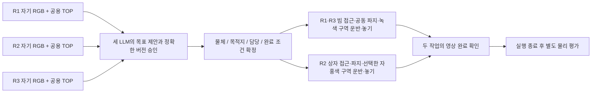

# 세 로봇 목표 합의와 실제 운반

기본 실행기는 `scripts/run_three_robot_e2e.py`이며 `run_three_robot_mission.py`로 연결된다.
세 독립 LLM이 물체·목적지·담당·완료 조건에 합의한 뒤 세 대 모두 물리 작업을 실행한다.



## 목표 선정과 지원 범위

- 주황색 빔 → 녹색 구역: `rgb_pair_goal_v1`, R1 아래 끝 + R3 위 끝.
- 작은 청록색 상자 → 자홍색 구역: `rgb_solo_box_v1`, R2 독립 운반.
- 상자 목적지는 두 후보 중 고른다. `auto`는 영상에서 가장 가까운 사용 가능한 구역,
  `far_magenta`는 사용자가 지정한 먼 구역이다. 각 에이전트의 선택 근거를 보존한다.
- 세 ACK는 동일 물체·목적지·작업 담당·완료 조건의 정확한 버전/해시를 가리켜야 한다.
  R2 관찰 전용, 화물 없는 이동, 선택과 다른 목적지 실행은 이 계약을 만족하지 못한다.

현재 기술 목록은 위 두 가지로 제한된다. 운반자 교체, 임의 물체 선정, 장애물 우회,
세 대가 하나의 물체를 함께 파지하는 기능은 포함하지 않는다. LLM이 목표를 선택하고
실행을 허가하며, 구체적인 움직임은 기존 RGB 로컬 기능이 수행한다.

## 동기화와 관측 경계

상위 계획은 세 독립 LLM, 연결·버전 승인·정지는 동기화 계층, 움직임은 각 로컬 실행기가
맡는다. 초기 배치와 팔 접기 후 작업 행동은 세 ACK가 모이기 전 차단한다. 이후 두 작업은
공유 물리 시간에서 독립적으로 진행한다. 빔 작업이 먼저 끝나도 R2 작업이 계속된다.
R2 오류나 계획 무효화는 전체 실행을 중단하며, 제한 시간을 넘기면 성공 처리하지 않는다.

입력은 자기 RGB·고정 공용 TOP RGB·자기 발행 명령·동료의 영상 기반 주장이다.
실시간 정답 위치·관절·접촉·평가 결과는 행동이나 단계 전환에 쓰지 않는다.
R2 영상은 기존 단안 보정의 640×480으로 전체 프레임을 축소한다. 카메라 배치/FOV는
바꾸지 않는다. 세 로봇과 두 작업 구역을 보여 주는 별도 관람 카메라는 제어 입력이 아니다.
모든 weld OFF, 기존 로봇/빔과 기존 small_box_01 외관·질량·접촉 설정을 유지한다.

R2는 영상으로 상자를 식별·접근하고, 팔을 좌우로 움직여 영상상 함께 움직이는지 확인한다.
운반은 매 0.25초 새 영상에서 선택된 구역과 상자의 차이를 보고 갱신한다. 새 명령이 없으면
이동은 만료된다. 파지 영상이 변하면 정지 후 새 파지 관찰을 수행하며 실패하면 중단한다.
상자 전체의 영상상 가로 폭이 목적 구역 안에 여유를 두고 들어오면 내려놓는다.
이 기준은 지원된 평행 레인용이며 일반 3D 도착 판정으로 해석하지 않는다.

기존 두 로봇 파지 모델은 학습 가중치·허용 오차를 유지한다. 새 작업이 추가된 TOP의
상수 배경만 입력 차이에서 제외한다. 제외 영역에 학습된 방향 성분이 있으면 거절하며,
자기 카메라의 새로운 영상이나 작업 구역 변화에 대한 검사도 유지한다.

현재 한 SIM 프로세스의 공유 시간에서 실행하며 LLM 추론 동안 SIM은 멈춘다.
실제 분산 프로세스·네트워크 장애·실시간 추론 중 하중 유지의 검증은 별도 범위다.

## 재현

기존 Python/MuJoCo 환경을 사용한다. macOS는 환경의 `mjpython`, Ubuntu는 `python`.
학습 파일은 버전 관리된 ZIP에서 추출한다. 실제 모델 호출에는 프록시가 필요하며 비용이 발생한다.

```sh
python -m zipfile -e experiments/2026-09-10-rgb-varied-start/models.zip outputs/three-robot-models
python scripts/ugrp_session.py run three-robot-demo -- /absolute/path/to/mjpython \
  scripts/run_three_robot_e2e.py \
  --grasp-model-dir outputs/three-robot-models/models/grasp \
  --stage-model-dir outputs/three-robot-models/models/varied \
  --reference-top tests/fixtures/camera_goal_transport/reference-top.jpg \
  --out-dir outputs/three-robot-NEW-ID
python scripts/audit_three_robot_mission.py outputs/three-robot-NEW-ID
```

`--solo-goal far_magenta`로 먼 목적지를 지정한다. `--team-planner fixture --planner local`은
외부 LLM 없는 물리 연결 진단이며 LLM 성공으로 합산하지 않는다. 출력 폴더와 자동 생성되는
동명 `-grasp-models` 폴더는 새 이름을 사용한다. 실험 전에 소스를 커밋하고 실행 중 고정한다.

과거 R2 정지 관찰 구성은 명시적으로 `--inspection-demo`를 붙여 실행하며, 해당 기록의
감사는 `audit_three_robot_e2e.py`를 사용한다. 과거 지연/보고 단절 시험은 그 구성의 결과다.

## 기록과 판정

`team/`에 실제 세 모델의 입력 이미지·요청·전송·응답과 계획 버전을 보존한다.
`llm/`은 R1/R3 단계 허가, `solo-decisions.jsonl`과 `solo-raw-actions.json`은 R2의
영상 판단과 발행 명령이다. 감사는 입력 해시·명령 이력·계획·각 RGB 결정을 재생한다.

평가용 좌표와 접촉은 `evaluation-only.jsonl`, `solo-evaluation-only.json`에만 별도로 저장한다.
두 물체 모두 들어서 이동하고, 선택한 목적 구역에 놓여 로봇과 분리된 채 안정되어야 한다.
세 대의 실제 이동량과 동시에 움직인 시간도 따로 검사한다. `motion.mp4`를 직접 검토한다.
원시 증거는 로컬 `outputs/`이며 Git에 올린 기록·대표 영상과 구분한다.
