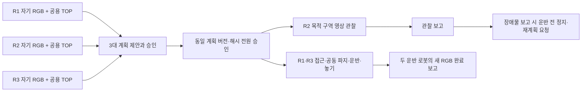

# 3대 계획 합의와 공동 운반 연결

세 독립 로봇의 `계획 제안 → 같은 버전 승인 → 작업 실행 → 관찰·완료 보고`를
기존 RGB 운반에 연결하는 최소 구성이다. 실행기는 `scripts/run_three_robot_e2e.py`다.



## 제공 범위와 담당 경계

- 상위 계획: 독립 LLM 세 개가 자기 RGB·공용 TOP·자기 발행 이력·전달된 자연어
  메시지에서 계획을 제안한다. 제안자는 버전마다 순환하며 영구 중앙 계획자는 없다.
- 창민의 연결·동기화: 전체 계획 승인, 버전/해시 검사, 참여자별 단계 허가,
  보고 누락 시 정지, 기록·재생 감사를 담당한다. 거절한 계획을 임의로 수정하지 않는다.
- 로봇별 실행: 기존 R1/R3 RGB 접근·정렬과 시연 팔 동작/RGB 보정을 재사용한다.
  세 로봇 입력에 실제 위치·관절·접촉·평가 결과를 전달하지 않는다.
- 평가: 제어가 끝난 뒤 별도 평가 결과로 파지·50cm 운반·놓기·해제 안정성을 판정한다.

현재 실행 가능한 운반 기술은 **R1 아래쪽 끝 + R3 위쪽 끝**뿐이다. 따라서 LLM의
계획 선택은 이 조합 수락/거절과 R2 관찰 시점(`during_approach` / `before_carry`)이다.
자유로운 운반자 선정·경로 생성·세 대 동시 파지는 구현했다고 주장하지 않는다.
R2는 고정된 기존 카메라에서 관찰하며 움직이거나 두 번째 화물을 운반하지 않는다.
다른 로봇 조합과 독립 운반 기술이 검증되면 같은 계획 계약의 기술 목록을 확장한다.

## 실행과 중단

초기 배치/팔 접기는 실험 설정이다. 그 뒤 작업 이동은 세 ACK가 모이기 전 차단한다.
제안 불일치·누락·잘못된 JSON은 원문을 보존하며, 최대 6회 협상 후 멈춘다.
계획 확정 후 공동 동작은 R1/R3의 새 영상 허가만 필요하다. R2를 매 단계의 장벽에
넣지 않는다. R2의 관찰 요청은 별도 실행 스레드에서 수행하며 물리 접근과 겹칠 수 있다.
`before_carry`는 계획에 명시된 선행 의존성으로 운반 전 보고를 기다린다.

R2 보고는 `VISIBLE_CLEAR/BLOCKED/UNCERTAIN`이며 물리적 안전·성공 판정이 아니다.
BLOCKED 또는 요청 실패는 운반 전 정지한다. UNCERTAIN도 정직한 관찰 결과로 남기고,
운반 여부는 두 운반 로봇의 새 RGB 판단과 로컬 운반 정책이 결정한다. 과거 R2의 CLEAR는
현재 운반 허가를 대신하지 않는다. 자동 우회 경로 생성이나 물체를 든 채 다른 조합으로
교체하는 복구는 없다. 계획 무효화 후 이전 허가는 다시 쓸 수 없다.

`TaskStageSync`/`TaskStageExecution`을 완전히 분산 연결한 실행기는 아니다.
기존 `CameraSkillGate`와 `PairCarryPolicy`를 재사용하며 하나의 SIM 프로세스에서
작동한다. 운반 중 매 0.2초 새 양쪽 RGB 보고가 필요하다. LLM 단계 판단 동안에는
기존처럼 SIM을 멈춘다. 실제 네트워크, 시계 차이, 프로세스 재시작, 실시간 추론 중
하중 유지, 내려놓기 중 통신 단절은 후속 검증이다. 카메라/FOV·외관·물리와 weld OFF 유지.

## 재현

기존 Python/MuJoCo 환경을 사용한다. macOS는 해당 환경의 `mjpython`, Ubuntu는
`python`을 사용한다. 학습 파일은 버전 관리된 ZIP에서 로컬 outputs로 추출한다.

```sh
python -m zipfile -e experiments/2026-09-10-rgb-varied-start/models.zip outputs/three-robot-models
python scripts/ugrp_session.py run three-robot-demo -- /absolute/path/to/mjpython \
  scripts/run_three_robot_e2e.py \
  --grasp-model-dir outputs/three-robot-models/models/grasp \
  --stage-model-dir outputs/three-robot-models/models/varied \
  --reference-top tests/fixtures/camera_goal_transport/reference-top.jpg \
  --out-dir outputs/three-robot-NEW-ID
python scripts/audit_three_robot_e2e.py outputs/three-robot-NEW-ID
```

기본값은 실제 모델 호출이며 프록시 설정이 필요하다. 출력 폴더는 새 이름이어야 한다.
실험 전에 변경을 커밋한다. `--team-planner fixture --planner local`은 외부 LLM 없는
연결 진단이며 R2는 UNCERTAIN을 반환한다. 이를 LLM 협상·관찰 성공으로 합산하지 않는다.
fixture의 시점 선택은 `--fixture-timing before_carry`로 바꿀 수 있다.

장애 주입은 `--fault ready_delay`(LIFT의 R3 준비 보고 두 번 보류),
`--fault carry_report_loss`(운반 12~16번째 보고에서 R3 전달 보류)다.
계산된 보고를 전달하지 않는 시험이며 실제 망 지연이나 로봇 고장이라고 부르지 않는다.
전자는 실제 영상 판단을 보존하기 위해 `--planner llm`이 필요하다.

저장: `team/team.json`(계획/관찰), `team/r*/`(모델 원본 입력·전송·응답),
`llm/`(두 운반 로봇의 단계 허가), `execution-trace.json`, `evaluation-only.jsonl`,
`motion.mp4`, `result.json`, `audit.json`. 원본 raw는 로컬이며 Git 기록과 구분한다.
