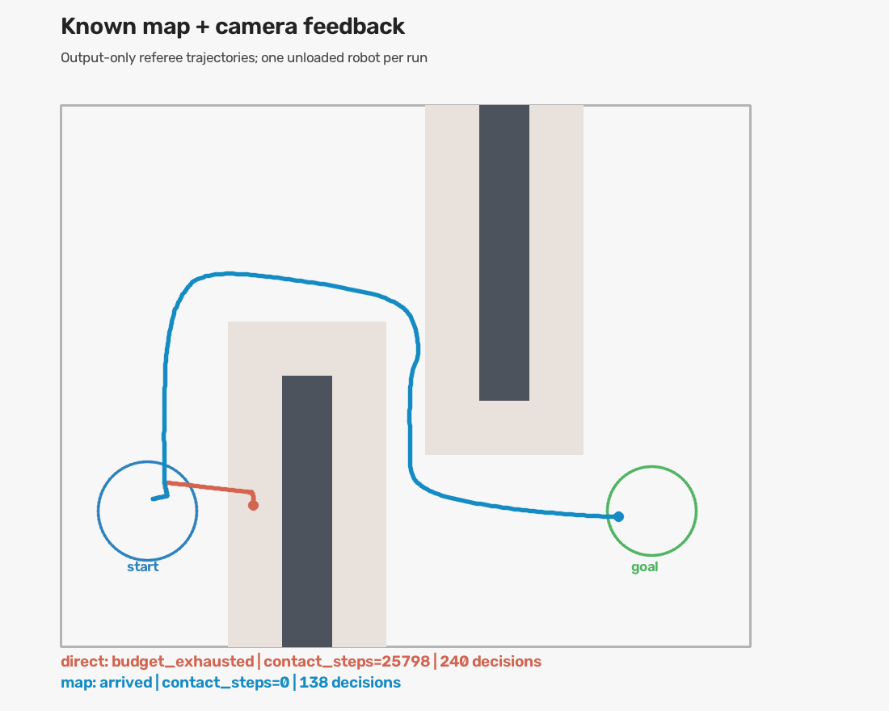

# 사전 지도 기반 영상 주행

사용자가 선택한 “미리 만든 지도도 로봇에게 직접 제공”을 구현했다. 같은 JSON으로 실제 벽과 항법 지도를 만들고, 공용 카메라에서 추정한 위치로 경로를 다시 계산한다. 실시간 정답 좌표·관절·접촉은 제어기에 주지 않는다.

**고정한 지도에서 시작 위치·방향을 바꾼 r1/r3는 모두 벽 두 개를 충돌 없이 우회했다.** 같은 영상 제어기로 목표를 향해 직행한 경우는 둘 다 벽에 막혔다. 0.32m 통로는 선언한 0.44m 차체 여유 폭보다 좁아 두 조건 모두 움직이기 전에 거부했다.



회색은 실제 벽, 연한 영역은 차체 반경과 안전 여유를 포함한 금지 영역이다. 파란 선은 지도 경로, 붉은 선은 직행 비교의 **평가용 정답 궤적**이다. 이 그림과 평가 좌표는 제어 입력에 쓰이지 않았다.

- [r1 실제 우회 영상](media/heldout_r1-slalom-map.mp4)
- [r3 실제 우회 영상](media/heldout_r3-slalom-map.mp4)
- [벽에 막힌 직행 비교 영상](media/heldout_r1-slalom-direct.mp4)
- [실행 방법과 지도 형식](../../docs/known_map_navigation.md)

## 검증 결과

실행 코드: [`9e810183e4ed5053661e660f17817689b0f7cd29`](https://github.com/kcm0127-dotcom/ugrp/commit/9e810183e4ed5053661e660f17817689b0f7cd29). 개발 완료 뒤 이 SHA를 고정해 최종 10개 조합을 전부 실행했다. 이후 변경은 보고·증거 정리다.

두 시작 조건은 r1 `[-0.48,-2.50], +12°`, r3 `[-0.54,-2.59], -12°`다. 실제 시작 좌표/각도는 장면 초기화에만 쓰며 항법기에 전달하지 않는다. 각 로봇은 별도 실행했고 장면 seed는 11이다.

| 조건 | r1 | r3 | 판정 |
|---|---:|---:|---|
| 열린 공간, 지도 경로 | 21.65 SIM초 / 70결정 | 22.30 SIM초 / 72결정 | 둘 다 도착, 접촉 0 |
| 열린 공간, 직행 | 21.65 SIM초 / 70결정 | 22.30 SIM초 / 72결정 | 둘 다 도착, 접촉 0 |
| 벽 두 개, 지도 경로 | 38.65 SIM초 / 138결정 | 41.05 SIM초 / 147결정 | 둘 다 도착, 접촉 0 |
| 벽 두 개, 직행 | 64.15 SIM초 / 240결정 | 64.30 SIM초 / 240결정 | 둘 다 벽 접촉·예산 소진 |
| 너무 좁은 통로, 지도 경로 | 정지 1결정 | 정지 1결정 | 둘 다 무이동 거부 |

도착과 올바른 거부는 별도 결과다. 목표 허용 반경은 0.18m이며 지도 우회 후 실제 목표 거리는 r1 0.137m, r3 0.143m다. 경로 길이는 각각 3.415m, 3.537m다. 모든 실행에서 weld OFF와 카메라/로봇 외형 불변 조건을 통과했다. 물리 평가의 지도 경계 검사는 로봇 중심뿐 아니라 선언한 0.18m 반경이 범위 안에 있는지도 검사했다.

`direct`도 동일한 지도 기반 초기 보정 검사를 사용한다. 따라서 이 비교는 **주행 중 장애물 경로계획의 효과**를 분리하며, 지도 정보 제공 자체를 완전히 끈 실험은 아니다. 네 비교 쌍의 최초 own/top JPEG 해시가 각각 일치했다. 각 시작 조건마다 보정 명령과 추정 Jacobian도 조건 간 동일했다.

최종 10개 실행의 원본 1,051프레임을 저장된 지도와 두 JPEG만으로 재생했고 결정이 모두 일치했다. 개발 실행을 포함하면 실제 물리 실행 23개, 1,566프레임의 감사가 통과했다. 실행 전 환경 메타데이터 오류 1개도 별도로 보존했다. 총 24번의 시도 중 실패를 제외하지 않았다.

최종 오프라인 회귀 검사: **547 passed, 152 subtests passed**. 실행 SHA의 [GitHub CI](https://github.com/kcm0127-dotcom/ugrp/actions/runs/34759078198)는 `offline-regressions`와 `ubuntu-simulation` 모두 통과했다. Ubuntu CI의 물리 검증은 기존 quickstart이며 이번 항법 코스의 실제 주행은 Mac MuJoCo 환경에서 수행했다. 외부 모델 호출과 모델 비용은 모두 0이다.

## 무엇이 문제였고 어떻게 고쳤나

지도만 추가하면 충분한지를 분리하기 위해 먼저 빈 공간·우회 코스·통과 불가 코스를 구성했다. 개발 과정은 다음과 같다.

| 버전 / 실행 SHA | 관측된 결과 | 근거와 수정 |
|---|---|---|
| v1 / `90fa956` | 장면 실행 전 메타데이터 오류 | 설치된 headless OpenCV와 배포 이름 차이. 실제 import한 버전을 기록하도록 수정 |
| v2 / `2593bd3` | 네 바퀴 색 성분을 네 후보로 판정하고 정지 | 실제 두 카메라 원본을 보존하고 차체 크기 안의 성분을 묶음 |
| v3 / `a2df402` | 열린 공간 도착, 우회 중 경로 없음으로 정지 | 초기 보정과 연속 주행에서의 영상 변위/명령 관계가 달랐음. 축 사이 정지 확인과 방향을 보존하는 제어 한계 적용 |
| v4 / `a0f070e` | 정지 확인 뒤에도 우회 중 정지 | 평가로 확인한 초기 실제 변위는 전진 약 10mm·횡이동 약 5mm인데 영상 중심 변동이 더 큼. 지도 최단 경로도 금지 영역에 너무 붙었음 |
| v5 / `9428f09` | 영상 신호 부족으로 보정 단계에서 정지 | 어두운 금색을 포함하고 기하 중심을 사용, 충분한 누적 영상 변위 요구, 벽 여유 비용 도입. 짧은 횡이동 6회로는 5cm 기준을 채우지 못함 |
| v6 / `9e81018` | 열린 공간·우회 도착, 좁은 통로 거부 | 보정 동작을 0.6초로 늘려 충분한 영상 신호를 얻음. 이 후보를 고정해 최종 비교 전체 실행 |

보정은 현재 영상에서 안전 여유를 확인하고 명령을 발행한 뒤 새 영상으로 정지를 확인한다. 축별 최대 6회 동안 누적 영상 변위가 5cm에 도달해야 이동 관계를 채택한다. 실제 관절/속도/위치를 넣어 보정하지 않았다. 최종 우회 영상의 위치 추정 오차는 평가용 보간 좌표와 비교했을 때 평균 약 1.8/1.9cm, 최대 약 2.5/2.7cm였다. 이 수치 역시 실행 후 평가이며 제어를 교정하지 않는다.

## 검토 범위와 한계

- 현재는 **공용 top RGB를 사용하는 고전적 기준 제어기**다. 자기 카메라 RGB는 원본 저장·디코딩·감사에 사용하고, 제어 판단에는 아직 사용하지 않는다. LLM 항법이나 학습된 협력을 입증한 결과가 아니다.
- 두 로봇은 같은 모델이며, 동일한 세 지도에서 두 시작 조건을 시험했다. 새로운 지도·장애물에 대한 일반화나 확률적 성공률, 동시 다중 로봇 주행을 입증하지 않는다.
- 정적 벽·평평한 바닥·무적재·접은 팔만 검증했다. 경사로/턱 통과, 동적 장애물 발견, 지도 오류 수정, 공동 운반은 후속 범위다. 보정의 국소 여유 검사는 이번 구동기와 시작 조건에서의 경험적 검증이다.
- 실제 관찰용 영상은 r1/r3 우회 전 구간을 4초 간격으로, 직행 실패를 8초 간격으로 표본 검토했다. 마지막 원본 top/own 영상도 확인했다. 접촉·weld는 모든 물리 step에서 별도 검사했다. `contact_steps` 수치는 시작/종료 평가 호출도 포함한 접촉 검출 횟수이며 개별 충돌 사건 수가 아니다.
- 입력 감사는 저장한 자료와 코드 경계의 재현성 증거다. 원래 실행에 숨은 상태가 없었다는 형식적/암호학적 증명으로 표현하지 않는다.

## 자료 보관과 재현

[전체 결과](all-results.json), [최종 비교 표](heldout-results.csv), [원본 위치](raw-locations.json), [업로드한 증거 해시](published-evidence-sha256.json), [사전 프로토콜](protocol.md)을 보존했다. `records/`에는 모든 시도의 설정·환경·결과·입력/장면 해시·감사와 프로세스 로그가 있다. 결정/평가 JSONL은 동일한 원본을 gzip 압축했고, 해제한 바이트의 SHA는 해당 원본 manifest와 일치한다.

Git에는 코드·지도·위 기록·대표 영상 3개·비교 그림·검토 표본·회귀용 카메라 원본 1쌍을 보관한다. **전체 RGB와 나머지 영상은 `/Users/changmin/projects/ugrp/outputs/known-map-*`에 로컬 보관**한다. 해시만 있는 전체 원본을 원격 백업 완료로 표현하지 않는다. 전체 입력 재생 감사는 이 원본과 실행 당시 항법 코드가 필요하다.

최종 비교 재실행은 깨끗한 실행 SHA 체크아웃에서 아래 명령을 사용한다. 별도 worktree이면 환경 실행 파일은 절대 경로로 지정한다.

```sh
python scripts/ugrp_session.py run known-map-heldout-NEW -- \
  python -m scripts.run_known_map_cohort --matrix heldout \
  --python /path/to/mjpython --out-dir /path/to/outputs/known-map-heldout-NEW
python -m scripts.report_known_map_cohort /path/to/outputs/known-map-heldout-NEW
```

GitHub [이슈 #35](https://github.com/kcm0127-dotcom/ugrp/issues/35). 작업 브랜치는 `codex/known-map-navigation`이며 #34 위에 쌓는다. main 병합은 사용자 승인 대상이며 이번 구현/검증에서 수행하지 않는다. 실행한 로컬 세션과 자식 프로세스는 모두 종료했다.
