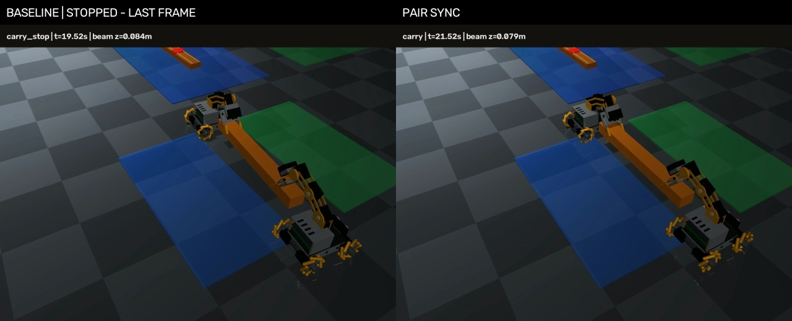

# 두 로봇 공동 운반 M1 — 정지·정렬·재합의 후 재개

2026-09-13~14 KST 작업. [작업 목록 #39](https://github.com/kcm0127-dotcom/ugrp/issues/39)의 첫 마일스톤을 [PR #40](https://github.com/kcm0127-dotcom/ugrp/pull/40)으로 구현했다. 두 로봇이 이미 함께 든 짐을 20cm 운반할 때 한쪽 구동이 늦으면, 공용 RGB에서 어긋남을 보고 멈춘 뒤 뒤처진 로봇을 제한적으로 전진시키고 새 양쪽 보고로 재개한다.

사전 정의한 M1 기준을 통과했다. 이는 고정 시작 자세의 직선 운반에서 확인한 결과다. 독립 LLM 협업, 다양한 파지 시작, 지도·공동 회전, 실물 로봇까지 완료했다는 뜻은 아니다.

## 비교 결과

| 조건 | 기존 RGB 운반 | 새 동기화·정렬 | 의미 |
| --- | ---: | ---: | --- |
| 정상 고정 시작 반복 | 10/10 | 10/10 | 결정적인 동일 조건의 반복 재현성 |
| r1/r3 출발 구동 보류 0.2/0.4/0.6/1.0초 | 4/8 | 8/8 | 기존 실패 조건을 포함한 회귀 비교 |
| 이동 시작 0.8초 뒤 0.35/0.75초 구동 보류 | 2/4 | 4/4 | 개발에 쓰지 않은 제한된 시점·기간 전이 |
| 초기/이동 중 한쪽 보고 1초 단절 | 4/4 | 4/4 | 새 방식의 HOLD·재합의 경계 확인 |
| 전체 | 20/26 | 26/26 | 실패를 포함한 52회 전체 기록 |

모든 52회에서 실제 RGB·자기 발행 명령·판단·동기화 사건 재계산 감사가 통과했다. 각 baseline/sync 쌍의 초기 운반 RGB도 같았다. 카메라/FOV·외관·물리 설정은 유지했고 weld 활성 tick은 모두 0이었다. 별도 검토에서 적용 명령 기록 970개가 발행 명령과 결함 주입 규칙에 일치했다. [전체 표](results.csv), [시간 통계](metrics.json), [실행 집계](cohort-report.json), [독립 검토](review/review.md)를 함께 보관한다.

기존 방식의 여섯 실패는 r1/r3의 0.6·1.0초 출발 보류와 r3의 이동 중 0.35·0.75초 보류다. 모두 영상 특징이 모델 지원 범위를 벗어나 종료했고 내려놓기·해제를 완료하지 못했다. 감사 통과는 기록과 계산이 맞는다는 뜻이며 작업 성공과 다르다.

보고 단절 비교에서 기존 방식은 로컬의 두 판단을 직접 사용하며 동기화 보고를 소비하지 않는다. 따라서 기존 방식의 4/4를 분산 통신의 결함 내성으로 해석하지 않는다. 새 방식은 누락된 보고의 비공개 판단을 참조하지 않고, 네 조건 모두 누락 중 양쪽에 0을 발행한 뒤 새로운 두 보고로 재개했다. 이산 관측과 부동소수점 때문에 설정 1.2초의 단절은 첫 누락 관측 1.4초에서 시작했다. 설정 시각과 실제 표본 시각을 [검토](review/review.md)에 구분했다.

## 근거와 변경

출발 지연은 자연 발생한 통신 지연을 측정한 것이 아니다. 실행기에 한쪽의 실제 구동 명령을 보류하는 결함을 의도적으로 넣었다. 기준선에서는 한쪽만 진행하면서 공용 영상의 짐 끝점 X 차이가 커지고, 결국 기존 영상 판단의 허용 범위를 벗어났다. 따라서 READY 합의만으로 해결될 문제라고 보지 않았다.

새 제어는 초기 공용 RGB의 짐 기울기와 현재 기울기를 비교한다. 차이가 3px를 넘으면 양쪽을 0.4초 멈추고, 12px 이내에서 뒤처진 쪽에 0.04 전진을 발행한다. 1px 이내로 돌아오면 0.4초 정지·재확인 후 재개한다. 영상 판단이 유효하지 않으면 재관측 횟수를 제한하며, 반복 복구·전체 판단에도 상한이 있다. 기존 학습 모델과 성공 기준은 완화하지 않았다.

운반 판단마다 해당 회차의 새로운 두 보고를 요구한다. 보고 누락·거부나 HOLD 이후 예전 GO로 움직이지 않는다. 프레임 중복, 메시지 순서 역전, 계획 버전 변경, 관측 시각 기준 만료, 이전 점유의 해제 메시지 재사용을 단위 시험으로 확인했다. 공유 자원 예약/점유/해제 모듈은 로컬 계약과 단위 시험 범위이며 실제 통로나 메시지 버스에 연결하지 않았다. [인터페이스 계약](../../docs/pair_carry_sync_contract.md).

이 결과는 준비 확인·정지·영상 정렬·재합의를 합친 효과다. READY 메시지 자체의 독립적인 인과 효과를 분리한 실험은 아니다.

## 시간과 비용

| 조건 | 기존 평균 판단 수 | 새 평균 판단 수 | 새 운반 구간 SIM 시간 |
| --- | ---: | ---: | ---: |
| 정상 | 14 | 14 | 2.95초 |
| 출발 지연 | 14.625 | 28.875 | 5.925초 |
| 이동 중 지연 | 16 | 32.5 | 6.65초 |
| 보고 단절 | 14 | 21 | 4.35초 |

판단당 두 로봇에 명령 하나씩을 발행한다. 운반 구간은 초기 운반 관측부터 마지막 운반 명령 종료까지이며 파지·내려놓기는 제외한다. 정상 작업 전체는 두 방식 모두 24.76 SIM초다. 기존 지연 조건의 짧은 시간에는 조기 실패가 섞여 있어 효율 우위로 볼 수 없다. [metrics.json](metrics.json)은 전체 시도와 성공한 시도의 평균을 따로 제공하며, 정지·정렬·재합의 시간과 판단/실행 실제 시간도 포함한다.

최종 52회 실행과 각 감사의 실제 경과는 약 554.75초였다. 외부 모델 호출과 API 비용은 0이며, 로컬 계산·전력 비용은 측정하지 않았다. SIM 시간, 실제 계산 시간, 실제 로봇의 통신·구동 지연은 서로 다른 값이다.

## 영상과 물리 검증 범위

[1초 출발 지연 전후 비교 영상](media/r1-delay-comparison.mp4)



왼쪽은 기존 방식, 오른쪽은 새 방식이다. 두 원본을 4fps·1배속으로 나란히 배치했다. 먼저 끝난 기존 영상은 `STOPPED - LAST FRAME` 표기와 함께 마지막 화면을 유지한다. 화면의 높이·SIM 시간은 평가용 오버레이로, 제어 입력에 들어가지 않는다. 비교 영상과 별개로 다섯 대표 원본 영상 및 [검토 프레임](review/frames)을 제공한다.

기존 평가기를 그대로 사용했다: 2초 이상 파지 유지, 운반 중 3cm 이상 들림과 두 로봇의 양측 접촉, 최종 20±3cm 이동과 횡방향 3cm 이내, 내려놓기 후 접촉 분리 및 1초 안정성. 약 10Hz 평가 표본이고 최대 간격은 0.15초다. 표본 사이 모든 물리 단계의 접촉 연속성을 증명하지 않는다. 성공 중에도 짐 높이가 다소 내려가므로 높이 유지 제어가 완성된 결과로 해석하지 않는다.

## 소스와 저장 자료

- 기반: 미병합 [PR #34](https://github.com/kcm0127-dotcom/ugrp/pull/34), SHA `690bead094195404fd8de9f6b86d12a8ea249852`. 지도/회전 PR #36·#38은 이번 소스에 포함하지 않았다.
- 개발 3회 실행 소스: `8bcf5eb` — 정상·r1 1초·r3 1초 모두 완료. 이후 독립 검토로 보고 경계·완료 누적을 보강했다. 개발 자료의 추가 감사는 최종 감사 코드로 수행한 사후 감사다.
- 최종 52회 실행 소스: `99898d8983315e39635c063e0b6b430c01818b22`. 실행 전 커밋·푸시했고 실행 중 변경하지 않았다. 결과 보관용 후속 커밋과 구별한다.
- 환경: macOS 27 arm64, Python 3.12.13, MuJoCo 3.12.0. 카메라와 모델 해시는 각 result, 설정/모델 입력 해시는 cohort-report에 있다.
- 개발+최종 55회 전체의 JSON/JSONL은 `records/`의 무손실 gzip, 실제 JPEG는 중복 제거한 `rgb-01.zip`·`rgb-02.zip`으로 보관했다. 서로 다른 JPEG 1,622개, 실행별 참조 파일 6,363개이며 JPEG archive 합계 72,124,130바이트다. `restore_evidence.py`가 원래 바이트를 해시 검증하며 복원한다.
- `evidence-index.json.gz`는 상대 경로→원본 해시·보관 위치를 연결한다. `raw-files.jsonl.gz`는 6,693개 전체 원본 파일의 위치·크기·SHA256이다. 영상 이외 복원 파일은 6,638개다.
- 원본: `/Users/changmin/projects/ugrp/outputs/pair-sync-comparison-v1`, `/Users/changmin/projects/ugrp/outputs/pair-sync-development-v1`. 대표 영상 외 나머지 전체 동영상 50개는 로컬에만 있다. 원본 해시를 원격 동영상 백업으로 표현하지 않는다.
- 프로젝트 지침에 따라 로컬과 GitHub에 저장하며 Google Drive는 사용하지 않는다. main은 별도 승인 없이 병합하지 않는다.

## 다른 위치에서 기록 재검증

저장소 루트에서 Python 3.12와 기존 테스트/시뮬레이션 의존성을 준비한다. 아래 `outputs/` 폴더는 새 이름이어야 한다. Mac에서는 검증된 `.venv-sim-worker-mac/bin/python`, Ubuntu에서는 본인의 Python 환경을 사용한다.

```sh
python experiments/2026-09-13-pair-carry-sync/restore_evidence.py outputs/pair-sync-evidence-NEW
python -m zipfile -e experiments/2026-09-10-rgb-varied-start/models.zip outputs/pair-sync-models-NEW
python experiments/2026-09-13-pair-carry-sync/audit_restored.py \
  --evidence-dir outputs/pair-sync-evidence-NEW \
  --grasp-model-dir outputs/pair-sync-models-NEW/models/grasp \
  --out outputs/pair-sync-readback-audit-NEW.json
```

기대값은 감사 55/55, 재계산된 물리 성공 49/55(개발 3개 + 최종 46개)다. 이는 보관 입력의 재계산이며 새 물리 실험이 아니다. 파지 모델 archive SHA256은 `d6d421c2d35ed448c4492592220b3e3141d346f5e576ebbdf5a7a3c787b7e635`다. 복원 도구는 기록 경로의 원래 Mac 경로에 의존하지 않는다.

새 물리 비교는 **소스 99898d8의 깨끗한 별도 checkout**에서 수행한다. 최종 cases 파일, 파지 모델, transport 모델을 위에서 준비하고 다음 실행기를 사용한다. 최종 cohort는 source/설정/model 고정 및 각 초기 RGB 쌍 일치를 검사한다. Mac은 `mjpython`, Ubuntu는 지원 환경의 Python 실행 경로를 `--mjpython` 인자로 준다. Ubuntu CI의 기본 렌더링 성공을 이 52회 비교의 Ubuntu 재현으로 간주하지 않는다.

```sh
python scripts/ugrp_session.py run pair-sync-NEW -- python scripts/run_pair_carry_cohort.py \
  --cases-json experiments/2026-09-13-pair-carry-sync/final-cases.json \
  --grasp-model-dir /absolute/path/to/models/grasp \
  --transport-model-dir experiments/2026-09-13-rgb-short-transport/models \
  --mjpython /absolute/path/to/your/python-or-mjpython \
  --out-dir /absolute/path/to/new-output
```

## 완료 지점과 남은 일

이번 완료 범위는 T1·T2의 **운반 단계** 계약과 기록, 그리고 T3의 고정 시작 M1 비교다. 공동 접근·파지·들기의 전체 전환, 로봇 재시작/네트워크 복구, 실제 자원 점유 통합은 아직 남아 있다. 내려놓기는 기존 시연 순서를 유지했다.

다음 기능 묶음은 T4의 두 차체·팔·짐 전체를 포함한 경로 계약과 T5의 하중 공동 회전이다. 단독 로봇의 제자리 회전을 그대로 두 대에 적용하지 않고, 통로 진입 전 같은 계획 버전으로 합의하는 경계부터 설계한다. 더 많은 동일 조건 반복이나 지도·회전 임의 확장 없이, 검증된 M1을 검토 가능한 상태로 마무리한다.
