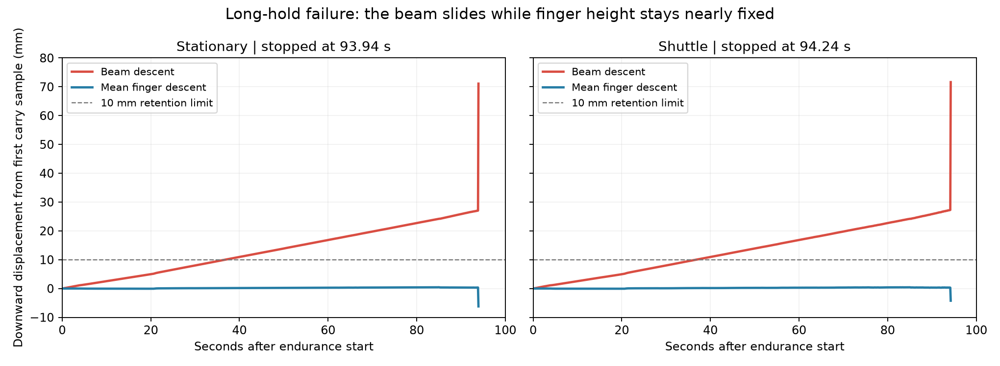

# 공동 파지 장시간 검증: 현재 3분·5분 모두 실패

현재 파지 설정은 정지 유지와 왕복 운반 모두 약 94초에 물체가 미끄러져 크게 기울어지고, own RGB 실루엣 guard로 공동 정지한다. 180초·300초 유지 성공은 없다. 최종 실행 SHA `593ccf15fde3900c5e4e5078b1bedf4811bece8e`. 파지/주행/물리 변경 후보는 모두 제외했고, 최종 변경은 장시간 시험 도구와 출력 전용 평가·감사·기록이다.

## 최종 기준 재실행

| 조건 | 유지 구간 마지막 표본 | 180초 | 300초 | 제어 라운드 | 측정 wall 시간 |
|---|---:|---|---|---:|---:|
| stationary | 93.94초 | 실패 | 실패 | 940 | 170.8초 |
| shuttle | 94.24초 | 실패 | 실패 | 943 | 183.8초 |

조건당 300초를 계획했으며 영상 guard의 조기 정지는 두 checkpoint 모두 실패다. 180초와 300초는 같은 궤적의 prefix이며 독립 반복이 아니다. initial baseline 2회와 최종 같은 설정 재실행 2회의 중단 시점·물리 결과가 일치한다. 같은 초기화와 환경에서의 재현이며 무작위 조건에서 성공률을 추정한 실험이 아니다.

stationary는 RGB 위치 유지, shuttle은 12초 주기·목표 0–16cm 왕복이다. 원본 평가에서 중심 x 이동 범위는 각각 0.55cm / 17.28cm다. 외부 LLM 호출 0, 비용 0이다. 초기 grasp 학생 추론과 영상 기하·결정론적 제어를 사용하며 LLM 협업 성능을 뜻하지 않는다.

## 확인한 문제

- 정지 유지 90.04초: 물체 하강 25.85mm, 평균 집게 중심 하강 0.352mm. 왕복 90.04초도 물체 25.825mm, 집게 0.320mm다. 물체와 집게의 상대 이동이 주된 관측이다.
- 양쪽 조건 모두 약 36.84초에 사전에 정한 높이 유지 한계 10mm를 넘는다. 이것은 출력 전용 판정이며 제어기에 전달하거나 조기 정지에 사용하지 않는다.
- 접촉이 아직 남아 있어도 미끄러짐이 누적된다. 현재 영상 실루엣 guard는 큰 기울어짐/모양 변화에서 정지했고, 초기 미끄러짐을 회복하지 못했다. 카메라에서 물체 전체가 사라졌다는 뜻은 아니다.
- soft contact 수치 모델은 원인 후보였으나 아래 설정 변경들은 정상 파지를 손상했다. 수치 모델과 파지 자세/하중의 기여를 완전히 분리했다고 주장하지 않는다.



## 제외한 후보도 보존

| 후보 실행 SHA | 비교 변경 | 관측 결과 |
|---|---|---|
| `863bbae` | NoSlip 0→3 | 출발 전 간격 안정화 실패; lift/hold 접촉 누락 1표본 |
| `fd68a2c` | impratio 10→100 | 출발 전 간격 2.776cm 축소 |
| `ff2d423` | 위 조건 + 제한된 RGB 오차 적분 | 간격 2.752cm 축소; 횡방향 명령 포화로 개선 미미 |
| `17e59b9` | 손가락–빔 접촉의 마찰 감쇠 3000 | 13.174 SIM초에 QACC 수치 불안정; 초기 파지 중단 |
| `887e95d` | 손가락–빔 접촉 impedance .995/.999 | lift/hold 간격 3.115cm 축소, 접촉 누락 3표본 |

각 후보는 stationary/shuttle 두 설정으로 실행했으나 모두 endurance 진입 전 같은 초기 구간에서 실패했다. 총 물리 실행 14회이며 성공한 변경 후보는 없다. 실패를 평가에서 제외하거나 본래 성공으로 바꾸지 않는다. 상세 설정·실행 SHA는 [사전 프로토콜](protocol.md), 명령·결과·경고는 [전체 기록](records/summary.json)에 있다.

MuJoCo 공식 문서의 [지속적 미끄러짐 설명](https://mujoco.readthedocs.io/en/stable/modeling.html#preventing-slip), [접촉 solver](https://mujoco.readthedocs.io/en/stable/modeling.html#solver-parameters), [마찰 reference](https://mujoco.readthedocs.io/en/stable/XMLreference.html#contact-pair-solreffriction)를 근거로 수치 비교를 설계했다. 그 설정을 실물의 마찰이나 파지 힘으로 간주하지 않는다.

## 최종 코드·입력 경계

- 기존 PR #48의 파지·주행 코드, 모델, 형상, 질량, 마찰, solver, 카메라/FOV를 유지한다. weld OFF다. 실패 후보의 제어/물리 옵션은 최종 소스에서 제거했고 실험 커밋 이력만 남겼다.
- 새 endurance actor는 자기 RGB와 공용 top RGB를 받는다. 이전 경로와 동일한 사전 지도·고정 작업 설정, 영상에서 얻은 위치, 자기 명령 개수만 사용한다. 실제 좌표/관절/접촉/평가를 제어·전환에 사용하지 않는다.
- finger 중심 높이와 상대 물체 높이는 evaluator 출력에만 추가한다. 300초 명령 완료 후 고정 place를 실행하고 바닥 방출·접촉 해제를 평가하지만, 이번 실제 시험은 300초에 도달하지 못했으므로 장시간 이후 방출 성공 증거는 없다.
- 저장된 RGB·명령·공동 허가의 정확한 재생 감사가 모든 14회에 통과했다. 입력 감사 통과는 물리 성공과 구분한다. 제외된 후보를 감사하려면 해당 호환 과거 소스가 필요하며, 최종 감사는 제외된 설정을 거부한다.
- 채택된 행동/물리 변경이 없으므로 6개 지형 재실행은 하지 않았다. 관련 소스가 #48과 동일한지는 [기존 코드 보존 검사](validation/preserved-source.json)로 확인했다.
- 최종 로컬 CI 661 tests + 154 subtests 통과. [로그](validation/ci-final.log). 물리 실험 실패는 별도의 결과로 그대로 남긴다.

## 실제 영상과 검토 범위

[실제 실패 영상](media/endurance-failure-review.mp4)은 초기 baseline 두 조건의 관찰 카메라 녹화를 4배속으로 재생한다. 관찰용 확대와 기존 SIM 시간/물체 높이 표기를 유지했으며 actor 입력 영상은 바꾸지 않았다.

직접 검토한 범위: 관찰 영상 선택 8프레임, 초기/정지 own RGB 두 장과 공용 top RGB를 합친 12장, 물체/손가락 하강 그래프. 모든 프레임을 사람이 검토한 것은 아니다. 선택 위치는 [관찰 프레임 목록](media/observer-selections.json), [actor 입력 목록](media/actor-input-selection.json)에 있다. 영상에서 유지 중 빔의 상태, 마지막 큰 자세 변화, 왕복 이동과 카메라 실루엣 변화를 확인했다.

## 재현과 남은 작업

모델 원본은 `/Users/changmin/projects/ugrp-worktrees/pair-loaded-navigation/outputs/pair-navigation/runtime/models/grasp`에 있다. Git clone만으로 이 모델 원본이 내려오는 것은 아니다. 모델 파일 해시는 각 result 기록에 있다. Mac에서는 다음을 프로젝트 루트에서 실행한다. PATH 변수는 환경별 실제 위치를 지정한다.

```sh
python3 scripts/ugrp_session.py run grasp-endurance -- \
  python3 experiments/2026-09-14-pair-grasp-endurance/run_cohort.py \
  --mjpython /path/to/mjpython \
  --grasp-model-dir /path/to/grasp-models \
  --out-dir outputs/grasp-endurance-NEW
```

결과를 감사하려면 `scripts/audit_pair_grasp_endurance.py RUN_DIR --grasp-model-dir MODELS`를 실행한다. 물리 재실행과 입력 재생은 별개다.

다음 구현 과제는 카메라 기반 미끄러짐 조기 감지와 파지·들어올리기 자세의 재설계다. 허용된 교사 진단에서 간격과 물체 높이를 함께 유지할 수 있는 접촉/팔 자세를 먼저 분리 검증한 뒤, 학생은 RGB와 자기 명령 이력만으로 새 조건에서 평가해야 한다. 시작 위치나 지형을 더 늘리는 것은 이 유지 실패가 해결된 이후가 적절하다.

원본 RGB·전체 영상·로그는 각 기록의 raw_directory에 로컬 보관한다. [원본 해시](records/raw-hashes.jsonl.gz)와 [저장 범위](records/raw-manifest.json)를 남겼으며 원격 raw 백업을 뜻하지 않는다. 선택 영상·압축 판정 기록·보고서는 Git에 보존한다. Google Drive는 사용하지 않는다. PR은 #48 위에 작성하며 main 병합은 별도 승인 이후다.
