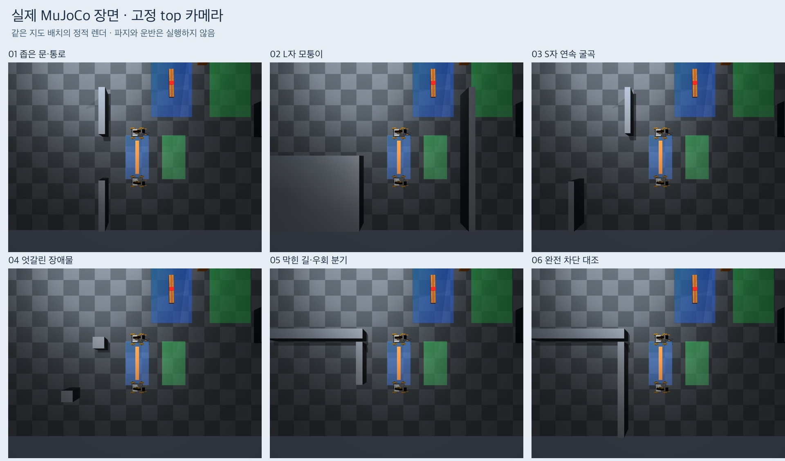

# 공동 운반 예시 지형 5종과 완전 차단 대조

평지 대표 배치 5종과 경로가 없는 대조 1개를 구성했다. 지도 JSON, 도면,
실제 MuJoCo 장면과 카메라 영상을 함께 보관한다. **이번 결과는 지형 구성과
정적 기하 검증이며, 짐을 잡고 통과하는 물리 실험은 아직 하지 않았다.**


| 지형 | 구성·확인하려는 상황 | 주변 9개 시작점의 계산 경로 |
| --- | --- | --- |
| [좁은 문·통로](maps/narrow-door.json) | 폭 56 cm 문. 두 로봇과 짐의 방향을 바꾸어 통과 | 9/9 있음 |
| [L자 모퉁이](maps/l-corner.json) | 안쪽 모서리를 돌아 위쪽 통로로 이동 | 9/9 있음 |
| [S자 연속 굴곡](maps/s-bends.json) | 위·아래로 엇갈린 벽. 메카넘 측방 이동이 가능하므로 차체 회전을 강제하지 않음 | 9/9 있음 |
| [엇갈린 장애물](maps/staggered-obstacles.json) | 어긋난 두 기둥 사이로 하중 전체를 이동 | 9/9 있음 |
| [막힌 길·우회 분기](maps/blocked-branch.json) | 위쪽 출구를 막고 아래쪽 우회로만 유지 | 9/9 있음 |
| [완전 차단 대조](maps/fully-blocked.json) | 위 배치의 아래쪽 우회로도 차단 | 0/9 있음 |

모든 배치는 기존 경계 2.93 × 1.75 m와 벽 높이 0.30 m를 사용한다.
계획용 전체 footprint는 여유 포함 0.45 × 1.07 m이다. 도면 S/G의 테두리는
각 위치에서의 이 공간이고, 점선은 중심의 계산 경로다. 점선만으로는 제자리
회전을 표시할 수 없으므로 정확한 자세 변화는 기록의 `route_m_rad`를 참고한다.
시작 좌표는 도면·기하 계산용이며 실행 중 관측으로 제공하는 값이 아니다.
실제 주행 입력 경로에는 기존 RGB 추정과 승인된 사전 지도만 사용한다.

## 실제 장면과 검증



- [개별 도면·top·관찰 시점 갤러리](gallery/index.html)
- [비스듬한 관찰 시점 모음](observer-overview.jpg)
- [전체 검증 수치·파일 해시](gallery/gallery-record.json), [실행 전 프로토콜](protocol.md)

실행 소스는 `6e92a36c836665a446e664c857dda71ac2669a80`이다.
기반은 PR #44의 `85fb0461efa5598656032139d8cb907c975cd1ab`이며,
후속 기록 커밋은 실행 소스나 지도를 변경하지 않는다.

| 검사 | 확인 결과 |
| --- | --- |
| 스키마·시작/목표 공간·경로의 이동 및 회전 공간 | 6개 지도 모두 예상과 일치 |
| 초기 6.5 cm 확인 동작, 방향 -15°부터 +15° | 6개 지도 모두 공간 확보 |
| 컴파일된 벽 위치·크기·높이 | 13개 벽 모두 지도와 일치 |
| 초기 로봇/빔과 새 벽의 접촉 | 6개 장면 모두 없음 |
| 기존 형상·마찰·외관·카메라/FOV | 새 벽 없는 기준 장면과 동일 |
| 질량·관성·solver 설정 | 기준 장면과 동일, impratio=1, NoSlip=0 |
| 인위적 파지 고정 | weld OFF |
| 관련 자동 회귀 검사 | `tests/test_pair_navigation.py`: 20 passed |

기준 장면 1개와 지형 6개를 각각 기존 팔 접기 초기화 0.9 SIM초 뒤 렌더했다.
총 생성 시간은 6.12초, 주행 명령 0회, 외부 모델 호출 0회, 모델 비용 $0이다.
환경은 macOS 27.0 arm64, Python 3.12.13, MuJoCo 3.12.0이다.
이 수치는 렌더 비용이며 운반 시간·성공률이 아니다. 기본 물리 설정에서의
실제 하중 유지와 통과 가능성은 다음 실험으로 확인해야 한다.

직접 검토한 영상 범위는 6개 지형 모두의 top·관찰 시점·r1/r3 자기 카메라
정지 프레임 총 24개와 도면 6개다. 벽 위치와 배치 차이가 보이며,
기존 로봇과 빔·창고 물체는 유지되어 있다. L자 지형에서는 자기 카메라 앞을
벽이 크게 가린다. 이 시야 제한을 그대로 보존했고 카메라나 조명을 바꾸지 않았다.
움직이는 파지/운반 장면은 검토 범위에 없다.

## 재생성

저장소 루트에서 실행한다. Mac은 기존 `.venv-sim-worker-mac`을 사용한다.
새 출력 폴더 이름이 필요하며, MuJoCo 렌더 전에는 소스·지도를 커밋해야 한다.

```sh
.venv-sim-worker-mac/bin/python scripts/build_pair_terrain_gallery.py \
  --geometry-only --out-dir outputs/terrain-plans-NEW

.venv-sim-worker-mac/bin/python scripts/ugrp_session.py run terrain-preview-NEW -- \
  .venv-sim-worker-mac/bin/mjpython scripts/build_pair_terrain_gallery.py \
  --out-dir outputs/terrain-preview-NEW
```

Ubuntu에서는 기존 설치 안내에 따라 만든 환경의 `python`을 `mjpython` 대신
사용하고 headless 렌더에는 `MUJOCO_GL=osmesa`를 설정한다. 이 새 갤러리의
실제 렌더 검증은 위 Mac에서 수행했으며 Ubuntu의 동일 출력까지 검증한 것은 아니다.
한글 도면 폰트는 Mac 기본 폰트 또는 Ubuntu `fonts-noto-cjk`를 사용한다.
새 worktree에는 가상환경 링크가 없을 수 있으므로 기본 프로젝트의 환경 경로를 사용한다.

초기화 메타데이터는 저장소의 `experiments/2026-09-10-rgb-varied-start/models.zip`
에서 두 JSON만 추출하고 아카이브와 개별 파일 해시를 검증한다. 추론 모델을 실행하지 않는다.
`gallery/<지형 ID>/scene.xml`은 컴파일된 장면 설정이며 시뮬레이션 종료 상태를
저장하는 snapshot은 아니다. 같은 초기 정지 프레임은 위 생성 명령으로 재현한다.

## 보관 범위와 다음 단계

최종 원본은 `outputs/pair-terrain-examples/final-01`에서 생성했다. 해당 결과의
67개 파일 전체와 검증 기록을 `gallery/`에 복사하고 SHA256 일치를 확인했다.
여기에는 기준 장면, top/own/observer RGB, 컴파일 XML, 단일 프레임 영상,
초기화 명령·평가용 기록이 포함된다. 평가용 좌표는 출력 기록이며 제어 입력이 아니다.
따라서 GitHub에서는 지도와 최종 렌더 원본도 확인할 수 있다. 개발 중 후보 탐색과
실패한 중간 도면 출력은 `outputs/terrain-design`에만 로컬 보관한다.
실행 세션 `terrain-examples-preview-01`은 종료를 확인했다.

다음은 고정 시작에서 이 5종을 실제 공동 운반하고, 통과·충돌·짐 미끄러짐과
시간·행동 수를 비교하는 단계다. 대표 배치의 주행 결과를 확인한 뒤 폭·회전 여유·
장애물 간격 변형을 늘린다. 경사·단차, 지연 주입, 15조건 코호트는 아직 수행하지 않았다.
