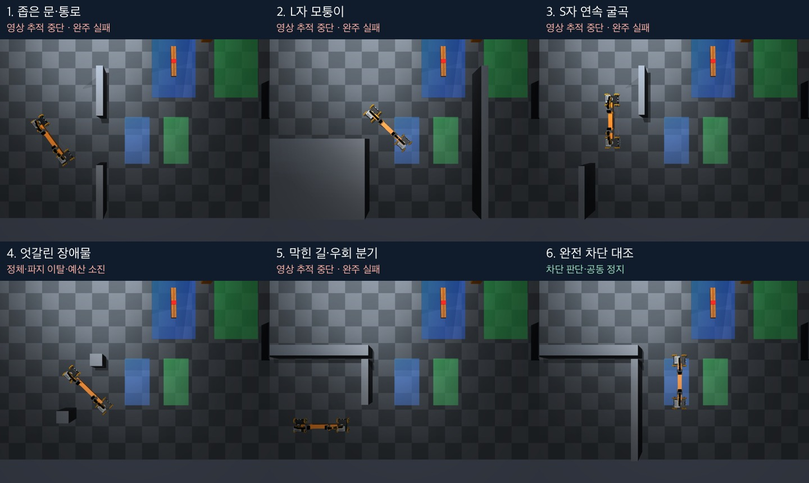

# 여섯 예시 지형의 실제 공동 운반 시험

**통과 가능 지형 완주 0/5, 완전 차단의 공동 정지 1/1.** 이론적으로 경로가 존재하는 것과
현재 영상 기반 제어기가 운반을 완료하는 것은 달랐다. 네 지형은 영상 인식 필터 때문에
정지했고, 엇갈린 장애물에서는 경유점 완료 조건에 오래 묶인 뒤 파지가 풀리고 예산이 소진됐다.

[실제 시험 영상 — 여섯 조건, 원본 4배속](media/terrain-trials-demo.mp4)

## 조건과 결과

실행 SHA: `f4da89ec53fed15c9efcea2e8bee19b99de31dfc`.
실행 전에 [프로토콜](protocol.md)과 [순차 실행기](run_cohort.py)를 커밋했다.
각 지형 고정 시작 1회, 같은 grasp 학생 모델, 파지 후 고정 8초 대기, 최대 750회×0.2초 판단이다.
파지 유지 증거가 있던 **명시적 `impratio=10` 비교 조건**이며 기본값 1은 변경하지 않았다.
weld OFF, noslip_iterations=0, 기존 질량·마찰계수·집게 힘·카메라·FOV를 유지했다.
이론 분석에서 만든 대안 경유점은 적용하지 않고 기존 A* 계획기·제어기를 그대로 시험했다.

| 지형 | 결과와 정지 원인 | 운반 SIM초 | 판단 회차 | 최소 lift |
| --- | --- | ---: | ---: | ---: |
| 좁은 문 | 문 통과 후 목표 방향 복귀 중 r3 바퀴 추적 중단 | 78.9 | 395 | 5.92 cm |
| L자 모퉁이 | 회전 중 빔 형상 필터 탈락 | 16.7 | 84 | 7.48 cm |
| S자 굴곡 | 중간 굴곡에서 빔 형상 필터 탈락 | 39.5 | 198 | 6.95 cm |
| 엇갈린 장애물 | 경유점 정체, 파지 이탈·낙하, 판단 예산 소진 | 149.9 | 750 | -0.21 cm |
| 막힌 길·우회 분기 | 아래쪽 우회 후 목표 구역 진입 전 r3 바퀴 추적 중단 | 63.3 | 317 | 6.33 cm |
| 완전 차단 | 경로 없음 판정·공동 정지, 기대 동작 통과 | 1.9 | 10 | 7.84 cm |

lift는 시작 시 짐 중심 높이 대비 상승량이다. 엇갈린 장애물의 음수 값은 지면 아래로
운반했다는 의미가 아니라, 시작 중심 높이보다 약간 낮아진 낙하 후 상태다.
운반 시간은 평가 샘플의 처음부터 마지막까지이며 파지·고정 대기·영상 처리 시간을 포함하지 않는다.
세부 시간·목표 오차·평가 gate는 [results.csv](results.csv), 전 조건 요약은 [results.json](results.json)에 있다.

영상 정지 네 조건과 완전 차단은 운반 평가 샘플 전체에서 양쪽 두 손가락 접촉·lift 3 cm 이상을
유지했다. 여섯 조건 모두 추가한 벽 접촉 0 tick, 지도 경계 준수, weld 활성화 0 tick이다.
엇갈린 장애물은 접촉 유지 샘플 비율 83.4%, lift 조건 통과 비율 99.27%이며,
비허용 접촉 560 tick이 낙하 구간에 기록됐다. 완료하지 못한 조건을 통과 성공에 포함하지 않았다.

## 실패 진단

### 바퀴 외관 추적 — 좁은 문·우회 분기

원문 오류는 각각 `r3 wheel template lost (0.478)`, `r3 wheel template lost (0.477)`이다.
현재 임계값 0.48을 밑돌아 두 실행기가 zero 명령을 발행하고 공동 정지했다.
좁은 문에서는 마지막 성공 관측의 위치 오차가 출력 전용 상태와 비교하여 r1 약 1.56 cm,
r3 약 1.85 cm였다. 정지 영상에 로봇·짐이 보이고, 파지와 높이도 유지됐다.
충돌이나 이미 발생한 낙하가 이 정지의 직접 원인은 아니다.
외관 점수 저하를 일으킨 배경·그림자·원근·시점 변화의 개별 기여는 이번에 분리하지 않았다.

### 빔 형상 필터 — L자·S자

원문 오류는 둘 다 `orange payload missing/ambiguous`다. 마지막 입력에서 빔 주변의 색상
성분은 존재하지만, 형상 검사에서 모두 탈락했다.

- L자: 가까운 빔 후보 618 px, 장축 분산 141.70, 장단축 분산비 7.37.
- S자: 가까운 빔 후보 983 px, 장축 분산 255.30, 장단축 분산비 9.68.
- 현재 기준은 면적 400 px 이상, 장축 분산 150 이상, 장단축 분산비 10 이상이다.

따라서 L자는 분산과 비율, S자는 비율 기준에 걸렸다. 후보의 이전 중심 대비 거리는 각각
0.63 cm·1.04 cm로 거리 기준 10 cm에는 충분히 들어왔다. 사람에게 짐이 보인다는 사실과
색상/형상 기반 감지기의 통과 여부가 달랐다. 임계값을 낮추는 수정이나 재시험은 하지 않았다.
[진단 수치](validation/payload-stop-diagnostics.json)와 같은 프레임의 색상 마스크를 보존했다.

### 경유점 정체와 파지 이탈 — 엇갈린 장애물

세 번째 경유점의 기준 위치에 도달한 뒤 약 95.6 SIM초 동안 다음 구간으로 넘어가지 못했다.
샘플 200/400/600에서 r3의 영상 기준 방향 오차는 5.0/3.5/4.5도로, 경유점 완료 기준
0.045 rad(약 2.58도)을 넘었다. 두 로봇 위치 오차는 각 샘플에서 약 1 cm 이하였다.
이후 연속 확인 조건이 충족되어 다시 진행했지만 판단 예산이 거의 소진된 상태였다.
[완료 조건 진단](validation/staggered-waypoint-diagnostics.json)

출력 전용 평가에서 최초 손가락 접촉 누락은 t=149.7 SIM초(운반 시작 후 약 125.1초),
최초 lift 3 cm 미만과 지지면 접촉은 t=173.5초였다. 마지막 영상은 빔 중심 약 2 cm로
지면에 떨어진 상태를 보였다. 그런데 마지막 배우 상태는 여전히 `track/ready`였다.
현재 빔과 로봇의 평면 정렬 검사만으로는 높이 하락·파지 상실을 제때 검출하지 못했다.
정체가 낙하를 필연적으로 일으킨다고 증명한 것은 아니지만, 이 실행에서 두 현상이 순서대로 관찰됐다.

## 검증과 저장

- 저장된 실제 RGB에서 **1,754회×두 로봇의 판단·허가·발행 명령**을 다시 계산하여 전부 일치했다.
  각 실행의 파지 입력·학생 출력·파일 해시 감사도 통과했다. 접촉·평가 좌표는 배우 입력에 없었다.
- 외부 LLM 호출·토큰 비용은 0이다. 고전 영상 학생 모델과 A* 기반 제어이며 LLM 협업 성능 평가가 아니다.
- `python -m pytest -q tests/test_pair_navigation.py tests/test_known_map_schema.py`: **40 passed**.
  최초 unittest 호출은 pytest 형식 테스트를 발견하지 못한 0건 실행이므로 통과 근거에 넣지 않았다.
- 각 조건의 정지 top RGB와 편집 관찰 영상의 시작·중간·끝 프레임을 직접 검토했다. 선택한 지점은
  [visual-selection.json](visual-selection.json), 영상 검토 범위는 [visual-review.md](visual-review.md)에 기록했다.
- 원본 영상의 프레임을 그대로 4배속 재생하고 제목만 추가했다. 배우 카메라 변경·보간 생성은 없다.
- 실험 종료 후 `terrain-trials-20260914` 세션과 실행 자식 프로세스 종료를 확인했다.
- 원본 약 268 MB는 로컬 `outputs/pair-terrain-trials-2026-09-14/`에 보관한다.
  원본 해시·위치는 [raw-manifest.json](raw-manifest.json)과 `raw-hashes.jsonl.gz`에 있다.
  Git에는 요약·검증·선택 영상만 저장하며 원본 전체의 원격 백업은 아니다.

다음 수정 우선순위는 부분적으로 보이는 빔과 이동한 바퀴의 영상 추적, 경유점 정체 처리,
영상으로 파지 상실을 감지하는 조건이다. 이번 작업은 현재 구현의 시험·진단이며 이 수정은 적용하지 않았다.
