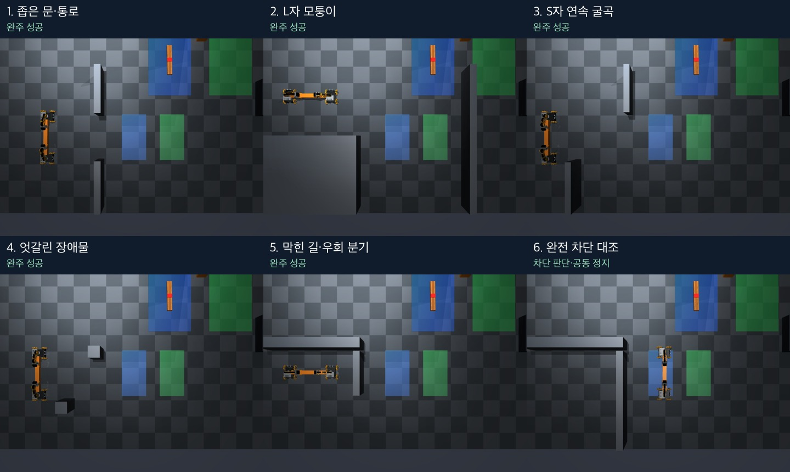

# 공동 운반: 예시 지형 5종 완주

**고정 시작 전체 비교에서 통과 가능한 5종 모두 운반·내려놓기에 성공했고, 완전 차단도 정상 정지했다.**
초기 baseline 완주 0/5 → 이전 영상 추적 후보 각각 1/5 → 이번 `robust` 5/5다.
카메라/FOV·지도·장면·물리 설정·grasp 모델·목표 도착/파지 유지 기준을 그대로 유지했다.

[전체 실제 영상 — 6조건, 4배속, 2분 11초](media/transport-robustness-demo.mp4)

## 원인과 수정

이전 S자에서 r3의 실제 방향 오차가 약 0.1도일 때 템플릿 추정은 5도로 읽었다.
2.58도 미만인 경유점 통과 기준을 계속 넘어서, 세 번째 구간에 약 100초 머물렀다.
짐 높이가 점차 내려가고 약 125초에 파지가 풀렸는데도 제어 상태는 `track`이었다.
이 실제 상태 비교는 사후 진단 전용이며 실행 입력에는 사용하지 않았다.
[진단 수치](validation/baseline-stall-diagnosis.json), [해석과 한계](validation/baseline-stall-diagnosis.md).

- 전체 바퀴 외관을 회전시켜 맞추는 추정 대신, 네 바퀴의 픽셀 군집과 사각형을 이용해
  중심·방향을 읽는다. 최초 로봇 식별 모델은 유지하고, 네 군집의 크기·거리·연속성을 검사한다.
  짧은 전진 probe는 앞뒤를 구분하고, 방향값은 바퀴 사각형에서 읽어 작은 위치 흔들림의
  각도 증폭을 줄인다.
- 로봇 사이 구역의 실제 주황색 빔 픽셀에서 긴 변을 읽는다. 부분 가림에도 중앙 빔을
  구분하며, 로봇 위치만으로 빔을 관측했다고 간주하지 않는다. 빔 픽셀이 없으면 정지한다.
- 자기 카메라에서 가까운 빔의 넓은 실루엣이 사라지거나 좁아지면 `grip_stop`으로
  공동 정지한다. 접촉을 인증하거나 놓친 짐을 다시 잡는 기능은 아니다.
- 관측된 경유점 진전이 10초간 개선되지 않거나 한 구간에서 36초가 지나면 현재 관측
  자세에서 다시 계획한다. 두 로봇의 새 경로·버전 일치 후 재개하며 최대 두 번 뒤에도
  정체하면 종료한다. 이전 버전의 허가는 재사용하지 않는다.

## 전체 물리 비교

| 지형 | 이전 `temporal-edges` | 이번 결과 | 판단 수 | 운반 SIM초 | 최소 lift | 목표 위치 오차 |
| --- | --- | --- | ---: | ---: | ---: | ---: |
| 좁은 문·통로 | 성공 | 운반·내려놓기 성공 | 449 | 90.7 | 5.61 cm | 2.37 cm |
| L자 모퉁이 | 빔 가림·복구 한도 | 운반·내려놓기 성공 | 239 | 48.7 | 6.70 cm | 3.24 cm |
| S자 굴곡 | 정체·파지 이탈·낙하 | 운반·내려놓기 성공 | 326 | 66.1 | 6.26 cm | 2.92 cm |
| 엇갈린 장애물 | 정체·파지 이탈 | 운반·내려놓기 성공 | 389 | 78.7 | 5.93 cm | 2.98 cm |
| 막힌 길·우회 분기 | 바퀴 재획득 한도 | 운반·내려놓기 성공 | 391 | 79.1 | 5.92 cm | 2.44 cm |
| 완전 차단 | 정상 정지 | 경로 없음·공동 정지 통과 | 11 | 2.1 | 7.84 cm | 도착 대상 아님 |

다섯 완주 모두 양면 파지·높이·수평 유지, 목표 위치/방향, 바닥 내려놓기를 통과했다.
목표 방향 오차는 모두 0.40도 미만이고, 전체 6조건의 벽 접촉·비허용 접촉·weld 활성은 0 tick이다.
이번 6조건에서는 영상 hold나 정체 재계획이 발동하지 않았다. 원인 수정으로 정상 진행했다.

먼저 같은 코드의 L자·S자·우회 분기 진단 3회도 모두 성공했다.
[진단 전체 기록](diagnostic/results.json), [진단 영상](diagnostic/media/transport-robustness-demo.mp4).
반복된 세 조건의 판단 수와 물리 평가값은 최종 비교와 같았다.

## 검증과 출처

- 진단/최종 실행 SHA: **`a1a6f3353a4c5b378f611267bd43c5820f776917`**.
  [사전 프로토콜](protocol.md), [코호트](cohort.json), [전체 결과](results.json),
  [CSV](results.csv), [최초 baseline 비교](comparison.json).
- impratio=10, noslip_iterations=0, weld OFF, 파지 후 8초 대기, 최대 750회 판단,
  trial당 wall 600초를 유지했다. A* 비용·지도·footprint·운동 gain·경유점 완료 오차를 바꾸지 않았다.
- 9회 모두 이전 후보와 지도·컴파일된 장면·초기 불변 설정·9개 grasp 모델 파일 해시가 일치했다.
  [조건·원본·선택 영상 검사](validation/conditions-and-artifacts.json).
- 최종 1,805회 + 진단 956회 = **2,761회 × 두 로봇 = 5,522개 판단·허가·명령**을
  실제 저장된 두 RGB 입력에서 재계산하여 모두 일치했다. 9회의 grasp 입력 감사도 통과했다.
- 기존 다섯 지형의 top RGB **2,459프레임**에서 추적 오류가 없었다. 이 재생은 변경된
  행동의 물리 실행과 구분했다. 자기 RGB 감시는 성공/파지 유지 영상에서 거부하지 않았고,
  기존 S자·엇갈린 장애물의 파지 이상을 각각 판단 627/626부터 잡았다.
  [픽셀 재생 결과](validation/geometry-replay.json).
- 실제 실패 RGB·RGB로만 만든 직전 상태를 `tests/fixtures/pair_transport_robustness/`에
  출처·해시와 함께 보존했다. 원본 영상의 픽셀 방향, 자기 카메라 낙하, 빔 픽셀 소실,
  재계획 버전·공동 정지·정체 종료를 포함해 **646 passed, 154 subtests passed**.
  [로컬 회귀 검사 로그](validation/ci-before-diagnostic.log).
- 마지막 성공 시험에서 파지 이상 감지·정체 재계획의 발동을 실제로 관찰한 것은 아니다.
  파지 이상은 기존 실제 실패 영상의 재생으로, 정체 재계획·종료는 고정 관측 회귀 검사로 검증했다.
- 각 로봇은 자기 RGB와 공용 top RGB, 사전 지도·고정 보정 정보만 사용했다. 자기 RGB를
  실제 지속 조건에 사용하며, 라이브 정답·접촉·관절·성공 평가는 제어 입력에 없다.
  외부 LLM 호출·토큰·비용은 0이다. 내려놓기는 기존 시연 명령 재생이다.
- 진단/최종 실행 wall 시간 합계는 204.7 / 427.0초다. 렌더링·입출력·동시에 수행한
  입력 재생 감사의 부하를 포함하므로 알고리즘 속도 우열의 독립 측정은 아니다.
- 두 실험 세션과 자식 프로세스를 종료했다. [시각 검토 범위](visual-review.md).

원본 **약 442 MB, 8,910개 파일**은 로컬 outputs에 보관한다.
[최종 원본 목록](raw-manifest.json), [진단 원본 목록](diagnostic/raw-manifest.json)과 압축 해시 목록을
보존했다. 선택 영상·이미지 약 8.5 MB 및 요약·검증 자료는 Git에 포함한다. 원본 전체의 원격 백업은 아니다.

## 실행과 범위

기존 공동 운반 실행기에 `--vision-mode robust --impratio 10 --budget 750`을 명시한다.
지도별 실행 예는 [maps 안내](../../maps/README.md)에 있다. CLI 기본값 `legacy`는 이전 비교 재현용으로 유지한다.

이번 결과는 **고정 시작의 예시 지형 5종**에 대한 성공이다. 더 긴 운반, 새 시작 자세·물체·조명,
완전 가림, 실물 로봇의 일반 성공률이나 최적성을 입증하지 않는다. 카메라만으로 모든 파지
상태를 판별하거나 파지 상실 후 자동으로 다시 잡는 기능을 완성한 결과로 해석하지 않는다.
