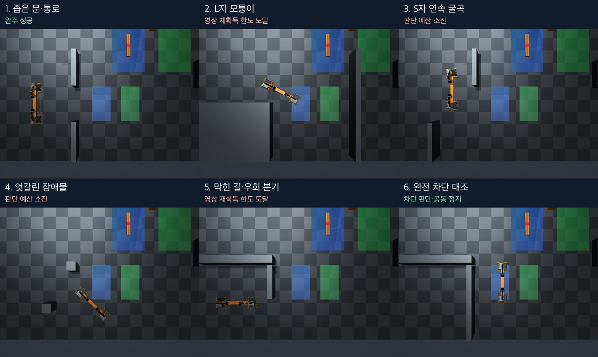

# 공동 운반 영상 추적·재획득: 구현과 두 후보 비교

**같은 고정 시작 시험에서 baseline 완주 0/5 → 새 후보 각각 1/5. 완전 차단 정지는 모두 1/1.**
좁은 문은 실제 운반·내려놓기를 완료했다. 영상 추적과 제한된 재획득은 개선됐지만,
두 번째 후보도 완주 수를 더 늘리지 못했다. 최적성·일반 성공률·모든 지형 해결을 주장하지 않는다.

[두 번째 후보 실제 영상 — 전체 6조건, 4배속, 2분 39초](media/vision-recovery-demo.mp4)

## 구현

- 초기 인식은 기존의 엄격한 빔·바퀴 조건을 유지한다. 이후 빔은 이전 선과의 거리·방향,
  보이는 길이·폭, 고정 물체 길이로 연결하고 부분적으로 보이는 영역을 추적한다.
- 바퀴는 확실한 RGB에서 얻은 외관을 로봇당 최대 4개 기억한다. 원래 외관의 점수가
  기존 0.48 기준에 미달할 때만 기억을 검사한다. 기억 점수 0.55 이상, 원래 외관 점수
  0.35 이상과 두 위치 후보의 5 px 이내 일치가 함께 필요하다. 원래 외관을 덮어쓰지 않는다.
- 빔·두 로봇이 모두 관측된 프레임만 추적 상태를 한꺼번에 갱신한다. 초기 인식 중 부분
  갱신도 실패 시 되돌린다. 불확실한 프레임이 다음 프레임의 잘못된 기준이 되는 것을 막는다.
- `vision_hold`이면 두 로봇에 zero 명령을 발행하고 경로 기준의 진행을 멈춘다.
  새 관측 3회 연속 확인 후 재개하며, 최대 25회×0.2초 안에 복구하지 못하면 종료한다.
  잘못된 카메라 파일·다른 제어 실패는 재시도 대상이 아니다.
- 두 번째 후보는 가려진 빔의 방향을 픽셀 분포의 PCA 대신 최소 외접 직사각형의 긴 변으로
  계산한다. L자 실제 실패 프레임에서 픽셀 분포가 치우쳐 생긴 방향 오차를 줄였다.

실행기 `scripts/run_pair_navigation.py`의 모드는 `legacy`, `temporal`, `temporal-edges`다.
기본값은 `legacy`이며 새 방식은 명시적 비교 옵션으로 제공한다. 이번 마지막 코호트는
`--vision-mode temporal-edges --impratio 10 --budget 750`으로 실행했다.
입력 감사는 각 기록의 모드를 그대로 다시 실행한다. 이전 모드도 보존했다.

## 같은 조건의 실제 결과

| 지형 | baseline | 첫 후보 `temporal` | 두 번째 후보 `temporal-edges` |
| --- | --- | --- | --- |
| 좁은 문 | 마지막 회전에서 바퀴 추적 중단 | 운반·내려놓기 성공 | 운반·내려놓기 성공 |
| L자 모퉁이 | 빔 형상 필터 탈락 | 빔 방향 편향으로 정렬 이탈 판정 | 더 진행했지만 빔 가림으로 재획득 제한 도달 |
| S자 굴곡 | 빔 형상 필터 탈락 | 재획득·재개 후 정체, 파지 이탈·낙하 | 같은 정체·파지 이탈·낙하 |
| 엇갈린 장애물 | 정체 후 파지 이탈·예산 소진 | 정체 후 파지 이탈·예산 소진 | 같은 정체·파지 이탈·예산 소진 |
| 막힌 길·우회 분기 | 바퀴 추적 중단 | 더 진행한 뒤 바퀴 재획득 제한 도달 | 같은 바퀴 재획득 제한 도달 |
| 완전 차단 | 경로 없음·공동 정지 | 기대 동작 통과 | 기대 동작 통과 |

각 후보는 지형별 1회이며, 이미 진단에 사용한 지형의 같은 시작 조건이다.
반복 시작·새 지형·새 카메라 조건의 일반화 검증이 아니다. 좁은 문에서 두 후보의 물리
평가값은 같았다: 목표 위치 오차 2.29 cm, 방향 오차 0.13도, 운반 구간 최소 lift 5.61 cm,
양쪽 접촉 유지·목표 도착·바닥 내려놓기를 모두 통과했다. 내려놓기는 기존 시연 명령 재생이다.

L자의 마지막 판단은 baseline 84회 → 첫 후보 92회 → 두 번째 후보 133회였다.
첫 후보의 약 147.4도 PCA 방향을 두 번째 후보는 영상 긴 변의 약 142도로 추정했다.
이후 빔이 더 가려져 충분한 영역과 기하 일관성을 연속 확인하지 못했고, 5 SIM초 복구 한도에서
정지했다. 첫 후보의 정렬 이탈 판정과 두 번째 후보의 가림 정지를 실제 파지 상실로 해석하지 않는다.
두 경우 모두 출력 전용 접촉·높이 평가는 유지됐다.

S자는 각 후보에서 실제 `vision_hold` 6회(1.2 SIM초) 뒤 재개한 사례가 1번 있었다.
그러나 이후 짐을 놓쳤고 마지막에도 제어 상태는 `track`이었다. 엇갈린 장애물도 파지 유지에 실패했다.
두 번째 후보의 S자·엇갈린 장애물은 각각 비허용 접촉 11,873 / 11,528 tick을 기록했다.
**추적이 오래 유지됐다는 사실을 안전한 운반 성공으로 세지 않는다.**

우회 분기는 판단 317회 → 374회까지 진행했으나, 마지막 바퀴 기억 점수 0.566 / 원래 외관
점수 0.469에도 두 위치 후보의 일치 조건을 만족하지 못했다. 기준을 낮춰 통과시키지 않았고
제한 시간 후 공동 정지했다. 목표 위치 오차는 34.5 cm여서 도착 성공이 아니다.

두 후보 전체 12회 모두 추가 벽 접촉 0 tick, 지도 경계 준수, weld 활성 0 tick이며,
baseline과 지도 해시·컴파일된 장면 해시·초기 불변 설정·grasp 모델 파일이 일치했다.
S자·엇갈린 장애물의 비허용 접촉을 벽 접촉 없음에 숨기지 않는다.

## 검증·조건·출처

- baseline 실행 SHA: `f4da89ec53fed15c9efcea2e8bee19b99de31dfc`.
- 첫 후보 실행 SHA: `13b1a49` — [프로토콜](protocol.md), [전체 결과](candidate-v1/results.json),
  [비교표](candidate-v1/comparison.json), [영상](candidate-v1/media/vision-recovery-demo.mp4).
- 두 번째 후보 실행 SHA: `cdac7b7e5154cdc531169a46c90732461b5ae06e` —
  [프로토콜](protocol-v2.md), [전체 결과](results.json), [비교표](comparison.json), [CSV](results.csv).
- 소스·프로토콜을 각 코호트 전에 커밋하고 실행 중 고정했다. 같은 grasp, impratio=10,
  noslip_iterations=0, weld OFF, 파지 후 8초 대기, 최대 750회 판단, wall 600초 제한이다.
  A*·운동 gain·경유점 완료 조건·지도·카메라/FOV·외관·질량·마찰·집게 힘은 변경하지 않았다.
- 12회 **4,897회×두 로봇 = 9,794개 판단·허가·발행 명령**을 실제 입력 RGB에서 재계산해
  모두 일치했다. 각 파지 입력 감사도 통과했다. [조건·파일 검사](validation/conditions-and-artifacts.json)
- legacy L자와 첫 후보 L자를 마지막 코드로 다시 감사하여 하위 호환을 확인했다.
  [이전 기록 재생](validation/backward-audits.json)
- 네 baseline 영상 전체 994프레임과 첫 후보 L자 92프레임의 새 감지기 재생이 통과했다.
  baseline이 유효한 프레임에서 로봇 위치 추정 차이는 0이었다. 재생은 변경된 행동의
  실제 궤적 검증과 구분한다. [픽셀 재생](validation/edge-rgb-replay.json)
- 실제 실패 프레임과 RGB로만 생성한 직전 추적 상태를 `tests/fixtures/pair_navigation_recovery/`에
  저장했다. 원본 경로·SHA와 픽셀에서 검토한 바퀴 중심·빔 방향을 기록했다.
  최종 코드 회귀 검사: **633 passed, 154 subtests passed**.
  [검사 로그](validation/ci-v2-before-trials.log)
- 고전 영상 추적과 A* 제어 비교다. 외부 LLM 호출·토큰 비용은 0이며 LLM 협업 평가가 아니다.
  자기 RGB는 아직 유효성 검사에만 쓰인다. 실제 접촉·높이·정답 상태는 평가 출력에만 있다.
- 첫 후보/두 번째 후보의 전체 실행 wall 시간은 553.3 / 577.0초였다. 렌더링·입출력·동시에
  실행한 읽기 전용 입력 감사의 부하를 포함하므로 알고리즘 속도 우열의 근거로 쓰지 않는다.
- 두 실험 세션과 자식 프로세스는 종료했다. 시각 검토 범위는 [visual-review.md](visual-review.md)에 있다.

원본 약 **765 MB**는 두 로컬 `outputs/pair-vision-recovery*-2026-09-14/` 폴더에 보관한다.
[첫 후보 원본 목록](candidate-v1/raw-manifest.json), [두 번째 후보 원본 목록](raw-manifest.json)과
각 `raw-hashes.jsonl.gz`에 파일별 해시가 있다. 선택 영상·이미지 약 11.4 MB와 요약·검증 자료는
Git에 저장한다. 원본 전체의 원격 백업은 아니다.

현재 다음 과제는 빔이 심하게 가려진 경우의 관측 개선, 경유점 정체 처리와 영상 기반 파지
상실 감지다. 이번 변경은 영상 추적·제한된 재획득의 첫 구현이며 이 나머지 문제는 해결하지 않았다.
