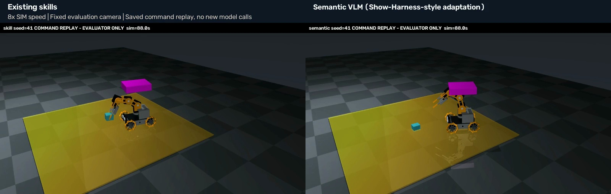

# 기존 action 스킬 vs Show-Harness식 세부 제어: 실제 비교 결과

동일한 세 장면에서 기존 스킬 방식은 **3/3**, 이번 MasterPi용 세부 제어 적용판은 **0/3**으로 파지 기준을 통과했다. 현재 연구의 기본 제어는 기존 스킬을 유지하는 편이 이 실험의 성공률과 모델 호출 수에 유리했다.

이는 로봇 한 대의 접근·파지·들기 파일럿이다. Show-Harness 원 논문 전체 구현, 학습된 정책, 공동 운반 성능을 재현하거나 평가한 결과는 아니다.

## 결과

| 장면 seed | 기존 스킬 | 세부 제어 적용판 | 모델 호출: 기존 / 세부 | 최대 상승: 기존 / 세부 |
|---|---|---|---:|---:|
| 41 | 성공, 마지막까지 34.0초 hold | 실패 | 2 / 30 | 6.78cm / 약 0cm |
| 42 | 성공, 마지막까지 35.4초 hold | 실패 | 2 / 30 | 6.79cm / 약 0cm |
| 43 | 성공, 마지막까지 84.0초 hold | 실패 | 2 / 30 | 6.82cm / 약 0cm |

성공 기준은 상자가 초기 높이보다 4cm 이상 올라간 상태에서 양쪽 손가락 접촉과 인위적 부착 제약 OFF가 2초 이상 연속 유지되는 것이다. 사전 프로토콜의 “endpoint”라는 표현은 정확하지 않았다. 실제 구현은 에피소드 중 이 사건의 발생을 판정하며, 이번 기존 방식의 세 성공은 별도 확인 결과 **종료 시점에도** 해당 상태를 유지했다.

| 합계·평균 | 기존 스킬 | 세부 제어 적용판 |
|---|---:|---:|
| 모델 호출 합계 | 6 | 90 |
| 보고된 입력 토큰 | 14,166 | 229,081 |
| 보고된 출력 토큰 | 231 | 4,039 |
| 공급자가 보고한 total tokens | 14,780 | 247,901 |
| 평균 실행 wall time | 71.3초 | 153.7초 |
| 실행된 매크로 수 합계 | 508 | 90 |
| 거절되어 wait로 바뀐 명령 | 0 | 38 |

두 조건 모두 `gemini-3.8-flash`를 요청했고 모든 응답이 같은 모델명을 반환했다. 공급자 total tokens는 입력+출력 합계와 다르므로 그대로 분리해 기록했다. 실제 청구 금액은 제공되지 않아 계산하지 않았다. 시간은 로컬 렌더링·물리 계산·모델 지연을 포함한 관측값이며, 통계적으로 통제된 속도 벤치마크가 아니다.

## 무엇이 달랐나

기존 방식은 매번 `approach → pick`을 선택했다. 스킬 내부의 기존 RGB 인식, 기하 계산, IK, 시각 검증이 여러 세부 동작을 이어서 수행했다.

세부 방식은 정적 명령 해석기를 통해 1cm의 목표 이동, 5도 목표 회전, 바퀴 이동, 집게 열기·닫기 등을 선택했다. 세 장면 모두 **`GRASP`를 한 번도 선택하지 못했다**. seed 41은 도달 불가능한 pitch 명령을 13번, seed 42는 도달 불가능한 이동을 2번, seed 43은 전진 이동을 23번 선택했다. 나머지 호출도 접근과 팔 조정에 사용되었다. 목표 이동량은 발행 명령에서 계산한 기구학 기준이며, 매번 실제 끝단이 정확히 그만큼 움직였다는 보장은 아니다.

이번 적용판은 거절 사유를 모델에 돌려주지 않고 최근 네 개의 수락된 자기 행동만 기억한다. 그래서 같은 도달 불가능 명령을 반복하기 쉽다. 이 실패는 모델 단독 능력과 함께 **현재 명령 해석기·기억·피드백 설계의 제한**을 반영한다.

## 비교 조건과 해석 범위

- 세 seed는 동일한 기존 `camera_team` 장면 생성기를 사용했다. 각 쌍의 초기 qpos·카메라·geometry hash와 첫 own/top JPEG 바이트가 동일하다.
- 양 모델의 입력은 실제 위치를 유지한 자기 wrist RGB와 기존 공용 top RGB, 고정 설명, 최근 네 자기 행동이다. 기존 top 시야는 r1의 파지 영역을 충분히 보여 주지 않는다. 이를 유리하게 바꾸지 않았다.
- 기존 transport planner의 nav-camera/state prompt를 공통 두 이미지 프롬프트로 바꾼 비교용 baseline이다. 원래 스킬 구현은 보존했고, 양쪽에 같은 actuator executor·settle 설정을 적용했다. nav-camera drive guard는 양쪽 모두 사용하지 않았다.
- 모델당 최대 30회, 120 SIM초, 보고된 입력 180,000토큰의 중단 기준이다. 물리는 모델 응답을 기다리는 동안 양쪽 모두 정지했다. 세부 방식은 9.2~13.5 SIM초에 마지막 모델 호출을 하고 예산 소진 후 남은 시간을 기다렸다.
- **동일 호출 상한은 동일한 물리 작업량이 아니다.** 기존 스킬 한 번에는 다수의 자동 단계가 포함된다. 이 결과로 의미 행동 표현 자체가 열등하다고 주장할 수 없다.
- 기존 스킬은 자체 RGB 검사로 `carrying` 또는 실패에 도달하면 추가 모델 결정을 멈춘다. 세부 방식은 별도 성공 검출기가 없어 예산까지 계속 선택한다. `check_grip`은 이 축소 실행 흐름에서 실질적으로 도달할 상태가 없었으며 선택된 적도 없다.
- 별도 학습·LoRA·상태 플러그인·행동 chunking을 사용하지 않았다. 다음 비교 후보는 자기 명령 이력으로 계산한 실행 가능 행동 제한과 거절 이력 전달, 더 긴 호출 예산이다. 이번 평가 seed에 맞춘 튜닝이나 성공 사례 교체는 하지 않았다.
- 세 장면의 결과만으로 새로운 환경의 일반 성공률, 실제 로봇 성공, 두 로봇 협업 성능을 주장하지 않는다.

## 검증과 영상

실제 96개 요청을 저장된 원본 이미지와 행동 이력으로 재구성했으며, 추가 상태가 없다는 입력 감사를 통과했다. 여섯 raw referee 로그의 독립 재채점도 저장된 판정과 일치했다. 대상 상자의 r1/r2/r3 warehouse weld는 21,618개 기록된 flag 모두 OFF다.

모델에게 주어진 시야만으로는 상자의 외부 지지를 완전히 배제하기 어려워, 성공 세 건과 seed 41의 실패 한 건을 **저장된 actuator 명령만으로 평가용 재생**했다. 새 모델 호출이나 정답 기반 보정은 없었다. 재생은 원래 상자 궤적과 최대 약 `5.32e-10 m` 오차로 일치했고, actor 카메라와 geometry는 그대로였다. 별도의 고정 평가 카메라는 모델 입력으로 전달되지 않았다.

성공 재생의 연속 hold 구간 전체에서 접촉 상대가 양쪽 손가락뿐임을 확인했다. 바닥·차체·다른 물체의 지지 접촉은 없었다. 영상의 초기·접근·들기·유지 장면을 표본으로 확인했으며, 정확한 시점과 범위는 [시각 검토 기록](visual-review.json), 전체 접촉·해시 검증은 [지지 검토](support-review.json)에 남겼다. 아래 비교 영상은 재생 영상이며, 새로운 모델 성공 시행으로 세지 않는다.

[seed 41 비교 영상, SIM 시간 8배속](comparison-seed41-8x.mp4)



자동 검증: portable suite **424 tests + 157 subtests 통과**. 최초 개발 과정의 constraint 기록 오류, JSON fence 형식 오류 및 수정 후 확인도 [개발 기록](development-record.json)에 보존했다. 본 평가 여섯 실행에는 모델/runner/cleanup 오류가 없다.

## 재현과 보관

- 본 평가 실행 코드: `c692d5c45138e3e77157dd2854b80449a3f0f5b1`.
- 평가용 재생 코드: `42e448b` 이후의 `scripts/replay_pick_match.py`; 정확한 SHA와 source hash는 replay 결과에 기록된다.
- 순서: skill-41, semantic-41, semantic-42, skill-42, skill-43, semantic-43. 각 실행에서 source SHA를 고정했다.
- [사전 프로토콜](protocol.md), [전체 결과](results.json), [환경](environment.json), [입력 감사](input-audit.json), [독립 재채점](independent-rescore.json), [원본 위치·해시](raw-manifest.json), [모델 응답](calls/), [재생 결과](replay/), [재생 원본 위치·해시](replay-manifest.json).
- 원본 영상·wire 이미지·세부 로그는 이 작업 트리의 `outputs/pick-match-cohort-v1/`와 `outputs/pick-match-replay-v1/`에 **로컬 보관**한다. Git에는 코드·설정·결과·해시·선별된 영상과 검토 증거를 보존하며 원본 전체의 원격 백업으로 표현하지 않는다. Google Drive는 사용하지 않는다.

본 평가 재현에는 지정 SHA를 별도 checkout하고 접근 가능한 본인 모델 프록시를 설정한 뒤, 새 출력 이름으로 다음과 같이 실행한다. 모델 응답은 달라질 수 있다.

```sh
python scripts/ugrp_session.py run pick-match-example -- \
  python -m scripts.run_pick_match --condition skill --seed 41 \
  --output outputs/pick-match-example-NEW
```

관련 설계: PR #41. 원 자료: [Show-Harness 논문](https://arxiv.org/html/2609.10522v1), [공식 저장소](https://github.com/showlab/Show-Harness).
