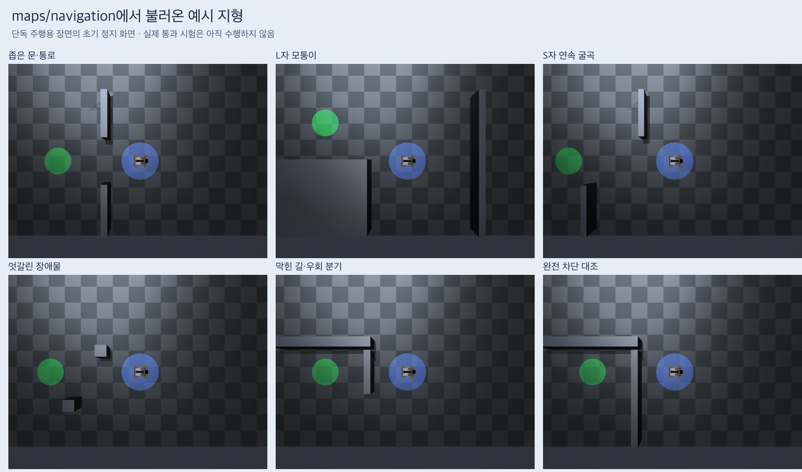

# 예시 지형을 실행용 maps에 등록

[지도 목록과 실행 명령](../../maps/README.md)에 예시 지형 6개를 추가했다.
기존 `maps/navigation`에서는 단독 주행용으로, `maps/pair_navigation`에서는
공동 운반용으로 불러올 수 있다. 기존 open/slalom/narrow와 원본 예시 파일은 보존했다.
갤러리 기본 카탈로그도 실험 폴더에서 `maps/pair_navigation/catalog.json`으로 연결했다.

## 검증 결과

실행 소스는 `045ba7d9b5310290323c931d98da8e06fadacfe6`이다.
정확한 SHA와 모든 파일 출처는 [검증 기록](verification.json)에 있다.

| 확인 항목 | 결과 |
| --- | --- |
| 공동 운반용 지도 6개 | 기존 예시와 파일 내용이 바이트 단위로 일치 |
| 단독 주행용 지도 6개 | 기존 스키마 로더 통과, 같은 벽·경계·카메라·시작 구역·목표 중심 |
| 두 경로의 컴파일된 벽 | 지도 위치·크기·높이와 일치 |
| 기존 지도 3개 | 내용 변경 없음 |
| 단독 주행 계산 경로 | 5개 존재, 완전 차단 대조는 없음 |
| 공동 하중 계산 경로 | 5개 지형 각각 주변 시작 9/9 존재, 완전 차단은 0/9 |
| 단독 주행 렌더 | 6개 장면 모두 로딩 성공, 초기 벽 접촉 없음, weld OFF |
| 공동 운반 렌더 | 기준 1개와 지형 6개 성공, 기존 예시와 지도·XML·카메라·형상 동일 |
| 회귀 검사 | 지도 스키마·단독 항법·heading·공동 항법 64 passed |

단독 주행용은 기존 반경 0.18 m + 여유 0.04 m, 2.5 cm 격자, 목표 반경 0.18 m를
사용한다. 공동 운반용은 기존 전체 하중 footprint와 목표 yaw를 그대로 유지한다.
두 형식의 의미가 다르므로 같은 지형이라고 동일 경로·동일 난이도를 주장하지 않는다.

직접 검토한 범위는 새 단독 주행 top 정지 화면 6개와 공동 운반 top 정지 화면 6개다.
단독 장면의 파란 원과 초록 원은 각각 새 지도의 시작·목표 구역이다. 공동 장면은
기존 창고 물체와 바닥 표시를 보존하며 해당 지형 목표는 도면 G와 지도 JSON을 따른다.
기존 단독 장면 실행기는 원래부터 창고 작업 물체를 숨기고 지도를 구성하는 경로이며,
이번에 그 장면 규칙이나 로봇·카메라를 수정하지 않았다.

두 확인 작업은 초기 정지 장면만 만들었다. 실제 주행·파지·운반 명령과 LLM 호출은
모두 0회이며 모델 비용은 $0이다. 따라서 실제 통과 성공률은 아직 없다.
환경과 생성 시간은 아래 각 원본 기록에 있다. 세션 2개와 소유 프로세스 종료를 확인했다.

## 기록과 원본

- [단독 지도 로딩과 렌더 기록](unloaded-preview/registration-record.json)
- [공동 지도 로딩과 렌더 기록](pair-registration-record.json)
- [원본 위치·파일 출처·회귀 검사·세션 종료](verification.json)
- [실행 전 프로토콜](protocol.md)

단독 원본 `outputs/terrain-registration/solo-final-01`은 `unloaded-preview/`에
전체 복사하고 파일 해시를 확인했다. 공동 원본은 `outputs/terrain-registration/pair-final-01`에
있다. 그 67개 파일 중 62개는 이미 Git에 보관한 기존 예시 갤러리와 바이트 단위로 같아
중복 저장하지 않았다. 정지 JPEG·도면·컴파일 XML은 모두 여기에 해당한다.
해시가 다른 단일 프레임 MP4 5개는 `pair-preview-differences/`에 별도 보관했다.
`verification.json`의 `pair_archived_file_sources`는 새 렌더 manifest의 각 원본이
저장소 어디에 있는지 연결한다. 새 결과 기록 자체도 이 폴더에 보관했다.

개발 중 형식 검사 결과 `outputs/terrain-registration/design-check-01`은 로컬에만 있다.
새 주행 시험은 `maps/` 파일과 소스 SHA를 고정한 별도 실행으로 진행한다.
