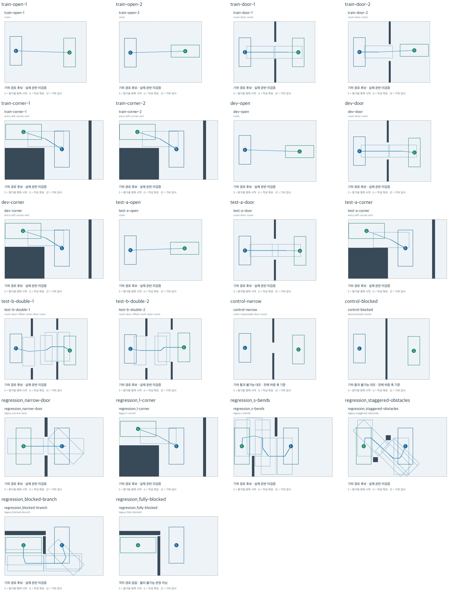
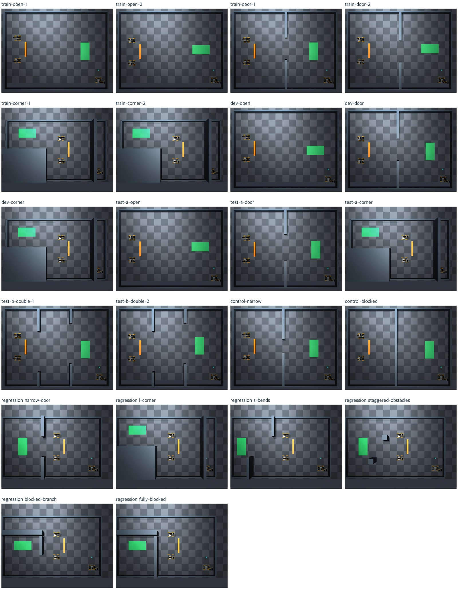
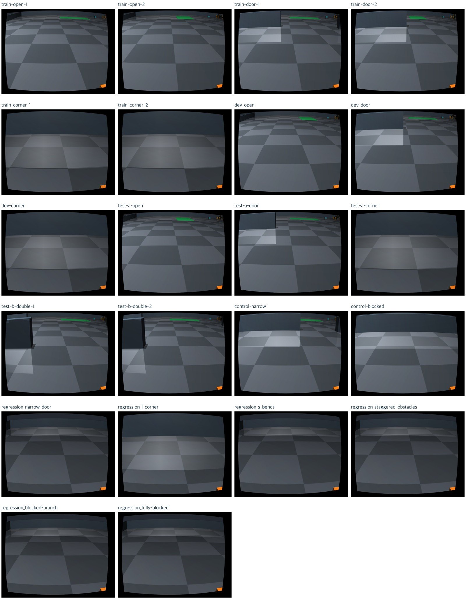

# ACT 맵·프로토콜 v1 정적 검토

작업 A의 재현 가능한 맵 생성·로딩, 학습/개발/시험 분할, 전체 하중 기하 검사,
실제 MuJoCo 카메라 미리보기와 평가 프로토콜을 구현했다.
**정적 검토 결과이며 교사/학생 운반 성공률이 아니다.**

## 고정 소스와 실행

- 기준 main: `7855e1a9991daa31ab42766b47be4dfb5c42eb4b`
- 계획 문서: `ac20cb2` (PR #70)
- 첫 진단: `26a450c95a2dc9138644efc1082d5a4b8e63f8c4`
- 최종 실행 소스: `16f7fe2e775868d70c8dc5ca6b37254c5d0e496b`
- 맵 설정: [suite_v1.json](../../maps/act_generalization/suite_v1.json)
- 분할·기하·과제 해시: [manifest.json](manifest.json)
- 환경: [environment.json](environment.json)
- 평가 설계: [protocol.json](protocol.json), 현재 `pilot_design`

```sh
.venv-sim-worker-mac/bin/python scripts/ugrp_session.py run act-map-preview-v2 -- \
  .venv-sim-worker-mac/bin/mjpython scripts/prepare_act_map_suite.py \
  --render --output outputs/act-map-preview-20260920-v2
```

소스와 설정을 커밋한 뒤 깨끗한 트리에서 전체 22개를 실행했다. 도중 소스를 변경하지 않았다.
이 명령은 기존 디렉터리를 덮어쓰지 않으므로 재현할 때 새 출력 이름을 사용한다.

## 결과

| 집합 | 지도 수 | 기하 경로 후보 | 경로 없음 | 정적 렌더 |
| --- | ---: | ---: | ---: | ---: |
| 학습 | 6 | 6 | 0 | 6/6 |
| 개발 | 3 | 3 | 0 | 3/3 |
| 시험 A | 3 | 3 | 0 | 3/3 |
| 시험 B | 2 | 2 | 0 | 2/2 |
| 새 불가능 대조 | 2 | 0 | 2 | 2/2 |
| 기존 회귀 | 6 | 5 | 1 | 6/6 |

전체 22개에서 지도·경계의 컴파일된 충돌 형상과 목표 표시를 확인했다.
초기 장애물 접촉 0개, weld 활성 0개다. 세 로봇 XML, 봉 XML, 네 정책 카메라 설정은
각각 22개 장면에서 동일한 해시/값을 유지했다. 저장된 22개 지도·학생 과제를
`load_prepared_map`으로 다시 읽어 manifest 해시 일치도 확인했다.

새 맵 16개는 장애물 윗면 전체가 기존 TOP frustum 안에 들어온다.
기존 회귀 6개는 원래 지도를 유지해 일부 높은 벽/추가 경계 벽의 윗면이 시야 밖에
있는 한계를 별도 표시했다. 이를 카메라/FOV 변경으로 숨기지 않았다.
새 코너 4개는 지형을 동쪽 14cm로 평행 이동해 해결했다.

전체 소요 시간 14.29초, 외부 모델 호출 0, API 비용 $0, 운반 시도 0이다.
이는 데이터 생성/정적 렌더 시간이며 운반 완료 시간이나 추론 성능이 아니다.
각 장면은 기존 접힌 팔 초기화만 진행했고 실제 들기·이동·방출 정책은 실행하지 않았다.
두 physics seed 중 정적 미리보기에는 11만 사용했다. seed 29 실행 또는 학습 seed 반복을
완료했다고 주장하지 않는다.

- 최종 요약: [summary.json](summary.json)
- 모든 지도별 기하·렌더·시간·제약: [results.json](results.json)
- 자동 검증: [offline-regressions.txt](offline-regressions.txt) — 1010 passed, 1 skipped, 184 subtests
- 신규 입력 경계/분할/해시/장면/시야/평가 게이트 테스트 22개 통과
- 작업 세션 `act-map-preview-v1`, `act-map-preview-v2` 모두 종료. 관련 자식 프로세스 없음 확인.

## 시각 검토 범위

22개 도면, 22개 TOP, 22개 r1 자기 시점의 축소 갤러리를 직접 확인했다.
새 코너 r3 원본 영상도 확인했다. 목표는 방향에 맞는 초록 바닥 영역이고,
장애물/분기/차단의 배치가 도면에 대응한다. 자기 시점에는 접힌 팔 초기화에서
바닥과 전방 벽이 주로 보인다. 집게나 화물이 항상 보이는 입력이라고 주장하지 않는다.
TOP/자기 카메라를 바꾸지 않았고, 배포 시 가림·파지·이동 중 영상 인식은 별도 검증이 필요하다.
r2/r3 전 원본은 저장했지만 모두 개별 확대 검토한 것은 아니다.





## 진단과 한계

첫 실행에서는 기존 지도의 높은 벽과 경계까지 모두 완전한 TOP 시야에 들어온다고
요구한 검사에서 새 코너 4개·기존 회귀 6개의 위반을 발견했다.
[첫 진단 요약](diagnostics/v1-summary.json), [전체 결과](diagnostics/v1-results.json),
[당시 분할·해시](diagnostics/v1-manifest.json)를 보존했다.
새 맵은 위치를 수정하고, 역사적 회귀 지도는 원형을 유지하면서 시야 한계를 드러냈다.
이후 최종 소스를 다시 커밋하고 전체 22개를 재검토했다.

기하 경로 19개가 실제 통과 가능함을 입증한 것은 아니다. 새 대조 두 개는
경계를 가로지르는 40cm/0cm 문이 전체 하중 최소 폭 45cm보다 좁다는 근거도 기록한다.
기존 완전 차단은 이번 검사에서는 격자 경로 없음으로 기록하며 별도 수학적 증명을 추가하지 않았다.
교사 통과, 실제 하중 유지, 낙하·충돌·방출 및 일반화 성능은 모두 미실행이다.

현재 새 맵은 정적 지도/과제 로딩과 production 장면 미리보기까지 연결했다.
기존 north/south ACT 및 dispatch 실행기를 새 경로에 연결하는 일은 남아 있다.
평가 수치와 모델 seed는 train/dev 교사 파일럿 후 고정한다. 시험 A/B에는
정적 검토만 했고 교사/학생 rollout을 하지 않았다. 협업 사건은 none만 활성화했다.

## 저장 위치

원본은 `/Users/changmin/projects/ugrp/outputs/act-map-preview-20260920-v1` 및
`/Users/changmin/projects/ugrp/outputs/act-map-preview-20260920-v2`에 로컬 보관한다.
각각 지도·학생 과제·setup/evaluation 전용 JSON·scene XML·TOP/자기/관찰자 영상,
전체 해시를 포함한다. [artifact-manifest.json](artifact-manifest.json)에 절대 경로와
원본 파일별 SHA-256을 기록했다. 이 해시와 요약/갤러리의 Git 보관은 raw 원본의
원격 백업이 아니다. Drive를 사용하지 않았다.
