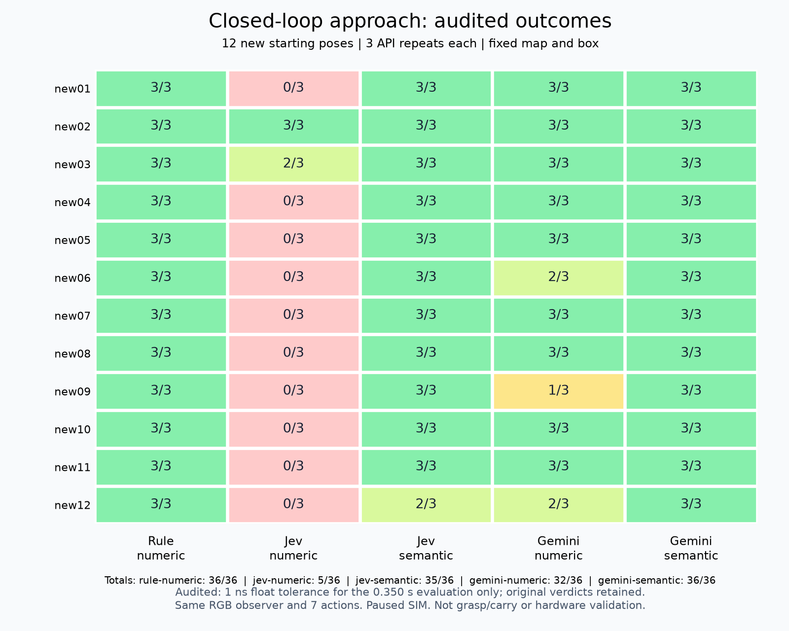

# Jev 의미 상태의 폐루프 검증 — 2026-09-21

새 시작 자세 12개 × 3반복의 실제 RGB 폐루프 접근에서 Jev는 숫자 입력 5/36회에서 의미 입력 35/36회로 개선됐다. 두 건의 출력 전용 시간 반올림 오류를 보정한 수치이며, 고정 실행기의 원판정은 33/36회다. Gemini도 32/36 → 36/36회로 개선됐다. 규칙 제어는 36/36회였다.

의미 입력은 거리·각도의 관계를 코드로 계산하고, 원래 수치·영상 통계 필드를 범주로 축약하며 질문 문구도 맞춘 구성이다. **표현과 문구의 결합 효과**이며, Jev가 더 정교한 수치 제어를 학습했거나 규칙보다 뛰어나다는 증거가 아니다. 이번 범위는 같은 맵·같은 물체에서 단일 로봇의 접근과 정렬이다.

## 완료 결과

| 조건 | 새 자세 원판정 | 시간 오차 검산 후 | 기존 3자세 회귀 |
|---|---:|---:|---:|
| 규칙 | 36/36 | 36/36 | 3/3 |
| Jev 숫자 | 5/36 | 5/36 | 0/3 |
| Jev 의미 | 33/36 | 35/36 | 3/3 |
| Gemini 숫자 | 32/36 | 32/36 | 3/3 |
| Gemini 의미 | 36/36 | 36/36 | 3/3 |

실행 소스는 `3d45a71c3553f3c2c9b6fb754adf9b541992a63a`. 사전에 고정한 195회를 빠짐없이 완료했고 네 워커는 모두 exit 0으로 종료했다. 실행 중 소스·문구·자세·동작·판정 기준을 변경하거나 실패 조건을 재시도하지 않았다. 36회는 서로 독립적인 36개 배치가 아니라 **12개 동일 초기 물리 상태의 API 3반복**이다.

원판정 도표는 [별도 보존](success-matrix-original.png)한다. [report.json](report.json)의 `success`와 `summary.*.*.successes`는 원판정, `audited_success`와 `audited_successes`는 아래 수치 검산이다.

## 실패 원인과 남은 한계

- Jev 숫자: 새 자세에서 바퀴 영상 추적 상실 22회, 70단계 제한 9회. 1,456개 모델 행동 중 표적 반대 방향 회전은 660개였다. 추적기는 제한된 방향의 바퀴 모양만 처리하므로 이 결과에는 모델 선택과 공통 관측기의 제한이 함께 작용한다.
- Jev 의미: 실제 제어 실패는 `new12-r0` 한 번이다. 목표 근처에서 오른쪽 표적에 왼쪽 회전을 선택하는 등 좌우/후진을 반복해 세 번의 RGB 정지 확인을 마치지 못했다. 마지막 물리 거리·방위는 충족했지만 완료 선언 조건을 못 맞췄으므로 실패로 유지한다. 1,684개 모델 행동 중 반대 회전 46개가 남았다. 나머지 11개 새 자세는 3/3, `new12`는 2/3회다.
- Gemini 숫자: `new06-r0`, `new09-r1/r2`, `new12-r1`에서 RGB 거리 0.2676–0.2684m로 하한 0.27m를 벗어난 채 정지를 반복했다. 네 번 모두 출력 전용 물리 위치 기준은 충족했지만 RGB 완료 기준을 못 맞춰 실패다. Gemini도 정밀 경계 해석에 항상 성공하는 것은 아니다.
- Gemini 의미와 규칙: 새 자세에서 모두 36/36회. 의미 입력 Jev의 개선은 확인했지만, 이 단순 과제에서 모델 호출의 필요성이나 최적 행동 공간을 입증하지는 못했다.

반대 회전 횟수·규칙 일치도는 사후 설명 지표다. 각 정책의 궤적과 관측 분포가 다르며, 유일한 최적 행동의 정답률로 해석하지 않는다. `stop`이 관성 안정화에 도움이 되는 경우도 있으므로 목표 밖 정지를 모두 잘못된 행동으로 세지 않는다.

## 출력 평가기의 시간 반올림 오류

`new-new09-r0-jev-semantic`, `new-new09-r2-jev-semantic` 두 실행은 RGB 완료·물리 거리/각도·무접촉·weld OFF·카메라 불변을 모두 충족했다. 하지만 마지막 평가 구간의 시간 차가 `18.050000000000875 - 17.70000000000107 = 0.349999999999806`으로 저장되어 `>= 0.35`에서 실패했다.

코호트가 완전히 종료된 뒤 별도 수정 커밋 `3f14253`에서 출력 전용 평가기에 **1ns 절대 수치 오차 허용**을 추가하고, 같은 수정으로 195회 전체를 재평가했다. 2ms 물리 간격보다 훨씬 작은 부동소수점 처리이며 0.35초라는 안정 시간, 거리·각도·접촉·RGB 완료 기준은 그대로다. 실제 0.348초는 계속 실패하는 회귀검사를 추가했다. 원본 결과 파일을 덮어쓰지 않았고, 요청·명령·주행을 다시 생성하지 않았다. 이 수정은 제어·단계 전환·정지에 사용되지 않는다.

## 시간·행동·사용량

| 조건 | 명령 수 합계 | 성공 시 명령 중앙값 | API 호출 | 입력/출력 토큰 | API p50 / p95 | 에피소드 평균 벽시계 / SIM 초 |
|---|---:|---:|---:|---:|---:|---:|
| 규칙 | 1,971 | 55 | 0 | 0 / 0 | 해당 없음 | 30.8 / 15.7 |
| Jev 숫자 | 1,705 | 35 | 1,456 | 1,241,546 / 101,413 | 0.549 / 0.635초 | 49.8 / 13.6 |
| Jev 의미 | 2,047 | 58 | 1,684 | 1,469,065 / 116,579 | 0.544 / 0.624초 | 56.9 / 16.3 |
| Gemini 숫자 | 2,025 | 54 | 1,667 | 877,940 / 17,822 | 1.979 / 5.141초 | 150.4 / 16.1 |
| Gemini 의미 | 1,965 | 55 | 1,602 | 831,474 / 17,911 | 1.850 / 4.094초 | 129.8 / 15.7 |

명령 수에는 여섯 번의 자기 식별 전진과 종료 정지도 포함된다. 실패가 빨리 끝난 정책의 전체 명령 수가 적다고 효율적이라고 해석하지 않는다. 성공 조건만의 중앙값도 선택된 서로 다른 성공 집합이라 직접적인 우열 근거가 아니다. 토큰은 각 제공자의 응답 usage이며 실제 청구 금액은 `null`이다. 4워커의 서비스/CPU 경합이 있는 벽시계이고 SIM은 추론 중 멈추므로 실시간 제어 성능 또는 이전 직렬 코호트와의 시간 우위로 보고하지 않는다.

## 입력 경계와 검증 자료

- 실제 저장 RGB에서 자기 식별과 관측을 재구성했다. 9,115개 행동의 관측·허용 필드 상태·요청·응답·실제 선택을 재검산했고, 18,230개의 제어 입력 이미지 해시가 일치했다. 같은 시작 자세의 첫 두 카메라 이미지 쌍도 모든 정책/반복에서 동일했다.
- 입력은 같은 고전 영상 관측기에서 나온 RGB 추정치와 자기 발행 명령 이력이다. Jev/Gemini에 원본 영상을 직접 해석시킨 비교가 아니다. 정적 카메라 보정 외에 실제 좌표·측정 관절·접촉·평가 결과를 제어에 넣지 않았다.
- RGB 완료 확인은 모든 정책에 공통인 코드가 처리했다. Jev가 독립적으로 작업 완료를 판정했다는 증거가 아니다. 모든 실행의 접촉·weld 카운터는 0이며 카메라/FOV/외관 조건은 유지됐다.
- 출력 전용 실제 위치 기록으로 원판정과 시간 오차 검산 성공을 모두 다시 계산했다. 원본 195개 동영상은 전체 디코딩을 통과했다. 비교 영상은 12개 새 자세의 반복 0만 보여주며 전체 반복의 지표는 표/JSON으로 공개한다.
- [protocol.json](protocol.json), 환경 4개, [압축 행동/요청 기록](turns.json.gz), [원본 해시 manifest](raw-manifest.json.gz), [영상 검증](raw-video-verification.json)을 보존했다. 전체 원본은 63,010개 파일, 약 3.65GB이며 로컬 전용이다. Git에 올린 해시는 원본의 원격 백업이 아니다.

로컬 원본: `/Users/changmin/projects/ugrp/outputs/jev-semantic-motion-20260921-v1`

로컬 비교 영상: `/Users/changmin/projects/ugrp/outputs/jev-semantic-motion-review-20260921/comparison.mp4`

## 연구 방향 판단

의미 있는 상태를 제공하는 방향은 채택할 근거가 있다. 다만 단순 접근은 규칙도 36/36회이며 Jev 의미 입력에는 반대 회전과 목표 근처 진동이 남았다. 다음 검증은 같은 의미 입력에서 **기존 고정 7동작과 영상 피드백으로 중단할 수 있는 coarse/fine 동작 구간**을 비교하는 것이다. 동작 크기는 별도 개발 조건의 RGB 변화로 정하고 새 평가 조건을 고정한다. 이번 12개 자세는 이제 회귀 자료다.

이후 차단·가림·후퇴·양보·파트너 변경처럼 규칙만으로 해결하기 어려운 선택에서 Jev의 기여를 검증한다. 파지·운반·다물체 계획·새 맵 구조·실물·SIM 연속 시간 실행은 이번에 검증하지 않았다. [설계 검토](../../docs/jev_control_design_review.md)의 다음 단계와 연결한다.

## 완료 검증

전체 `python -m pytest -q`: **2,243 passed, 4 skipped, 229 subtests passed**. 시간 반올림 회귀검사 두 개를 포함한다. 비교 영상도 전체 디코딩을 통과했고, 네 페이지 각각의 시작·중간·종료 프레임 12장과 두 결과 도표를 시각 검토했다. 195개 영상을 모두 사람이 끝까지 본 검토는 아니다. [검증 기록](verification.json), [테스트 로그](offline-tests.txt)에 범위와 해시를 남겼다.

## 사전 고정 프로토콜

- 새 시작 자세 12개 × 3회 × 5정책 = 180회. 기존 3자세 × 1회 × 5정책 = 회귀 15회. 총 195회. 정확한 시작 위치/방위와 무작위 실행 순서(seed 210921)는 `scripts/run_jev_semantic_cohort.py`에 고정한다. 같은 맵·물체의 새 시작 자세이며 새 지형 일반화가 아니다.
- 다섯 조건: 규칙, Jev 숫자, Jev 의미, Gemini 숫자, Gemini 의미. 각각 `jev-1.13.0`, `gemini-3.8-flash`. 세 반복은 같은 물리 초기 조건에서 원격 모델을 새로 호출하며 36개 독립적인 시작 조건이 아니다.
- 의미 입력은 이전 72회 진단의 B 구성을 그대로 재사용한다. 거리·각도의 관계와 완료 여부를 허용된 RGB 추정값으로 계산하며 표현에 맞는 질문을 사용한다. 명시적인 동작별 정답 조건(C)은 사용하지 않는다. 상태와 문구 변화의 결합 효과를 측정한다.
- 기존 RGB 관측기, 고정 카메라/FOV/외관, 여섯 번의 자기 식별 전진, 일곱 0.2초 동작, 0.05초 정지 간격, RGB 완료 범위와 3회 확인, 별도 물리 판정은 변경하지 않는다. weld OFF. 정답·관절·접촉·평가가 제어/전환/종료를 보정하지 않는다.
- 에피소드마다 최대 70개 정책 단계, 입력 180k 토큰, 실제 360초, API 요청 30초. 오류를 자동 재시도하지 않는다. 4개의 독립 MuJoCo 프로세스가 고정된 순서를 분담한다. 서비스/CPU 경합이 있으므로 이전 직렬 실행과 시간 우위를 비교하지 않는다. SIM은 추론 중 멈춘다.
- 모든 시도를 분모에 넣는다. 관측기 초기화/추적 실패도 제외하지 않는다. 결과를 보고 자세·문구·동작·임계값을 바꾸지 않는다. 이전 개발/회귀와 새 조건을 합산하지 않는다.
- 원본 RGB·실제 요청/응답·행동·별도 평가·영상·환경·소스 SHA를 보존한다. 원시 파일은 로컬 전용이며 결과/압축 기록/해시는 Git에 남긴다. 실제 청구액은 확인하지 않으면 null이다.

## 실행

`python scripts/ugrp_session.py run jev-semantic-cohort -- python scripts/run_jev_semantic_cohort.py --execute --mjpython /absolute/path/to/mjpython --output /new/output`

키는 숨김 입력으로 받고 자식에 익명 stdin 파이프로만 전달한다. argv·환경·파일에 저장하지 않는다. 외부 서비스 재시작과 main 병합은 하지 않는다.
