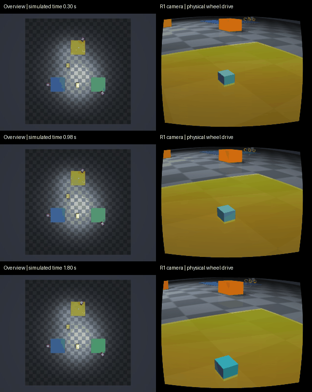

# Kaggle CLI CPU 실행·회수 진단 — 2026-09-21

Kaggle CLI 2.2.4와 사용자 계정 `changmin2026`을 사용한다. Dataset과 script kernel은 비공개이며 CPU만 요청한다. 계정 인증정보는 소스·결과에 포함하지 않는다.

## 후보와 실패

| 후보 | 실행 소스 SHA | 결과 |
|---|---|---|
| 1 | `fdf58ce85b51b6d8a4ad2b0ef695804c5b82c053` | Dataset 라이선스 `copyright-authors`를 서버가 거부. VM 실행 전 실패. CLI 종료 코드 0이므로 응답 본문 오류 검사 추가. |
| 2 | `6c4b465f9e5483c50bb14995b4697217127aacb8` | private Dataset·kernel 생성 성공. 원격 pip 설치에서 DNS 실패. 인터넷 ON 설정과 실제 네트워크 접근을 구분. |
| 진단 | `b1cc9dc` | 읽기 전용 kernel로 Python 3.12.13·Ubuntu 22.04·OSMesa 부재·PyPI DNS 실패 확인. `runtime-probe.json` 보존. |
| 3 | `fac69ec513510fcc5acfc371ea752de3c0fe77c4` | 오프라인 패키지 전송. Kaggle이 deb 파일명의 `~`를 제거하여 해시 검사 전 파일 부재로 중단. 시스템 설치나 물리 실행 전 실패. |
| 4 | `205f43582cd728c65a7417dce418b89a860b52da` | 인터넷 OFF에서 설치·물리·카메라 데모·회수 성공. 최종 후보 1회 중 1회 통과. |

2번 후보의 로컬 제출기는 `b4da668`이며 서버 응답·privacy 파싱만 수정했다. 원격 실행 소스는 표의 SHA로 고정했다. 런타임 진단은 물리 시뮬레이션이 아니다. 첫 세 후보를 최종 후보의 반복 시행이나 성공률에 섞지 않는다.

## 최종 결과

- 실제 Kaggle CPU·OSMesa에서 R1 이동 **0.138548m**, **1.5 SIM초**, **12프레임** 확인.
- 원격 작업 wall time **25.62초**(설치·대기·전송 제외), 종료 코드 0, kernel 최종 상태 COMPLETE. 이 작업의 세션 시작·종료를 run.log에서 확인.
- private Dataset/kernel 설정, 실행 SHA, ZIP 및 내부 모든 파일 해시 검증. `manifest.json`, `run.json`, `summary.json`, 패키지 목록 보존.
- 0·5·11번 프레임의 공용/자기 카메라 장면과 이동 변화를 직접 확인. 전체 접촉·프레임 감사는 수행하지 않음.
- Kaggle 기본 `sitecustomize`의 `wrapt` 누락 경고가 로그에 남지만 설치 검사·시뮬레이션·패키지 기록은 종료 코드 0. 경고를 숨기거나 시스템 환경을 변경하지 않음.
- [비공개 실행 결과](https://www.kaggle.com/code/changmin2026/ugrp-simulation-091c35d9d526)는 해당 계정에서 조회 가능.

## 범위와 보존

고정 바퀴 명령으로 기본 물리 이동·공용/자기 카메라 렌더링·CLI 결과 회수만 확인한다. 모델 호출은 0회이며 자율 행동 수·운반 성공률·실물 검증에 해당하지 않는다. 파지 weld를 활성화하지 않는다. GPU·유료 자원을 구매하지 않았으며 실제 계정 과금은 별도 계측하지 않았다.

최종 후보는 Python wheel과 Ubuntu 공식 archive의 SHA-256 고정 deb를 private Dataset으로 전송한다. 인터넷 OFF 상태에서 전용 venv와 작업 폴더에 설치하고 시스템 환경을 변경하지 않는다. 해시가 맞지 않으면 실행을 중단한다.

원본 위치·작업 식별자·해시는 `attempts.json`에 남긴다. raw 소스 번들·의존성·실패 로그는 로컬 outputs에 보존하고, 실제 생성된 Kaggle private Dataset/kernel은 계정에서 확인할 수 있다. Git에는 선택한 결과와 해시만 포함하며 모든 raw 파일의 GitHub 백업을 뜻하지 않는다. Drive는 사용하지 않는다.
