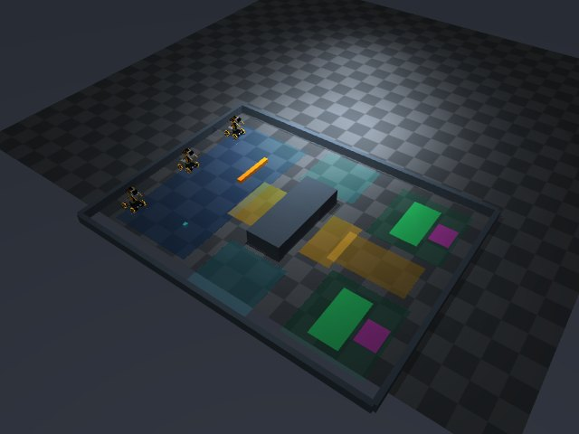

# 기존 연구 장면·로컬 구성 검토

최종 실행 소스 `7dc11f62f819485b909c1b7b307bb4a28192d5b6`.
Mac 실제 환경과 Ubuntu 24.04 GitHub CI에서 검사했다. [구성·누락 검토](../../docs/simulation_inventory.md),
[실행 방법](../../docs/local_simulation.md), [전체 실행·해시](verification.json)를 참고한다.

## 수정과 확인

- 기존 4개 엔진 예제에 출하장 5, 단독 지도 9, 공동 지도 6, ACT 22, 다중 물건 12를 연결했다.
  기본 native 실행·init·new는 dispatch/shared_crossing seed11이다. 원본 지도는 변경하지 않았다.
- 장면별 로봇/물체 초기화, 같은 model/data의 reset, 실제 화물 목록·경계, 고정 TOP,
  사용자 추가 물체의 유지, 관측과 평가의 분리, weld OFF를 확인했다.
- 새 연구 폴더의 정지 제어기 2회 호출, 설정 폴더 기준 경로, timeout의 종료 코드 2,
  의도적 builder 실패의 코드/오류 보존을 실제 CLI로 확인했다.
- 기존 스킬·통신/평가·ACT/교사·Jev·실물 경로는 `workflows` 17개 진입점에서 찾을 수 있다.
  초기화된 장면을 운반 성공, 자동 모델 연결 또는 모든 기존 실험 재현으로 표현하지 않는다.

| 검사 | Mac | Ubuntu CI |
|---|---|---|
| 모든 등록 장면 생성·10 tick·reset | 58/58 | 58/58 |
| 연구 장면의 추가 물체·RGB·명령 만료·weld OFF | 통과 | 통과 |
| 기존 출하장 native viewer + 캡처 + MP4 | 2 SIM초·정상 종료 | Xvfb 1 SIM초·정상 종료 |
| 녹화 디코딩/실제 브라우저 재생 | 640×480·21프레임·2.1초 | 640×480·11프레임·1.1초 |
| 기존 API·확장·native 종료 회귀 | 이전 검사 보존 | 최종 소스에서 통과 |

로컬 관련 검사 124개+27 subtests, 전체 오프라인 1,261개+187 subtests 통과(3 skip).
마지막 변경은 영상 이름을 기존 `motion.mp4` 규칙에 맞추고 형상 변경 여부 기록을 바로잡았으며,
관련 42개를 다시 통과했다. 최종 소스의 PR/push CI 12개 모두 통과했다.
Linux PR merge SHA `4e678859acfa656a682dc9b1bca3376660aa0268`의 부모는 main `ca767689`와 실행 브랜치
`7dc11f6`; Git tree가 동일함을 확인했다.

[GitHub 실행](https://github.com/cmk404/UGRP-Multi-Robot-Collaboration-Project/actions/runs/35702516688).
원본은 로컬 outputs에 있고 Linux artifact는 14일 보존이다. Mac 원본이 원격 백업됐다는 뜻은 아니다.

## 처음 발견한 실패와 최종 검증 경계

첫 단위 검사에서 지도 validator가 OpenCV를 import하는데도 "cv2가 로드되지 않는다"고 요구한
테스트가 실패했다. MuJoCo/학습 모델을 import하지 않는 실제 경계로 검사 조건을 수정했다.
처음 실행한 v1의 MP4는 `video.mp4`여서 기존 TensorBoard 영상 목록에 등록되지 않았다.
v2에서 `motion.mp4`로 수정 후 원본 해시·manifest·재생을 확인했다. v1 결과도 보존했다.

timeout과 plugin-failure의 protocol_complete=false는 의도한 부정 검사 결과다. native GUI의
실제 키보드/마우스 자동 조작은 이전 도구 접근 시간 초과로 미확인이다. API reset·실제 창 실행·
렌더링·유한 종료와 구분한다. 외부 LLM 호출·훈련·실물·새 운반 성공률 비교는 수행하지 않았다.

## 확인한 대표 장면

기존 공동 출하장:



[S자 단독 지도](navigation-overview.jpg) · [공동 좁은 문](pair-overview.jpg) ·
[ACT 두 문 지형](act-overview.jpg) · [물건 8개](multi-overview.jpg).

## TensorBoard와 원본

기본 체크아웃 `outputs/tensorboard/0922-scenes-mac`, `0922-scenes-linux`에 31개 새 기록을 변환했다.
원본 경로/해시 중복 검사를 하고 EventAccumulator로 실제 로딩을 확인했다.
`outputs/tensorboard-view.json`의 `simulation_scenes`에 고정 URL·지표·열을 저장했다.
현재 비교의 11개 시행과 protocol_complete/wall_s/commands/model_calls 카드 4개,
HParams 다섯 열과 실제 수치를 UI에서 확인했다. HParams 표의 전역 목록에는 이전 실행도 남는다.

Mac/Linux 최종 영상 두 개가 manifest에 등록되고 실제 재생됐다. 기존 다른 작업의 6006/6009
서버는 변경하지 않았다. 검토용 6011 미디어 프로세스는 소유 세션으로 시작·종료했다.
이 세션 종료 후 영상은 `outputs/research-native-mac-v2/motion.mp4`와
`outputs/research-linux-v2/research-native/motion.mp4`를 로컬에서 직접 연다.

재검사:

```bash
python scripts/ugrp_session.py run scenes-check -- python -m scripts.check_simulation_scenes --output outputs/scenes-check-NEW
bash scripts/open_simulation.command run configs/simulation/local.json --sim-seconds 2 --capture --video --output outputs/scenes-native-NEW
```

Mac은 기존 환경 Python 또는 자동 선택 launcher를 사용한다. Linux native는 데스크톱/GLFW,
headless RGB는 설치한 OSMesa 설정을 사용한다. 출력 이름은 새로 정한다.
