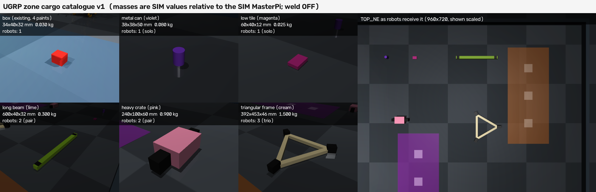

# 2026-09-25 구역 화물 목록과 물리 가능성 (정답 교사, weld OFF)

사용자 요청(2026-09-25): 역할 배분과 팀 구성이 의미 있도록, 한 대가 드는 물건·정확히 두 대가 필요한 물건(긴 빔, 무거운 상자)·세 대가 필요한 물건(삼각 틀)을 만든다. "몇 대 필요"는 규칙이 아니라 물리에서 나와야 한다. 사용법과 명세는 [docs/zone_cargo.md](../../docs/zone_cargo.md)에 있다.

**범위:** 모든 결과는 **정답 교사 조건**이다(정답 pose·IK·접촉력 사용). RGB/학생 성공이 아니다. 동기 SIM, `zone_wide` seed 11의 빈 바닥(출발 화물 pose 2.5, 0.2), 접촉 `local_contact_fine`(timestep 0.25 ms), 검사마다 1회. 벽·문·다른 화물·구역 교사 연동은 하지 않았다. 질량은 SIM MasterPi 모델 기준이며 실물 적재 능력 주장이 아니다.

**고정 소스:** `d81514a` (작업 트리 깨끗, 모든 결과의 `git_dirty=false`). 목록 해시 `catalogue_sha256`은 [results.json](results.json)에 있다.

**weld:** 모든 실행에서 OFF. 매 physics step마다 `eq_active`가 모두 0인지 검사했고(최댓값 0), 운반 중 pose 직접 쓰기나 외력 보조는 없다. 로봇은 `CameraRobotPort` 명령(메카넘 구동, 서보 펄스)만으로 움직였다. 옛 고수준 빔 제어기의 weld 활성 경로(`sim/multi_masterpi_production.py` `_activate_beam_constraint`)는 호출하지 않는다.

## 1. 한 대의 적재 한계 (근거의 기준)

상자 모양(34×40×32 mm, 상자 재질·손가락 접촉 pair)의 `cal_block`을 질량만 바꿔 한 대가 잡고 7 cm 들어 8초 버틴 뒤, 0.5 m 운반하고 내려놓는다.

| 질량 kg | 결과 | 들린 최저점 m | 로봇 최대 기울기 ° | 버티는 동안 미끄러짐 mm/s |
|---:|---|---:|---:|---:|
| 0.03 | 성공 | 0.067 | 0.04 | 0.04 |
| 0.30 | 성공 | 0.053 | 0.11 | 0.28 |
| 0.60 | 성공 | 0.038 | 0.18 | 0.55 |
| 0.66 | **성공(최대)** | 0.036 | 1.44 | 0.60 |
| 0.68 | 실패: 앞으로 넘어짐 | 0.000 | 39.7 | – |
| 0.70–1.20 | 실패: 앞으로 넘어짐 | 0.000 | 34–36 | – |

- 한계는 **0.66–0.68 kg**이며 원인은 앞바퀴 축을 중심으로 한 전복이다(정적 추정 0.67 kg: 로봇 1.1 kg, 무게중심 x≈0, 앞바퀴 x=0.06, 파지점 x=0.155). 팔 서보(어깨 2.2 N·m 등)는 어느 질량에서도 포화되지 않았다. 손가락 마찰(μ 3.4, 손가락당 5.4 N)도 한계가 아니다.
- **느린 미끄러짐:** `local_contact_fine`의 마찰은 감쇠형(`solreffriction 0 -6000`)이다. 그래서 들고 있는 물체가 약 **0.9 mm/s·kg**로 손가락 사이를 내려간다. 첫 개발 실행에서 0.9 kg 상자를 0.04 m/s로 58초 운반하다 이 미끄러짐 때문에 떨어뜨렸다. 접촉 설정은 바꾸지 않았다. 대신 운반 속도를 0.05 m/s·0.2 rad/s로 올리고, pair/trio 손잡이를 46 mm로 높였다(56 mm는 손목 충돌).

## 2. 목록

| 종류 | 치수 mm | 질량 kg | 필요 | 로봇당 부담 | 물리 근거 |
|---|---|---:|---:|---:|---|
| box (기존) | 34×40×32 | 0.030 | 1 | 0.030 | 기존 상자 |
| can | Ø38×50 | 0.080 | 1 | 0.080 | 한계의 12% |
| tile | 60×40×12 | 0.025 | 1 | 0.025 | 낮은 물건, 7 mm 높이에서 잡음 |
| long_beam | 600×40×32 | 0.300 | 2 | 0.150 | 손목 회전이 없어 긴 축 위에서만 잡힘(끝에서 9 cm 안). 한쪽만 들면 지렛대가 되어 먼 끝이 바닥에 남음 |
| heavy_crate | 240×100×60 | 0.900 | 2 | 0.450 | 0.9 > 0.68(한 대 전복). 본체 폭 100 > 집게 61 mm, 손잡이로만 잡힘 |
| tri_frame | 한 변 0.35 m, 392×453×46 | 1.500 | 3 | 0.500 | 두 대가 들려면 0.75/대 > 0.68. 두 손잡이만 잡으면 셋째 꼭짓점이 바닥에 남음 |

정적 명세는 `required_carriers`, 역할별 grasp frame·접촉 geom, 접근 base pose, 충돌 형상, 질량·관성(MuJoCo 컴파일 값과 테스트로 일치 확인), 접촉 profile, formation, 착지 영역, 시각 명세를 담는다. 실행 인스턴스(body 이름, 설정 pose)와는 분리했다. 이 계약 항목은 Codex의 읽기 전용 팀 운반 설계 분석(2026-09-25, 조정자 전달)이 제안한 것이며, 코드와 대조해 반영했다.

## 3. 정답 교사 검사 (`d81514a`)

운반 경로: solo는 1.0 m 직진. pair/trio는 0.8 m 직진 → 제자리 90° 회전 → 0.5 m 직진(총 1.3 m + 회전). 교사는 virtual structure 방식이다(공통 기준 궤적, 공통 포화 비율, 오차 4 cm 이상이면 기준 정지). 파지 뒤 모든 손가락의 접촉력이 0.5 N 이상이어야 들기로 넘어간다.

| 검사 | 로봇 | 결과 | 들림 | 배치 오차 mm | 화물 최대 기울기 ° | 미끄러짐 mm | 로봇 최대 기울기 ° | 운반 중 손가락 합력 N | SIM s | 부하(1분) 시작→끝 |
|---|---|---|---|---:|---:|---:|---:|---:|---:|---|
| solo_box | r1 | **성공** | O | 6.0 | 6.4 | 0.8 | 0.04 | 10.4 | 38.0 | 6.94→8.68 |
| solo_can | r1 | **성공** | O | 8.8 | 5.1 | 1.8 | 0.05 | 8.7 | 38.0 | 8.39→7.32 |
| solo_tile | r1 | **성공** | O | 8.7 | 6.3 | 0.7 | 0.44 | 10.5 | 38.0 | 7.32→7.58 |
| pair_beam | r1+r2 | **성공** | O | 4.4 | 0.0 | 5.1 | 0.08 | 10.7 | 52.3 | 7.58→7.88 |
| pair_crate | r1+r2 | **성공** | O | 4.5 | 0.01 | 15.2 | 1.75 | 10.8 | 53.0 | 7.88→6.17 |
| trio_frame | r1+r2+r3 | **성공** | O | 0.7 | 0.01 | 17.5 | 1.94 | 10.8 | 54.3 | 6.17→6.67 |
| solo_beam | r1 | 실패(기대) `carry_timeout` | X | 924 | 6.2 | 19.6 | 0.14 | 10.7 | 150.0 | 6.46→7.45 |
| solo_crate | r1 | 실패(기대) `grip_lost_in_transit` | X | 939 | 12.1 | 91.6 | 6.95 | 10.7 | 105.6 | 7.49→9.71 |
| duo_frame | r1+r2 | 실패(기대) `grip_lost_in_transit` | X | 936 | 7.2 | 86.9 | 4.19 | 10.1–10.7 | 65.6 | 10.06→11.21 |

- 성공 6건: 들림 확인, 운반 중 화물이 바닥에 닿은 표본 0, 떨어뜨림 0, 서보 포화 0. 착지 오차 5 cm·yaw 10° 이내, 방출 후 손가락 접촉 0, 손가락 외 로봇 몸체와 화물의 접촉 0.
- **"두 대 필요" 근거:**
  - solo_beam: 한쪽 끝만 들려 빔이 6°로 기울고 먼 끝은 바닥에 남았다(최저점 0.0 m). 운반을 시도해도 바닥에 끌려 150 SIM초 뒤 시간 초과로 끝났다.
  - solo_crate: 상자가 10–12° 기울고 한쪽이 바닥에 남았다. 로봇은 7° 앞으로 기울었다. 끌고 가다가 손잡이가 빠졌다(92 mm).
- **"세 대 필요" 근거:** duo_frame에서 셋째 꼭짓점이 바닥에 남아(최저점 0.0 m) 들리지 않았다. 끌어 보는 동안 r2의 손잡이가 빠졌다(87 mm).
- 세 실패 검사는 모두 양쪽 손가락 접촉(각 5.4 N)을 확인한 뒤 들기를 시도했다. 파지 실패가 아니라 들기 실패다.
- 미끄러짐은 부담에 비례한다(버티는 동안 crate 0.41, frame 0.47 mm/s/대). 무거운 물건은 운반 시간이 길수록 위험하다. 지금 경로(약 35 SIM초 운반)에서는 15–18 mm로 끝났다.

영상(교사 조건, 4배속): [solo_box](media/solo_box.mp4) · [solo_can](media/solo_can.mp4) · [solo_tile](media/solo_tile.mp4) · [pair_beam](media/pair_beam.mp4) · [pair_crate](media/pair_crate.mp4) · [trio_frame](media/trio_frame.mp4) · [solo_beam](media/solo_beam.mp4) · [solo_crate](media/solo_crate.mp4) · [duo_frame](media/duo_frame.mp4)

## 4. TOP RGB 구분 (탐지기 변경 없음)

`zone_wide` TOP 네 장(960×720)을 렌더하고, MuJoCo 분할(평가 전용)로 종류별 화소를 모아 비교했다.

- 상자 색 HSV 범위에 들어가는 화물 화소는 main `zone_perception_v1`과 PR #163 `top_zone_v2`(사본) 모두 **0%**다.
- 가장 가까운 색 쌍은 long_beam–green box (ΔE76 22.1)다. 빔은 15:1 막대 모양이라 모양으로도 구분된다.
- 로봇 화소(9,796개) 중 화물 색과 ΔE<15인 화소는 tri_frame(크림색)에만 16개 있다. 틀은 약 3,000 px 크기의 삼각 윤곽이라 모양으로 구분된다.
- TOP 크기: can 약 210 px, tile 약 204 px, crate 1,713 px, beam 2,350 px, frame 약 3,000 px. 모두 50 px 하한보다 크다. 다만 can·tile은 작아서, 같은 색끼리 닿으면 한 덩어리로 보일 수 있다.
- 개발 중 흰 원통은 위에서 바닥처럼 어둡게 보였고(ΔE 4.5), 갈색 상자는 구역 A 칠과 가까웠다(ΔE 8.8). 그래서 색을 바꿨다.

## 5. 변경과 테스트

- 새 파일: `sim/zone_cargo.py`, `sim/zone_cargo_scene.py`(opt-in `CargoZoneScene`), `scripts/cargo_formation_teacher.py`, `scripts/probe_zone_cargo.py`, `scripts/render_zone_cargo_catalogue.py`, `tests/test_zone_cargo.py`, `docs/zone_cargo.md`.
- `sim/zone_arena.py`, `sim/zone_scene.py`, `scripts/zone_teacher.py`, `scripts/run_zone_dispatch.py`, 지도 파일은 **수정하지 않았다**(다른 작업 소유). 교사는 `zone_teacher`의 `ArmSequence`·`FOLDED`만 import한다.
- 바이트 동일성: 화물이 없는 `CargoZoneScene`은 `ZoneScene`과 같은 XML을 만든다. `zone_open` v2, `zone_wide` v1 × 접촉 프로필(없음, `local_contact_fine`)의 XML SHA-256을 테스트에 고정했다(`58bc404e…`는 zone_wide 기록의 `zone_open` 해시와 같음).
- `configs/simulation_workflows.json`에 `zone-cargo-probe`, `zone-cargo-catalogue`를 등록했다(워크플로 23→25, 관련 테스트 갱신). 실행 번들 레지스트리는 건드리지 않았다. 예약 ID `rgb-standard-dispatch-v65`는 **사용하지 않았다**.
- `scripts/run_ci_tests.py`(`87eaac8`): 2,267 통과, 9 건너뜀. `d81514a`의 변경은 영상·그림 표시뿐이며, 이 커밋에서 관련 테스트를 다시 돌렸다(PR 본문 참고).

## 6. 원본

원본은 작업 worktree의 `outputs/zone-cargo/final-d81514a/`에만 있다(로컬 보관이며 원격 백업이 아니다). 파일별 SHA-256은 `results.json`의 `raw_files`에 있다. 드라이버 기록(`driver.log`)에는 실행마다 1/5/15분 부하 평균이 있다. 개발 실행(`dev*`, `sweep-1/2`, `cat-dev*`)은 소스가 고정되지 않은 진단 기록이라 결과로 세지 않는다. 그중 1번 절의 미끄러짐 실패(개발 `pair_crate` 0.04 m/s)는 설계 변경의 근거로 위에 적었다. `collect.py`가 `results.json`과 `media/`를 만든다.

## 7. 다음 단계 제안 (구역 교사·지도 연동)

1. **TeamJob 연동 (구역 실행기 소유 작업과 협의):**
   - 화물 하나를 소유하는 `TeamJob{participants, role_by_robot, formation}`과 N명 교사를 둔다. 접근은 각자 하고, CLOSE 이후는 이 기록의 `FormationTeacher`처럼 하나의 화물 궤적으로 움직인다.
   - 모든 손가락 접촉력을 확인하는 장벽을 두고, 정렬 시간 초과를 준비 완료로 치지 않는다.
   - 목표 차감·실패·slot 반납은 화물당 한 번만 한다(Codex 분석 2절).
2. **경로:** 벽·문 planner(`claude/zone-hard-routes`)에 화물+모든 chassis의 합 footprint를 넘기는 `pose_clear`/`swept_clear` 인터페이스를 둔다. 회전은 문 밖에서만 하게 한다. 뒤로 가는 로봇의 속도 한계 때문에 pair/trio 속도는 약 0.05 m/s다.
3. **착지 구역:**
   - beam(0.6 m)·frame(약 0.45 m)은 `zone_open` 칸(0.12 m)에 맞지 않는다. `zone_wide` 구역(0.6×1.4 m)에 화물 종류별 착지 영역을 두고, 목록의 `landing_half_extents_m`·yaw 대칭으로 심판한다.
   - 심판은 중심점이 아니라 전체 footprint로 판정한다.
4. **목표 형식:** `{"A": {"red": 1, "heavy_crate": 1}}`처럼 화물 종류를 목표에 넣는다. 예를 들어 "한 구역에 crate 1 + frame 1"이면 로봇 3대로 동시에 할 수 없어 순서·역할 배분이 문제가 된다.
5. **미끄러짐 관리:**
   - 운반 시간 × 부담을 교사 계획의 비용으로 둔다(예: 0.5 kg/대는 약 0.47 mm/s).
   - 긴 경로는 중간에 내려놓고 다시 잡는 단계를 넣을지 먼저 SIM으로 확인한다. 접촉 설정은 바꾸지 않는다.
6. **RGB 지원:** 이 기록의 시각 명세(색, 모양, 가로세로비, TOP 크기)로 탐지기 쪽 작업(`claude/zone-rgb-color`)이 종류 판별을 추가한다. 이후 RGB 학생의 공동 파지는 교사 시연으로 별도 검증한다.
7. **반복:** 출발 위치·방향·역할 순열을 바꾼 반복 검사와 운반 속도·부담의 미끄러짐 한계 곡선을 측정한다. 지금은 조건마다 1회다.
