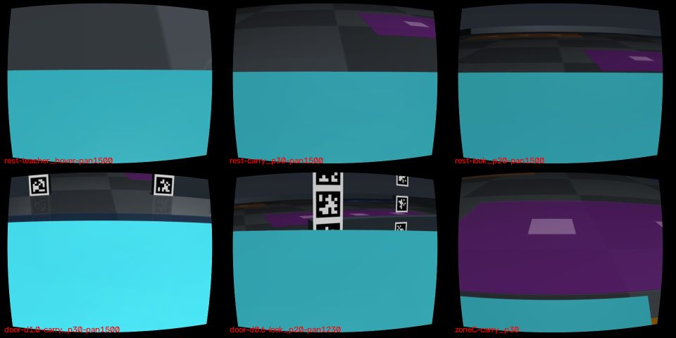

# 손목 카메라 전용 운반 시야와 zone 상자 스킬 (2026-09-25, M1 스킬 측)

**범위:** M1(`zone_wide_door`에서 로봇 1대가 손목 카메라만으로 청록 상자 1개를 문 너머로 배달)의 **시야·스킬 측**을 다룬다. 태그와 위치 추정은 PR #177(`claude/zone-owncam-loc`)이 맡는다.
- 이 기록의 스킬 결과는 모두 `pose_source=gt_stub_eval_only`다. 위치 추정기 자리에 시뮬레이터 정답을 넣은 **스킬 격리 시험**이며, 문을 통과하지 않았다. **M1 성공이 아니다.**

## 요청과 사용자 결정 (2026-09-25)
- 로봇 입력은 자기 `robot_cam`(MasterPi 팔 끝 어안)·정적 지도·자기 발행 명령 이력뿐이다. `nav_cam`은 금지다. TOP은 평가에만 쓴다.
- AprilTag는 벽·문기둥에만 붙인다(화물·로봇 금지). weld는 OFF, 물리는 zone 장면 그대로 `local_contact_fine`이다. 기존 코드를 재사용한다.

## 무엇을 만들었나
| 파일 | 내용 |
|---|---|
| `harness/owncam_view.py` | 발행 PWM → 손목 카메라 광선, 가림 마스크를 반영한 바닥·벽면 가시 범위, 태그 투영 크기. 순수 함수 |
| `scripts/probe_owncam_carry_view.py` | 진단 probe. 교사(GT)가 파지·주행하고, 자세별 렌더·상자 유지·시험 태그 검출을 기록한다. 시험 태그는 probe 장면 전용 시각 평면이며 지도 파일은 바꾸지 않았다 |
| `harness/wrist_zone_skill.py` | **`wrist_zone_skill_v1`**. N7 `VisualBoxSkill`을 서브클래스로 재사용하고, N7 클래스와 기본값은 그대로 둔다. 추가한 것: 주문서 픽업 칸까지 자세 추정 기반 주행, carry 자세, 슬롯 앞 정렬, 놓은 뒤 자기 RGB로 다시 보기 |
| `scripts/run_zone_owncam_skill.py` | 스킬 격리 러너. 사전 등록한 시나리오 501–505와 개발용 401–402가 있다. 로봇 입력은 `robot_cam`뿐이고, 정답은 평가 전용 파일에 따로 쓴다 |
| `tests/test_wrist_zone_skill.py` | 순수 테스트 17개. nav_cam 거부, 모듈의 world/TOP 접근 없음, N7 불변, 폴백 표시 여부 |

- 실행 번들 ID는 쓰지 않았다(dispatch 어댑터와 번들 closure는 바꾸지 않음).
- workflow도 등록하지 않았다. 등록부 `configs/simulation_workflows.json`과 `scripts/run_ci_tests.py`는 PR #169·#173·#177이 함께 바꾸는 파일이라 충돌을 피했다. 새 테스트의 CI 등록은 병합 순서가 정해진 뒤에 한다.

## 1. 상자를 든 상태의 손목 시야 (probe)
| 실행 | 소스 | 순서 | SIM s | 부하 평균(시작) |
|---|---|---|---|---|
| probe1 | `4219506` | 휴식 → 주행 → 문 | 482 | 8.6 |
| probe2 | `a868328` | **문 먼저**(파지 직후, 가림 최악) → 휴식 → 주행 → 구역 C | 559 | 51 |

- **가림:** 카메라가 집게에 고정돼 있어서 들고 있는 상자가 항상 같은 픽셀을 가린다. 파지 직후에는 프레임의 62–64%(유효 픽셀의 약 75%)가 가려지고, 위쪽 약 10° 띠만 보인다. pan은 가림을 풀지 못한다. 자세는 이 띠가 향하는 높이와 거리만 바꾼다.
- **상자 유지:** 모든 자세, 0.4 m 후진·전진, 90° 제자리 회전에서 상자를 놓치지 않았다(weld OFF). 다만 손가락 안에서 누적 미끄러짐이 있었다. probe2 기준으로 파지 후 약 480 SIM s에 1.6–1.8 cm였다.
- **자세 권고** (발행 PWM 3/4/5, 집게 1500, pan 1500):
  - carry_p30 `777/2053/1646`: 광축 -22.6°. 파지 직후 바닥 0.67–3.7 m, 1.0 m 앞 벽 높이 0.005–0.15 m가 보인다. **운반 기본 자세**다.
  - look_p20 `1072/2400/1482`: 광축 -12.5°. 멈춰서 보는 자세이며, 1.0 m 앞 벽 높이 0.15–0.32 m가 보인다.
  - look_p10 `897/1998/1598`: 광축 -2.5°. 높은 곳(0.27–0.54 m)을 본다.
  - 교사 carry(hover, 도구 pitch -90°): 바닥 0.25–0.32 m만 보이고 **벽 태그는 0개**다.
- **구역 칠:** 구역 C 앞에서 보라 칠이 carry_p30에서 화면의 49%, look_p20에서 33%를 차지했다. 교사 hover에서는 0%였다.
- **시험 태그 검출** (파지 직후, OpenCV 36h11):
  - 벽면 0.05 m 높이 태그: carry_p30으로 0.6–1.0 m에서 44–68 px, look_p20으로 1.5 m에서 30 px. **0.3 m에서는 검출되지 않았다.**
  - 문기둥 0.15 m 높이 태그: look_p20으로 1.5→0.3 m 전 구간 31–104 px. 단 0.6 m 이하에서는 pan ±24°가 필요했다.
  - 0.25 m 높이: look_p10에 pan을 더해야 보였다.
  - 태그 크기: 0.08 m 태그는 1.5 m에서 30 px, 0.05 m 태그는 18 px로 둘 다 검출됐다.
- **태그 권고**(PR #177 코멘트 [issuecomment-5833491542](https://github.com/cmkang131/UGRP-Multi-Robot-Collaboration-Project/pull/177#issuecomment-5833491542)에 게시):
  - 벽면 0.05 m 태그(검은 사각 0.072 m)는 유지한다.
  - 각 문 가장자리 바깥 0.05 m에 문기둥 판(폭 0.09 m, 높이 0.30 m, 양면)을 세우고 0.072 m 태그를 **높이 0.15 m와 0.25 m**에 붙인다.
  - 문 양옆 1 m 안은 0.30 m 간격, 그 밖은 0.5 m 간격으로 붙인다.
  - 정책: 운반은 carry_p30으로 하고, 문 1.5 m·0.6 m 앞에서 멈춰 look_p20으로 pan {1230, 1500, 1770}을 훑는다.
- **한계:** SIM 손목 영상은 핀홀 렌더를 어안으로 재매핑한 것이라 유효 시야가 약 54°×42°다. 실물 어안은 더 넓다.

## 2. N7 체인에서 nav_cam·TOP 사용처 감사
| 모듈 | 카메라 | wrist 전용 버전에서의 처리 |
|---|---|---|
| `visual_box_skill.VisualBoxSkill` | `robot_cam`만(`_validate_observation`) | 서브클래스로 그대로 재사용 |
| `markerless_box`, `visual_box_surface`, `visual_attachment`, `markerless_face`, `visual_floor` | 자기 RGB와 발행 PWM | 재사용 |
| `scripts/evaluate_gemini_team.py` (N7 러너) | LLM 주행 입력으로 `nav_cam` 사용(115, 201, 211, 278행) | 쓰지 않음. 주행은 자세 추정 인터페이스로 대체 |
| `visual_drive_guard.validate_visual_drive` | `nav_cam` 전용 | 쓰지 않음. carry_p30의 바닥 띠(0.67–3.7 m)로 대체할 예정(미구현) |
| `visual_navigation.VisualNavigator`, `visual_transport` | `nav_cam` 전용 | 쓰지 않음 |
| `visual_placement.inspect_placement` | wrist와 **nav_cam** 둘 다 필요 | 쓰지 않음. `zone_color_boxes.detect_own(own_zone_v2)`와 자세 추정으로 슬롯을 판정 |
| `solo_box_transport` (dispatch v61) | 조작은 own, 목표 서보는 **TOP** | 파지 설정만 재사용(`previous_endpoint`, 채도 150, `release_refine_ground_fit`) |
| `camera_pixel_grasp` | TOP(공동 빔) | 해당 없음 |
| `zone_color_boxes.detect_own` / `detect_top` | own / TOP | own만 사용 |

## 3. 스킬 격리 결과 (`zone_wide_door` 동쪽 열린 구역, 문 통과 없음)
- 소스는 `d016c04`로 고정했다. 테스트·집계 파일만 더한 `3982bde`에서 이어 돌렸고, 러너 closure는 같다. 501은 `d016c04`에서 실행했다.
- 조건: 시나리오당 1회, SIM 한도 300 s, 동기 SIM, `OMP_NUM_THREADS=1`. 호스트 부하 평균은 20–120이었다(코호트 로그).

| seed | 슬롯 | 결과(러너 판정) | GT 파지 | GT 슬롯 | SIM s | 면 법선 출처 |
|---|---|---|---|---|---|---|
| 501 | B1 | SIM_LIMIT(접근 교착) | ✗ | ✗ | 300.4 | – |
| 502 | A3 | SIM_LIMIT(접근 교착) | ✗ | ✗ | 300.4 | – |
| 503 | A1 | **OWN_RGB_PLACEMENT_IN_SLOT** | ✓ | ✓ (-5.3, -12.6 mm) | 127.3 | 지도 관례 폴백 |
| 504 | C3 | SIM_LIMIT(접근 교착) | ✗ | ✗ | 300.6 | – |
| 505 | B2 | CARRY_VISUAL_GRASP_DRIFT | ✓ | ✗ (들고 있는 채 정지) | 173.3 | 지도 관례 폴백 |

- **사전 등록 코호트 결과:** 파지 2/5, 슬롯 배치 1/5 (pose_source=gt_stub_eval_only). 스킬의 자기 판정과 GT는 5/5 일치했고, 거짓 성공은 0이다. weld eq_active 최댓값 0, 벽 접촉 0.
- **개발 시드(성공률에 합산하지 않음):**
  - 401: 첫 실행은 면 정렬 대기로 실패. 수정 후 성공이며 같은 소스로 재실행해도 SIM 172.854 s로 같았다.
  - 402: 첫 실행은 놓기 확인 실패(`release_refine_ground_fit` 누락). v61 설정을 넣은 뒤 성공했다.

### 실패 원인
1. **접근 교착 (501, 502, 504):**
   - 원인은 zone 천장 조명이다. 상자 앞면 아래쪽이 회색으로 렌더되어, 청록 실루엣의 바닥 직육면체 적합이 흔들린다. 투영 IoU 중앙값은 0.70(0.7 이상인 프레임은 약 절반)이고 가로 추정 표준편차는 6–7 mm였다. 성공 사례는 IoU 0.85–0.93, 표준편차 2.7–3.5 mm였다.
   - N7 접근은 pan(±20 PWM)과 수직 오차 게이트가 **같은 프레임에서** 둘 다 통과해야 전진한다. 두 게이트가 번갈아 걸려 x≈0.25–0.28 m에서 멈췄다. 전진은 7–15회뿐이었고, pan 명령은 1492와 1524 사이를 수백 번 반복했다.
   - 성공 시드(503·401·402)도 같은 0.40 m 대기 거리에서 출발해 전진 22–23회로 0.17 m까지 접근했다.
   - 조정자 가설 중 "대기 거리가 팔 도달 밖이고 가까이 가는 규칙이 없다"는 **틀렸다**. N7 접근에는 반경 0.168 m 초과 시 전진하는 wrist 전용 규칙이 있다.
   - 서보 3의 500 도달도 정상 동작이다(성공한 503도 34프레임). 이후 서보 4로 넘어간다.
   - 가설 중 **맞은 부분:** 진행이 없을 때의 시간 한도나 후퇴가 없다. 실패가 y 위치(조명 각도)와 연관돼 있다.
2. **운반 중 grasp drift (505):**
   - 가장 긴 운반(약 2.5 m, 86 SIM s)에서 상자가 손가락 안에서 천천히 밀렸다.
   - 자기 RGB anchor 중심이 N7 한계 25.6 px를 넘어 정지했다. 상자는 들린 상태(z 0.168)였다. probe에서 본 누적 미끄러짐과 같은 현상이다.
   - 자세를 바꿀 때 보이는 약 32° 기울기는 도구 pitch를 -90°에서 -30°로 바꿨기 때문이고, 모든 실행에서 같았다. 미끄러짐이 아니다.
3. **면 정렬:** 같은 조명 문제 때문에 RGB 면 적합 3회 연속을 얻지 못한 경우가 있었다. 손목 흔들기 8회 뒤 정적 지도 관례(동쪽을 보며 파지)와 자세 추정으로 만든 폴백 법선을 썼다(503, 505, 401). 출처는 결과에 기록했다.

### 다음 버전(v2) 후보: 새 시드 집합으로만 평가하고, v1 결과는 바꾸지 않음
- 접근: pan 재조준에 이력(hysteresis)을 두거나 최근 N개 새 프레임의 평균을 쓴다. 진행이 없으면 후퇴하고 다시 본다.
- 운반: carry 중 anchor를 주기적으로 다시 잡는다(co-motion 확인 후). 또는 경로를 짧게 끊고 정지 점검을 넣는다.
- 파지 깊이(GRASP_Z)가 가림 폭과 미끄러짐에 주는 영향을 측정한다.
- carry_p30 바닥 띠로 wrist 전용 전진 가드를 만든다.

## v2 사전 등록 (`wrist_zone_skill_v2`, 시험 실행 전 커밋)
v1과 501–505 결과는 위 기록 그대로 둔다. v2는 새 모듈 `harness/wrist_zone_skill_v2.py`다. v1 파일은 바이트 그대로이며 테스트가 d016c04 해시로 확인한다.

**바꾼 것(v1 실패별)**
- 접근 교착(501/502/504):
  - 자기 RGB 추정치를 퓨전한다. 차체가 움직인 뒤의 최근 5프레임 중앙값을 쓰고, IoU 0.75 이상 적합을 우선한다.
  - pan과 손목 보정을 한 동작으로 합쳤다(pan 이력 30 PWM, 근거리 수직 허용 25 px).
  - 보정만 4회 이어지면 짧게 전진한다(0.08, 0.3 s).
  - 한 프레임 적합 실패는 퓨전 추정으로 최대 6프레임 메운다.
  - 40프레임 동안 1.5 cm 진행이 없으면 후퇴(자세 추정 기준 0.15 m)하고 새 스킬로 재접근한다(최대 2회).
- 운반 미끄러짐(505):
  - carry_p30을 유지한다.
  - 자기 RGB anchor 중심 이동 18 px 이상 또는 mask IoU 0.85 미만이면, 또는 N7 drift 정지가 나면 멈춘다. N7 release로 내려놓고 지면 정지를 확인한 뒤, 자세 추정 기준 0.18 m 물러나 wrist 접근으로 다시 잡는다(최대 2회).
  - 짐을 든 상태의 속도 상한을 0.08에서 0.12로 올렸다(빈 이동과 같음).
- 입력 경계는 v1과 같다. `pose_source=gt_stub_eval_only`, 문 통과 없음, **M1 아님**, weld OFF, `local_contact_fine`.

**개발 시드 403–406 (합산 금지)**
- v1 실패와 비슷한 y 위치(403·404)와 긴 운반(405·406)으로 조정했다.
- 조정 이력: fused-only 브리지 추가(404-a 접근 149 s → 404-b 51 s), 운반 속도 상한 추가(405-b 재장착 2회·370 s → 405-c 1회·271 s).
- 최종 조정본에서 403·404·405·406 모두 슬롯 배치했다. 단 403은 브리지 이전 버전에서의 결과다.
- 관찰: 재장착은 운반 속도와 관계없이 운반 시작 약 60 s 뒤에 발동했다. 시간에 따른 grip creep로 본다.

**시험 시드와 판정 (고정)**
- 시드 **511–520**, 각 1회. 시나리오는 `scripts/run_zone_owncam_skill.py::SCENARIOS`에 있으며 모두 분할벽 동쪽이다.
- 주 지표: **GT 슬롯 배치 성공 수/10**. 평가 전용 GT로, 상자가 주문 슬롯 ±0.06 m 안 바닥에 있고 기울기가 15° 미만이어야 한다.
- 보조 지표: GT 파지 성공 수, 스킬 자기 판정과 GT의 일치 수, 거짓 성공 수, SIM 시간, 명령 수, 재장착·후퇴 횟수, weld eq_active 최댓값(0이어야 함), 벽 접촉.
- 한도: SIM 420 s(v1은 300 s. 재장착·재접근 시간을 반영해 늘렸다), 제어 1300단계.

**중단 규칙**
- 시험 중에는 소스를 바꾸지 않는다(시험 커밋 SHA 고정, 깨끗한 트리). 코호트 도중 재조정이나 재실행은 하지 않는다.
- 첫 제어 단계 전 예외 같은 인프라 오류만 1회 재실행하고, 그 사실을 기록한다.
- 결과와 무관하게 10개를 모두 돌린다. 실패도 전부 보고한다.
- 동시 SIM은 2개 이하, 스레드는 1로 제한한다(OMP/OPENBLAS/VECLIB/MKL=1). 시드별 시작 부하 평균을 기록한다.

## v2 결과 (사전 등록 시드 511–520, 소스 `edd075d`, 깨끗한 트리)
- 조건: 동기 SIM, 스레드 1, 레인 2개. 시드별 시작 부하 평균은 12–71이다(`cohort-v2-edd075d/cohort.log`).
- 중간에 세션이 끊겼다가 재개했지만, 10개 모두 이미 끝나 있었다. **재실행은 없다.**

| seed | 슬롯 | 러너 판정 | GT 파지 | GT 슬롯 (오차 mm) | SIM s | 재장착 | 후퇴 |
|---|---|---|---|---|---|---|---|
| 511 | B3 | IN_SLOT | ✓ | ✓ (-15, -3) | 126.6 | 0 | 0 |
| 512 | A1 | IN_SLOT | ✓ | ✓ (-14, +3) | 123.1 | 0 | 0 |
| 513 | A3 | IN_SLOT | ✓ | ✓ (-6, -5) | 232.0 | 1 | 0 |
| 514 | C2 | IN_SLOT | ✓ | ✓ (-5, +3) | 212.5 | 1 | 0 |
| 515 | B1 | IN_SLOT | ✓ | ✓ (-6, -1) | 241.5 | 1 | 0 |
| 516 | C1 | IN_SLOT | ✓ | ✓ (-6, -5) | 202.6 | 1 | 0 |
| 517 | A2 | IN_SLOT | ✓ | ✓ (-3, -9) | 220.0 | 1 | 0 |
| 518 | B2 | NO_UNIQUE_CYAN_BOX | ✓ | ✓ (-4, +10) | 217.6 | 1 | 0 |
| 519 | C3 | CARRY_TOP_GEOMETRY_AMBIGUOUS_FOR_DROP | ✓ | ✗ (들고 있는 채 정지) | 180.3 | 1 | 0 |
| 520 | B3 | IN_SLOT | ✓ | ✓ (-6, +9) | 116.3 | 0 | 0 |

- **주 지표: GT 슬롯 배치 9/10.** (v1은 501–505에서 1/5였다. 시나리오가 달라 직접 비교가 아니라 참고용이다.)
- 보조 지표: GT 파지 10/10. 자기 판정과 GT 일치 9/10, 거짓 성공 0. 재장착은 7/10에서 1회씩, 후퇴는 0. weld eq_active 0, 벽 접촉 0.
- 접근 교착은 사라졌다. 강제 전진은 한 번도 필요 없었고, 퓨전과 합친 보정만으로 풀렸다. v1이 교착했던 y≈-2.7(511)과 y≈+1.1(512)에서도 성공했다.
- 518: 물리 배치는 성공했다. 하지만 구역 B 칠 위에서 놓은 뒤 다시 보기(`detect_own` own_zone_v2)가 두 시점 모두 0개를 검출했다. 보수적 **거짓 음성**이다.
- 519: 재장착 1회 뒤 슬롯 앞에서 회전하던 중, N7 운반 검사가 `TOP_GEOMETRY_AMBIGUOUS_FOR_DROP`로 끝냈다(상자 z 0.170, 들린 상태). v2는 `VISUAL_GRASP_DRIFT`와 anchor 경고에만 재장착하므로 이 보수적 정지는 종료로 처리됐다.
- v3 후보(새 시드 필요):
  - 이 정지 사유에서는 N7 grip 탐침(좌우 pan)을 실행한 뒤 재장착한다.
  - 구역 칠 위 다시 보기에서 청록 검출 범위를 보강한다.
  - grip creep 자체를 줄인다(파지 깊이·운반 자세).
- TensorBoard 새 스냅샷은 `outputs/tensorboard/0925-zone-owncam-skill-v2`(파생 보기 `outputs/zone-owncam-skill-20260925/tensorboard-view-v2/`, 공용 서버에서 run 19개와 값 일치 확인)다. v2 시험 10개, v2 개발 run, v1 기준 5개가 들어 있다. 보기 키는 `zone_owncam_skill_v2_20260926`.

## 운반 미끄러짐 원인 (2026-09-26, v3 이전 진단)
질문: v2에서 상자가 속도와 관계없이 약 60 s마다 손가락 사이로 미끄러졌다. 받아들여야 할 물리인가, 접촉·파지력 인공물인가?

**점검한 설정**
- 파지 명령: PWM 1500이다. `sim/masterpi_dynamics_v2.py`의 `closure=(2000-pwm)/500×0.016 m`에서 완전 닫힘 목표에 해당한다. 턱은 상자에 막혀 11.7 mm에서 멈추고, 목표와의 차이(4.3 mm)×kp 1200으로 턱당 5.19 N을 누른다(forcerange ±18 N 안).
- 손가락–상자 접촉 쌍: mu 3.4, condim 3, solref 0.013, `solreffriction (0, -6000)`(감쇠만 있는 마찰 기준). 상자는 30 g이다.
- 프로필: zone 단독 운반(`run_zone_owncam_skill.py`)은 `local_contact_fine`이다(`noslip_iterations 0`). 화물용 `cargo_noslip_v1`(`sim/zone_cargo_contact.py`, `local_contact_fine`+`noslip_iterations 10`, 해시 `2e003d85…`)은 `CargoZoneScene`에서만 명시적으로 선택된다. zone 교사, RGB 스킬, ACT에는 아직 적용된 적이 없다(zone-cargo-catalogue §8).
- 실물 MasterPi: 파지력·미끄러짐 보정은 `validated:false`이다. 실측 미끄러짐 자료는 없다.

**진단 probe** `scripts/probe_zone_box_grip_hold.py`(소스 `a4225bc`, 깨끗한 트리, GT 교사 파지, weld OFF, 평가 전용)
- 절차: carry 자세(v1/v2 `CARRY_POSTURE`)에서 180 s 정지 유지한 뒤 교사 사각 주행(약 63 s)을 한다.

| 프로필 | noslip | 정지 180 s 끝 변위 | 정지 creep | 주행 중 추가 변위 | 법선력 합 | 접선력 합 | 끝까지 들림 |
|---|---|---|---|---|---|---|---|
| `local_contact_fine` | 0 | 6.35 mm | **2.09 mm/min**(선형) | 2.10 mm | 10.38 N | 0.30 N | ✓ |
| `cargo_noslip_v1` | 10 | 0.05 mm | **0.016 mm/min** | 0.03 mm | 10.38 N | 0.30 N | ✓ |

- **판정: 수치 인공물이다. 받아들일 물리가 아니다.**
  - 무게를 버티는 데 필요한 마찰비는 0.30/10.38 = 0.029로, mu 3.4의 1% 미만이다. Coulomb 마찰이라면 완전히 붙어 있어야 한다.
  - 변위는 정지 중에도 시간에 비례해 선형으로 늘었고(주행 여부와 무관), 파지력과 접촉력이 같은 상태에서 noslip만 켜면 130배 줄었다. soft 마찰 제약의 감쇠-only 기준이 만드는 creep이다(cargo 카탈로그 §8의 0.5 kg 측정과 같은 기전).
  - v2의 "약 60 s마다 재장착"은 이 creep(60 s에 약 2 mm)이 근거리 anchor 경고(18 px)에 닿는 시간과 맞는다. 따라서 **v2의 재장착은 인공물을 가리는 행동이었다.** v2 결과표는 그대로 두되, 재장착 횟수는 물리적 행동 근거가 아니라고 해석을 고친다.
- 조치:
  - 기본값은 바꾸지 않는다. 러너에 `--contact-profile {local_contact_fine, cargo_noslip_v1}`을 추가했다. 기본은 `local_contact_fine`이고, 선택한 프로필·해시·실제 `noslip_iterations`를 result.json에 기록한다.
  - noslip은 전역 solver 옵션이다. 차체 주행과 정지 상자가 변하지 않는다는 근거는 cargo 카탈로그 기록이며, 이 스킬 장면에서의 영향은 v3 두 조건 비교로 확인한다.
- 원자료: `outputs/zone-owncam-skill-20260925/grip-hold/{local_contact_fine,cargo_noslip_v1}/`(samples.jsonl, result.json, hashes.json).

## v3 사전 등록 (`wrist_zone_skill_v3`, 시험 실행 전 커밋)
v1·v2 파일은 바이트 그대로다. 테스트가 d016c04·edd075d 해시로 확인한다. v3는 `harness/wrist_zone_skill_v3.py`다.

**바꾼 것(v2 실패별)**
- 519: N7은 `external_navigation` 과제에서 `TOP_GEOMETRY_AMBIGUOUS_FOR_DROP`를 "외부 계획기가 check_grip을 명시적으로 선택하라"는 인계로 쓴다. v2는 이것을 종료로 처리했다.
  - v3는 차체를 세우고, 현재 프레임을 anchor로 N7의 좌/우/홈 자기 카메라 부착 탐침(`carry_probe_*`)을 실행한다(최대 2회).
  - 통과하면 운반을 재개하고, 실패하면 N7 사유로 정직하게 종료한다.
- 518: 구역 B(파랑) 칠 위에서 조명받은 상자는 어둡고 채도가 낮은 청록이라 `detect_own(own_zone_v2)`가 놓친다.
  - v3는 놓은 뒤 확인에 N7 바닥 직육면체 적합(`observe_ground_box`, 채도 150, 위치 정밀화)을 먼저 쓴다. 바로 앞 release 검사가 쓰는 검출기와 같다. 실패하면 `detect_own`으로 넘어간다. 어느 검출기를 썼는지 기록한다.
  - 오프라인 확인(기록된 v2 프레임): 518 look-back 프레임은 적합 성공 (0.168, -0.009) m였다. 511/513/516에서는 `detect_own`과 1 cm 안에서 일치했다.
- 재장착 로직(v2)은 남겨 두되, 인공물 제거 조건에서는 발동하지 않을 것으로 예상한다. 발동하면 시각 오경보로 따로 보고한다.
- 입력 경계는 v1·v2와 같다. `pose_source=gt_stub_eval_only`, 문 통과 없음, **M1 아님**, weld OFF, #178 위치 추정기 미연결.

**개발 시드 (합산 금지)**: 407(북→구역 B 긴 운반), 518과 519 재실행(v2 시험 시드를 v3 개발용으로만 사용).

**v3 개발 기록** (소스 `5117fa8`; 뒤의 두 실행은 문서만 수정된 dirty 트리, 실행 코드 동일; `outputs/.../dev-v3/`)

| 실행 | 프로필 | 결과 | GT 슬롯 | SIM s | 재장착 | grip check | look-back 검출기 |
|---|---|---|---|---|---|---|---|
| 519-lcf | local_contact_fine | IN_SLOT | ✓ | 212.1 | 1 | 2회 모두 ATTACHED | N7 바닥 적합 |
| 518-ns | cargo_noslip_v1 | IN_SLOT | ✓ | 149.5 | 0 | 0 | N7 바닥 적합 |
| 519-ns | cargo_noslip_v1 | IN_SLOT | ✓ | 149.8 | 0 | 0 | N7 바닥 적합 |
| 407-ns | cargo_noslip_v1 | IN_SLOT | ✓ | 175.6 | 0 | 0 | N7 바닥 적합 |

- v2가 끝내지 못한 두 경우(519 운반 중 정지, 518 거짓 음성)가 v3에서 모두 풀렸다. 개발 중 추가 조정은 없었다.
- noslip 조건에서는 anchor 경고도 재장착도 0이었다. v2의 재장착이 creep 때문이었다는 판정과 맞는다.

**시험 시드와 조건 (고정)**
- 시드 **521–530**, 조건별 각 1회. 시나리오는 `SCENARIOS`에 있다. 모두 분할벽 동쪽이고, 운반 거리는 1.05–3.23 m, 구역 B 목적지는 4개다.
- **주 조건 P**: `--profile v3 --contact-profile cargo_noslip_v1`(명시).
- **보조 조건 S**: `--profile v3 --contact-profile local_contact_fine`. 스킬 수정 효과와 프로필 효과를 분리하고, 인공물이 행동에 주는 비용(재장착 수·시간)을 잰다.
- 주 지표: 조건 P의 **GT 슬롯 배치 수/10**. 평가 전용 GT로, 주문 슬롯 ±0.06 m 안 바닥에 있고 기울기가 15° 미만이어야 한다.

**판정 기준 (조건 P)**
- G1 GT 슬롯 배치 ≥ 9/10.
- G2 자기 판정과 GT 일치 ≥ 9/10, 거짓 IN_SLOT 0.
- G3 weld eq_active 0, 벽 접촉 0, 모든 단계의 `pose_source=gt_stub_eval_only`.
- G4 GT 배치 성공인데 `NO_UNIQUE_CYAN_BOX`로 끝난 경우 0, 들고 있는 채 `CARRY_TOP_GEOMETRY_AMBIGUOUS_FOR_DROP`로 끝난 경우 0.
- 보고 항목: 재장착 수(예상 0), grip check 수와 결과, SIM 시간, 명령 수, 검출기별 look-back 수. 조건 S는 같은 항목으로 보고하고 게이트는 적용하지 않는다(비교용).
- 한도: SIM 420 s, 제어 1300단계(v2와 같음).

**중단 규칙**
- 시험 커밋 SHA 고정, 깨끗한 트리. 코호트 도중 소스 변경·재조정·재실행은 하지 않는다. 첫 제어 단계 전 인프라 예외만 1회 재실행하고 기록한다.
- 조건 P 10개를 먼저 돌린 뒤 조건 S 10개를 돌린다. **거짓 IN_SLOT이 한 번이라도 나오면 즉시 코호트를 멈추고 보고한다.** 그 밖에는 결과와 무관하게 모두 돌린다.
- 동시 SIM은 2개 이하, 스레드는 1(OMP/OPENBLAS/VECLIB/MKL=1)로 제한한다. 시드별 부하 평균을 기록한다.

## v3 결과 (사전 등록 시드 521–530, 소스 `7322a96`, 깨끗한 트리)
- 조건: 동기 SIM, 스레드 1, 동시 SIM 2개 이하. 시드별 시작 부하 평균은 9–37이다(`cohort-v3-7322a96/cohort.log`, sha256 `3ba75790…`).
- **인프라 사건(기록):** 코호트 도중 실행과 무관한 파일(`build_tensorboard_v3.py`)을 worktree에 추가해 트리가 dirty해졌다. 그 결과 조건 P의 523/525/527/529 실행기가 **제어 단계 전에 실행을 거부했다**(출력 없음, 로그는 `P/<seed>.infra-dirty-refusal.log`로 보존).
  - 파일을 밖으로 옮기고, 내 드라이버 셸만 멈췄다(실행 중이던 522는 유지).
  - 같은 인자로 이어 가는 드라이버(`run_v3_cohort_continue.sh`)로 사전 등록 규칙에 따라 1회 재실행했다. 그 밖의 재실행은 없다.

| seed | 슬롯 | P 판정 (cargo_noslip_v1) | P GT·SIM s | P 재장착 | P grip check | S 판정 (local_contact_fine) | S GT·SIM s | S 재장착 | S grip check |
|---|---|---|---|---|---|---|---|---|---|
| 521 | B2 | IN_SLOT | ✓ 114.8 | 0 | 0 | IN_SLOT | ✓ 114.6 | 0 | 0 |
| 522 | B3 | IN_SLOT | ✓ 167.4 | 0 | 0 | IN_SLOT | ✓ 225.5 | 1 | 0 |
| 523 | C1 | IN_SLOT | ✓ 205.5 | 0 | 1 | IN_SLOT | ✓ 265.6 | 1 | 1 |
| 524 | A3 | IN_SLOT | ✓ 169.5 | 0 | 0 | IN_SLOT | ✓ 230.3 | 1 | 0 |
| 525 | C2 | IN_SLOT | ✓ 155.8 | 0 | 0 | IN_SLOT | ✓ 212.4 | 1 | 0 |
| 526 | B1 | IN_SLOT | ✓ 163.6 | 0 | 0 | IN_SLOT | ✓ 261.7 | 1 | 0 |
| 527 | A1 | IN_SLOT | ✓ 152.8 | 0 | 0 | IN_SLOT | ✓ 213.8 | 1 | 0 |
| 528 | A2 | IN_SLOT | ✓ 107.7 | 0 | 0 | IN_SLOT | ✓ 107.6 | 0 | 0 |
| 529 | C3 | CARRY_TOP_GEOMETRY_AMBIGUOUS_FOR_DROP | ✗ 118.0 | 0 | 2 | IN_SLOT | ✓ 217.8 | 1 | 0 |
| 530 | B2 | IN_SLOT | ✓ 162.9 | 0 | 0 | IN_SLOT | ✓ 227.6 | 1 | 0 |

**게이트 판정 (조건 P)**
- G1 GT 슬롯 배치 **9/10** → 통과.
- G2 자기 판정과 GT 일치 **10/10**, 거짓 IN_SLOT 0 → 통과.
- G3 weld 0, 벽 접촉 0, `pose_source`는 모두 `gt_stub_eval_only` → 통과.
- G4 **실패(1건, 529).** 들고 있는 채 `CARRY_TOP_GEOMETRY_AMBIGUOUS_FOR_DROP`로 끝났다(상자 z 0.171 m).
- 다시 보기는 20개 실행 모두 N7 바닥 적합으로 확정됐고, 구역 B 목적지 8회 중 거짓 음성은 0이다(518 유형 해결).

**조건 비교 (보조)**
- S: 10/10 배치, 일치 10/10, 거짓 성공 0. 재장착은 8/10에서 1회씩 일어났다. P는 재장착 0, anchor 경고 0.
- SIM 중앙값: P 159.4 s, S 221.7 s. 제어 단계 중앙값: P 329, S 442.5.
- P가 성공한 9개 시드에서 쌍별 S−P 차이의 중앙값은 **+60.0 s**다. 재장착 1회의 비용이며, 재장착이 없던 521/528은 ±0.2 s다. creep 인공물을 없애면 같은 스킬이 약 60 s 빨라진다.

**529 분석 (v4 후보, 이번 결과에는 반영하지 않음)**
- C3 앞으로 가려고 구역 C 칠 위를 북쪽으로 지날 때, N7의 낮은 표면 높이 인계가 약 4 s 간격으로 세 번 났다(stale surface-height 목표 z<0.035). 앞의 두 grip check는 모두 ATTACHED였고, 세 번째에서 상한 2회에 걸려 종료했다.
- 523(C1)에서도 1회 발생 뒤 통과했다. v2의 519도 같은 C3 목적지에서 났다. 구역 C 칠 위 운반 중의 체계적인 시각 오경보다.
- S의 529는 재장착으로 경로와 시각이 달라져 성공했다(우연적 차이이며 조건 효과로 해석하지 않는다).
- 후보: grip check를 통과한 뒤에는 같은 운반 구간에서 이 인계를 이동 거리 기준으로 억제하거나, 통과 뒤 stale 목표 높이를 갱신한다. 새 버전과 새 시드로만 평가한다.

## M1까지 남은 차단 요인
1. 자세 추정기 연결: PR #178의 폐루프 추정기를 `PoseEstimate` 인터페이스에 붙여야 한다. 지금은 stub이며, #178 보고 이후에 한다.
2. 문 통과 정책: carry_p30 주행과 look_p20 정지 관찰, 문기둥 태그(`_tags_v2`).
3. 접근 교착(v2), 다시 보기 거짓 음성(v3), creep 재장착(v3 P 조건)은 격리 조건에서 해결됐다. 남은 것은 구역 C 칠 위 N7 인계 반복(529)이다.
4. 접촉 프로필 결정: zone 스킬을 `cargo_noslip_v1`로 운영할지 사용자 결정이 필요하다. 전역 solver 옵션이며, 팀 운반·교사·ACT 경로에는 아직 적용되지 않았다.
5. 위치 추정 오차가 슬롯 배치(허용 ±6 cm)와 놓은 뒤 확인에 미치는 영향 측정.

## TensorBoard
- 스냅샷: `outputs/tensorboard/0925-zone-owncam-skill`(run 7개: v1-s501…s505, v1-dev401/402).
- 원본 result.json을 바꾸지 않으려고 `outputs/zone-owncam-skill-20260925/tensorboard-view/*/result.json`에 파생 파일을 만들었다. 원본 경로와 해시를 기록했고, `success`는 GT 슬롯 배치다.
- 보기 설정: `outputs/tensorboard-view.json`의 `zone_owncam_skill_v1_20260925` 키. 고정 카드는 reported_success, sim_s, commands, model_calls(0), wall_s다.
- 공용 서버(PID 9291, 다른 작업 소유)에서 run이 나오는 것과 값이 원본과 같은 것을 확인했다. 모델 응답 시간은 LLM이 없어 해당 없음이다.

- v3 스냅샷: `outputs/tensorboard/0926-zone-owncam-skill-v3`(run 34개: v3P-s521…530, v3S-s521…530, v3dev 4개, v2 기준 s511…520). 파생 보기는 `outputs/zone-owncam-skill-20260925/tensorboard-view-v3/`이고, 생성은 `build_tensorboard_v3.py`로 한다.
  - 보기 키는 `zone_owncam_skill_v3_20260926`(HParams 열: policy, case, outcome, 성공, sim_s, commands).
  - 공용 서버(PID 9291, 다른 작업 소유)에서 run 34개가 나오는 것과, 스칼라·HParams 세션 24개(v3) 값이 원본과 같은 것을 확인했다.

## 원자료 (로컬 전용, 원격 백업 아님)
- v3: `grip-hold/{local_contact_fine,cargo_noslip_v1}/`, `dev-v3/*`, `cohort-v3-7322a96/{P,S}/<seed>/`와 `cohort.log`. 경로와 해시는 `results.json`의 `grip_hold_probe`, `v3_development_runs`, `v3_cohorts`에 있다.
- 위치: 기본 체크아웃 `outputs/zone-owncam-skill-20260925/`. probe 2개, `cohort-d016c04/{501..505}`, `dev/*`, `cohort-d016c04/cohort.log`(시드별 부하 평균 포함).
- 경로·SHA-256·부하 평균·단계 시각은 `results.json`에 있다.
- 재생성: `python experiments/2026-09-25-zone-owncam-skill/build_results.py`.
