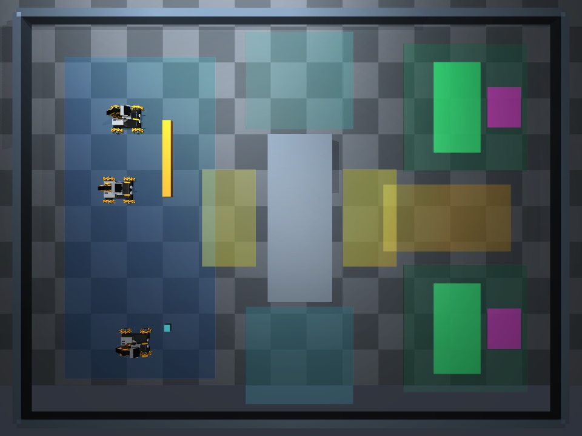
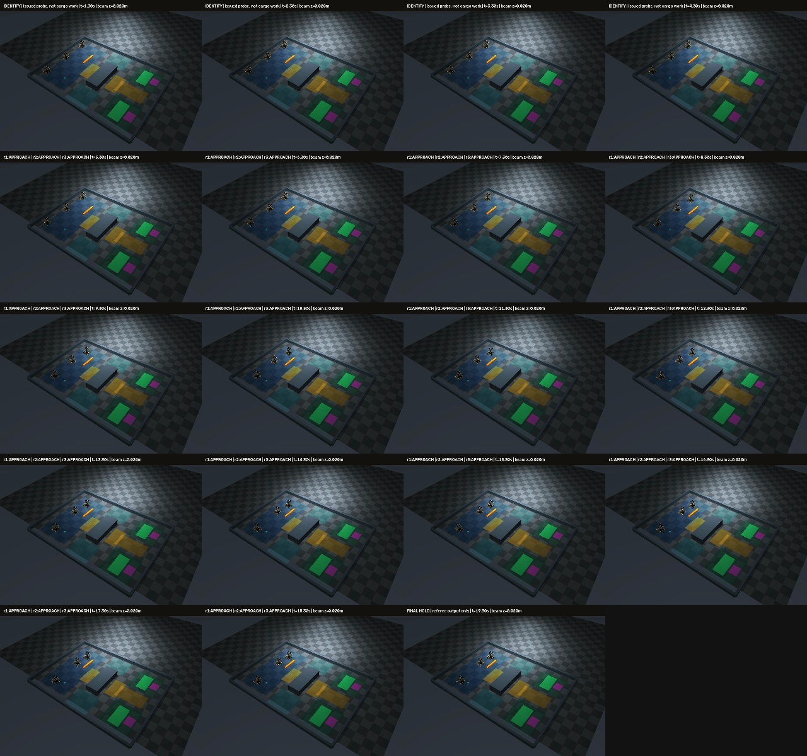
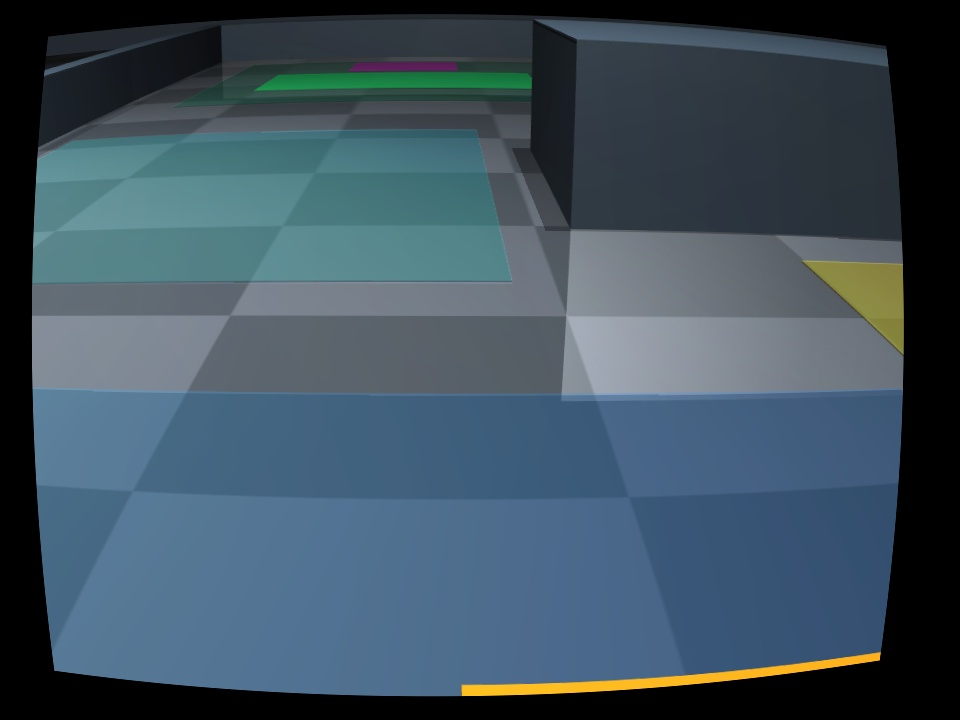
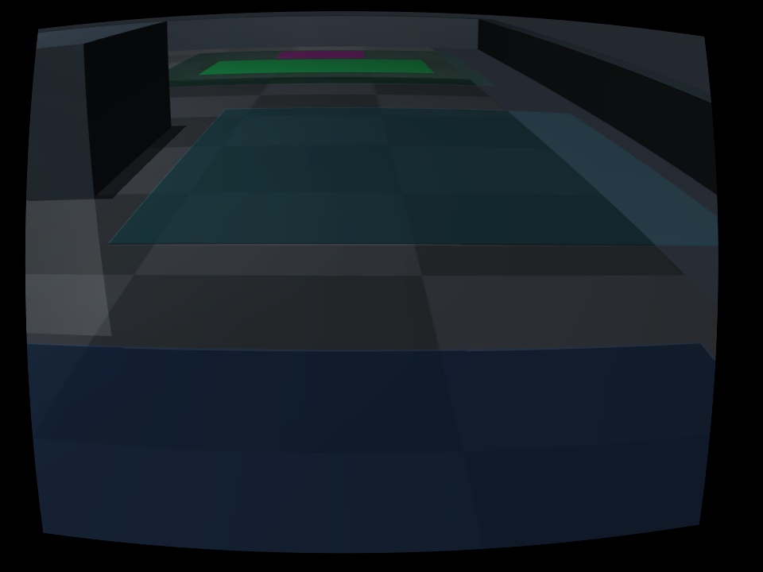
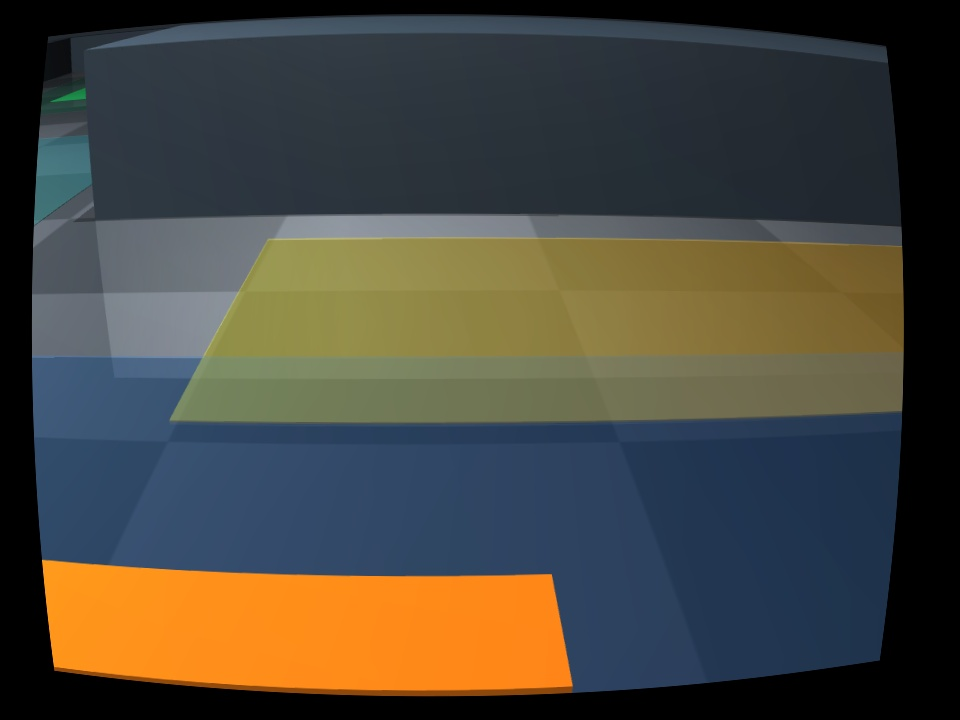

# 연구 출하 환경 E2E 진단 — 2026-09-17

후속: 기존 스킬을 실제 연결하고 새 합의부터 물리 운반·방출까지 확인한 [최신 기록](../dispatch-skill-integration-20260917/README.md). 아래 D1/D2/D3는 당시 raw-action 진단으로 보존한다.

**공동 계획과 세 로봇의 실제 접근까지 연결했다. 완전 운반은 실패했고, 최종 시도는 파지 전 APPROACH에서 종료했다.**
실제 모델 호출과 MuJoCo 명령을 실행한 기록이며, 성공 시연이나 역할 고정 기준선이 아니다.

## 최종 시도 D3

- 소스: `993b08f5fd87c6157a537dfa85b7a722339ff8cc` (실행 전 커밋, 실행 중 고정).
- 환경: `shared_crossing`, seed 11, macOS arm64 / Python 3.12.13 / MuJoCo 3.12.0.
- 실제 3개 Gemini 3.8 Flash 클라이언트가 3라운드 뒤 동일 계획에 ACK.
- 합의: **B 출하 구역**, 빔은 **r1 상단·r3 하단 / 북쪽 경로**, 상자는 **r2 / 남쪽 경로**, 작업 병행.
- 실행: 24회 판단, 71개 허가 명령. 바퀴 명령 69개, 기존 열린 집게를 다시 여는 명령 2개.
  어깨·팔꿈치·손목을 정렬하는 명령은 0개, 파지 준비 완료 보고도 0개.
- 실제 작업 접근 경로 길이: **r1 38.2cm / r2 42.3cm / r3 34.7cm**.
  초기 식별용 각 2.66cm 이동은 위 수치에서 제외했다. 목적지 방향 순변위가 아닌 경로 길이다.
- 세 로봇의 동시 몸체 이동 구간: **7.7 SIM초** (10Hz 평가에서 구간별 1mm 초과 이동 기준).
- 빔·상자의 운반 변위 **각 0m**, 들기/목표 슬롯/내려놓기/해제 완료 **모두 실패**.
- 총 벽시계 512.6초, 모델 81호출, 보고된 입력 708,270 / 출력 19,178 / 총 748,187토큰.
  공급자의 총량은 입력+출력 합과 다르므로 원본 수치를 그대로 기록한다. 청구 금액은 제공되지 않았다.
- 종료: `decision_round_budget`. `protocol_complete=false`, `physical_success=false`.
- weld 활성 0, 고정 장애물과 로봇 접촉 0, 카메라·외형 불변 검사 통과.

전체 영상: 로컬 `outputs/dispatch-e2e-d3/execution.mp4` (18.9초, 189프레임, 10fps).
SIM 시간 그대로이며 추론 대기 중에는 물리가 멈춘다. 첫 부분은 식별 주행으로 따로 표시했다.
Git에는 아래 검토용 정지 화면만 보관하며 raw 영상의 원격 백업을 주장하지 않는다.

## 모든 진단과 수정

| 시도 | 소스 | 실제 호출 | 실행 판단 | 허가 명령 | 종료 / 의미 |
|---|---|---:|---:|---:|---|
| D1 | `c3f8d5f` | 12 | 1 | 0 | 실행 시작 시 반대쪽 빔 끝 배정을 r1이 거절, 전체 정지 |
| D2 | `71f69b6` | 60 | 16 | 36 | 역할 정의 수정 후 세 로봇 접근, 토큰 예산 종료 |
| D3 | `993b08f` | 81 | 24 | 71 | ID 응답 호환 수정 후 24회 실행, APPROACH 종료 |

D1에서 계획 프롬프트는 end_a/end_b를 정의하지 않았지만 실행 프롬프트는 위/아래 끝으로 해석했다.
계획 단계부터 같은 의미를 명시하고, 자기 식별 주행의 영상 차이를 좌측/상단 기준 백분율로 설명하도록 수정했다.
픽셀 차이에서 계산한 값이며 seed나 정답 로봇 위치를 사용하지 않았다. D2에서는 r2/r3가 잘못된 첫 배정을
영상 근거로 거절한 뒤 올바른 배치에 합의했다. 이 한 배치의 결과를 일반적인 신원 식별 성공률로 해석하지 않는다.

D2에는 모델이 자기 `robot_id`를 추가해 12개 응답이 거절되는 형식 병목이 있었다.
D3는 이 알려진 선택 필드가 실제 요청한 endpoint와 같을 때만 허용한다. 다른 ID와 임의 추가 필드는 계속 거부한다.
D3의 잔여 형식 오류 1개는 `message` 누락이며, 해당 명령은 실행하지 않았다.
D3는 24회를 마치도록 입력 토큰 문턱을 50만에서 80만으로 늘렸다. 이 세 실행은 수정 과정의 진단이며 통제된 성공률 비교가 아니다.

## 남은 병목과 연결 지점

1. **새 환경의 로컬 접근 → 팔 정렬 → 파지 준비 연결.** 이번 실행은 LLM의 raw 명령으로 실제 빈 실행 경로를 연결한 실험이다.
   기존 고정 레인에서 학습·검증한 접근/파지 스킬을 새 환경에도 일반화했다고 가정하지 않았다.
   마지막까지 바퀴 미세 이동을 반복했고 팔 정렬을 생성하지 못했다. 다음 연결 지점은 역할별 RGB 로컬 스킬과
   공통 `at_grasp_pose`/`stopped` 보고다. 평가 좌표로 준비 완료를 대체하면 안 된다.
2. **근접 관측의 신뢰성.** 원래 카메라/FOV를 유지한 마지막 OWN 영상에서는 빔이 아래 가장자리로 잘리고,
   r2 영상의 상자는 시야 밖이다. TOP은 제공되지만 집게 정렬을 충분히 확인했다는 보고가 없었다.
   실제 사진 기반 움직임 학습/기억과 검증된 로컬 스킬이 필요하며, 카메라 재배치나 실시간 정답 보정은 사용하지 않았다.
3. **후반 동기화·지형 검증은 도달 전.** 공동 GRASP/LIFT/TRANSIT/LOWER/RELEASE는 프로그램과 오프라인 계약 검사를 갖췄지만
   이번 물리 실행에서 도달하지 않았다. 통로 예약 경쟁, 하중 유지, 좁은 지형, 운반 중 재계획을 실제 검증했다고 보고하지 않는다.
   기존 `TaskStageSync`/`TaskStageExecution` 통합, 자원 점유 해제의 시각적 확인도 후속 검토 범위다.

## 입력·명령·검증 기록

- 제어 경계: 자기 RGB + 공용 고정 TOP + 사전 지도/고정 보정 + 자기 발행 명령 + 동료 주장 + 프로토콜 허가.
  실시간 좌표·측정 관절·접촉·성공 판정은 별도 referee 출력에만 기록했다.
- [입력 감사](input-audit.json): 세 진단의 **153개 원본 요청/실제 wire**, **654개 이미지 사용**을 원본 RGB와 대조했다.
  자기 카메라 소유권, 미래 명령 혼입, 조건을 드러내는 요청 ID, 실제 전송 이미지와 context 일치를 확인했다.
  이 검사는 모델의 지각이나 주장이 옳다는 뜻은 아니다. [재실행 도구](audit_inputs.py).
- [원본 해시와 위치](raw-manifest.json), [전체 결과](results.json), [프로토콜](protocol.md),
  [로컬 검사](local-tests.txt), [프로세스 정리](process-lifecycle.json), [시각 검토 범위](visual-review.json).
- 로컬 자동 검사: **789 passed, 154 subtests passed**. 실제 운반 성공 판정과 별도다.
- raw 영상·로그·wire는 이 worktree의 `outputs/dispatch-e2e-d1`, `d2`, `d3`에 보존한다.
  Git 원격에는 요약·선택 이미지·해시만 저장한다. Drive 사용 없음.

실행 방법은 [환경 문서](../../docs/research_dispatch_arena.md)를 따른다. PR #65는 #64 위에 쌓인 변경이며 main 병합은 별도 승인 대상이다.
