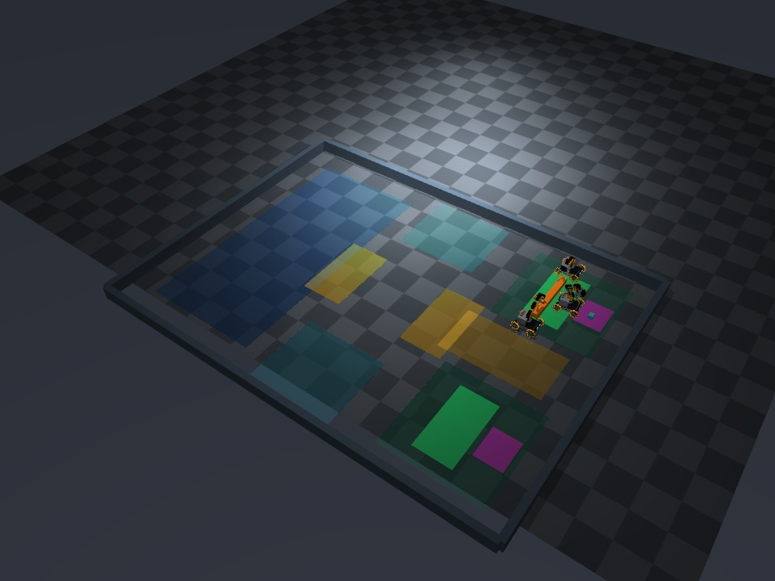

# 기존 스킬 연결 수정 후 공동 출하 E2E

**최종 F1: 세 LLM의 새 합의 → 실제 접근·파지 → 빔·상자 운반 → 내려놓기·해제·안정까지 완료.** 코드 `509c2b2885c8e0023ed9151a38a092be63391b78`, `open / seed11`, `local_contact`, 기록 계획 재생 없음. 이번 후보의 전체 실행은 1회이며, 통계적 성공률이나 미지 배치 일반화 결과가 아니다.

| 항목 | 실제 결과 |
|---|---|
| 공동 계획 | Gemini 3.8 Flash의 독립된 세 로봇 대화, 4라운드·12호출, R2 제안 v2에 전원 동의 |
| 선택 | dock_a, R1/R3 빔·북쪽, R2 상자·남쪽·빔 작업 후 |
| 빔 | 1.702m 이동, 최대 7.76cm 부상, 슬롯 내부·접촉 해제·바닥 안정 |
| 상자 | 2.369m 이동, 최대 6.88cm 부상, 슬롯 내부·접촉 해제·바닥 안정 |
| 로봇 주행 경로 길이 | R1 2.680m / R2 4.310m / R3 2.634m, 식별용 주행 포함 |
| 세 로봇이 동시에 몸체 이동한 시간 | 0.50 SIM초; 병행 준비 후 공유 운반 자원과 합의된 선행 작업을 기다림 |
| 제약 | weld 0, obstacle contact 0, 카메라 배치/FOV 불변 |
| 시간 | 실제 330.32초, 녹화 164.3초(10fps·1,643프레임); LLM 추론 중 SIM 정지 |
| 토큰 | 입력 113,816 / completion 3,151 / 공급자 total 122,547. 공급자 반환값을 그대로 합산했으며 항목 차이의 원인을 추정하지 않음 |
| 비용 | USD 확인 불가(null); 호출·토큰은 실제 응답 합산 |
| 검사 | 로컬 필수 CI 815 passed + 154 subtests; 물리 E2E와 별도 판정 |

입력 감사: 실제 계획 요청·전송 메시지 12개, 역할별 이미지 연결 323개, 접근 예측 242개, 파지 예측 32개 재구성. 상자 결정 517개를 저장된 실제 영상·자기 발행 명령·기록된 자원 대기 신호로 동일하게 재실행했다. 평가 좌표·접촉·관절 측정은 제어 입력에 포함하지 않는다.

영상: 로컬 원본 `outputs/dispatch-final-f1/execution.mp4`. 모든 프레임 디코딩 확인 및 7개 지정 프레임과 최종 장면을 직접 검토했다. 전체 영상을 매 프레임 수동 검토했다는 의미는 아니다. Git에는 선택된 검토 이미지와 감사 결과를 보관한다.



이전 D1/D2/D3는 새 환경에서 raw LLM 동작만 실행했으며, 이미 성공한 접근/파지 모델과 상자 실행기를 호출하지 않았다. 이번 수정은 그 연결 오류를 해결한다. LLM 세 에이전트가 합의한 목적지·담당 로봇·경로를 실제 모델 슬롯과 물리 포트에 연결한다. 실행 모델이 정답 좌표를 받거나 실패한 스킬을 raw 명령으로 몰래 대체하지 않는다.

## 확인한 경계

- B0: 기존 환경/기존 모델의 운반 성공을 먼저 재현했다. 빔 약 48.3cm, 상자 도착·놓기 성공, weld OFF.
- S4: 기존 모델이 실제 호출됐지만 새 배경은 기존 heading 모델의 지원 범위 밖이었다.
- T2/T4: 승인된 교사 학습 경로에서만 좌표·관절·접촉을 사용했다. 접근 323개 표본, 파지 복구 180/180개 성공 표본으로 기존 학습기를 재학습했다. 학생 입력과 교사 표적을 분리했다. 교사 성공은 학생 성공이 아니다.
- S5 이후: 파지 중 가려지는 빔 끝을 매번 재정렬하면 전체 배경이 움직였다. 마지막 접근 RGB에서 얻은 평행 이동을 파지 동안 고정했다.
- 조명/바닥: TOP과 OWN의 밝은 빔 및 청록색 바닥이 옛 색상 마스크를 깨뜨렸다. 파지 지원/동시 보고/물체 동행 판정 임계값을 낮추지 않고, 별도 출하 영상 보정과 이력 추적을 적용했다. 상자와 바닥의 색이 합쳐지면 바로 전 TOP 영상의 실제 특징점을 양방향으로 추적하고 다수 특징점의 이동 일치를 요구하며, 현재 자기 영상의 파지 확인은 별도로 통과해야 한다. 이전 실행기는 원래 보정값이 기본이다.
- 경로: 각 축의 정지 조건과 도착 판정의 거리 기준이 달라 생긴 경유점 정지를 수정했다. 상자는 출하 앞마당을 거쳐 슬롯의 동쪽으로 진입해 놓인 빔을 가로지르지 않는다.
- 예약: 접근은 병행하되 운반 자원을 얻기 전에는 집지 않는다. 혼잡 때문에 물체를 들고 오래 기다리는 전이를 제거했다.
- 내려놓기 확인: Q7에서 물리 방출은 성공했지만 영상의 바닥 상자 모델이 초기 접촉점 추정에 묶여 카메라 회전 전후 10.6mm 차이를 만들었다. 출하 경로의 방출 단계에만 전체 윤곽의 XY/방향을 제한 범위 안에서 추가 최적화한다. 투영 일치도 .678→.975, 두 영상 추정 차이 .228mm. 기존 10mm 정지 판정과 카메라 배치는 유지했다.

## 물리 계산 조건

장시간 파지 문제는 정지 재생으로도 재현됐다. 원래 조건은 양 집게의 접촉 힘이 유지되는 동안 빔이 서서히 흘러내려 약 10초 만에 바닥에 떨어졌다. 이는 MuJoCo의 연성 접촉에서 발생할 수 있는 미끄러짐과 일치한다. [공식 설명](https://mujoco.readthedocs.io/en/latest/modeling.html).

전역 NoSlip 후보는 바퀴의 기존 주행 응답도 바꿔 제외했다. 큰 감쇠를 기존 적분 간격에 바로 적용한 후보는 수치 불안정으로 제외했고, 접촉 강성만 높인 후보도 운반을 통과하지 못했다. 이 실패를 R1~R6에 보존한다.

최종 후보 `local_contact`는 집게/화물의 기존 법선 접촉 파라미터와 마찰계수를 유지한다. 마찰 방향의 계산 시간 척도를 바꾸고 이를 0.5ms 물리 적분으로 해상한다 (`solreffriction="0 -3000"`, 기존 2ms 대비). 12개 선언된 집게/화물 조합에만 적용하며 전역 NoSlip은 0이다. 정적 XML 해시와 실제 모델 배열 비교로 질량, 형상, 카메라, 마찰계수, 모터 힘이 동일함을 확인했다. 접촉이 생기는 실제 형상에서 기존 마찰 한계 안의 힘을 계산하며, weld/접착력/물체 위치 쓰기를 추가하지 않는다. [접촉 파라미터 정의](https://mujoco.readthedocs.io/en/latest/XMLreference.html).

R7은 정지와 1.329m 이동 각각 31초 동안 310/310개 표본에서 네 손가락 접촉을 유지했고, 집게를 열면 물체가 바닥으로 떨어졌다. 이는 별도 물리 진단이며 학생 E2E를 대체하지 않는다. 이 설정은 수치 모델의 선택이며 실물 하드웨어 보정 결과가 아니다.

## 검증 범위와 제외

기존 `open` 조건에서 전체 실행을 검증한다. `shared_crossing` 등의 0.685m 통로는 기존 평행 운반 대형의 보수적 0.93m 외곽보다 좁다. 회전/재파지 스킬이 없으므로 이를 사전에 거부하며, open 결과를 장애물 통과 성공으로 표현하지 않는다. 지형, 다양한 각도/거리, 모든 역할 배정의 물리 일반화는 별도 검증이 필요하다.

S1~S13은 원인을 좁히며 수정한 진단으로 통제된 성공률 코호트가 아니다. S11은 경유점 정지를 확인하고 종료했으며, 그룹 인터럽트가 영상 인코더도 종료해 최종 메모리 로그를 저장하지 못했다. 보존된 RGB·부분 영상·referee 스트림만 인용하며 완전 입력 감사를 주장하지 않는다. 이후 정리 경로는 인코더 오류가 최종 기록 저장을 막지 않도록 수정했다.

Q 조건은 빔을 미리 배치하고 상자 구간을 분리한 fixture 진단이다. 빔을 옮긴 전체 E2E나 새로운 LLM 합의로 세지 않는다.

원본 영상·로그·교사 RGB는 로컬 `outputs/`에 보관한다. Git에는 요약, 선택된 검토 이미지, 모델 번들, 원본 경로와 해시를 저장한다. 해시만으로 raw 원격 백업을 주장하지 않으며 Drive는 사용하지 않는다.

## 재현 경로

최종 번들은 `models.zip` 안의 `models/grasp`, `models/varied`를 그대로 푼다. 원본 교사 절대 경로는 출처 기록이며 실행기는 실제 번들의 상대 파일과 SHA를 먼저 확인한 뒤 실행별 복사본을 만든다. 출력은 반드시 새 이름을 쓴다.

```sh
unzip experiments/dispatch-skill-integration-20260917/models.zip -d outputs/dispatch-models
python scripts/ugrp_session.py run dispatch-e2e -- \
  .venv-sim-worker-mac/bin/mjpython scripts/run_dispatch_e2e.py \
  --executor skills --variant open --seed 11 \
  --grasp-model-dir outputs/dispatch-models/models/grasp \
  --stage-model-dir outputs/dispatch-models/models/varied \
  --output outputs/dispatch-e2e-NEW --max-wall-s 900
```

이 경로는 실제 세 LLM을 호출한다. 프록시 준비는 기존 설치 안내를 따른다. `--plan-replay`는 기록 계획 fixture 진단, `probe_dispatch_solo_route.py`는 빔을 미리 배치한 상자 단독 진단이므로 새로운 합의부터의 전체 E2E가 아니다. `--executor raw`는 이전 저수준 LLM 진단을 명시적으로 선택하는 옵션이다.

## 감사와 기록 읽기

- `results.json`: B0, S1~S13, T1~T4, R1~R7, Q1 이후, F1 이후의 요약. 소스가 바뀐 진단을 하나의 성공률로 합치지 않는다.
- `full-reports.json.gz`: 각 실행의 원본 최종 보고서를 손실 없이 압축한 묶음. 평가 좌표가 들어 있는 출력 자료이며 학생 입력이 아니다.
- `raw-manifest.jsonl.gz`: 로컬 원본 파일의 절대 경로, 크기, SHA256. raw 영상/대량 RGB의 원격 백업은 아니다.
- `environment.json`: 실행 환경, 보관 범위, 비용 집계의 한계. USD 비용은 확인할 수 없어 null이며 호출·토큰 수를 보존한다.
- `models.zip`: 접근/파지 모델과 기존 시연 명령. `model-provenance.json`에서 교사 소스와 번들 해시를 확인한다.
- 입력 감사는 저장된 LLM 요청·실제 전송 메시지·모델 예측을 재구성한다. 최종 학생의 상자 결정도 같은 원본 RGB·자기 명령 이력과 기록된 자원 대기로 다시 실행한다. 이것은 물리 성공 판정을 대신하지 않는다.
