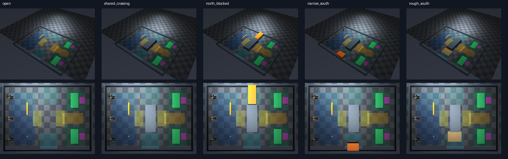

# 공동 출하 연구 환경 — 2026-09-17

[실제 장면·카메라·합의 결과 뷰어](index.html) · [실행 방법](../../docs/research_dispatch_arena.md) · [프로토콜](protocol.md)

공동 목표는 빔과 상자를 **같은 출하 구역**에 배치하는 것이다. 다섯 실제 MuJoCo 환경,
공유 통로/출하 앞마당, 초기 3자 합의, 계획에서 생성한 로봇별 프로그램을 구성했다.
이 기록은 환경/입력/계획 연결 검증이며 **새 지형의 실제 운반 E2E 성공은 아니다.**

## 최종 비교

실행 소스는 `e9ececb`로 고정했다. `results.json`과 `environment.json`에 전체 SHA와 환경을 기록했다.
모든 최종 조건은 seed 11이다. 입력 식별자에는 조건 이름이나 seed가 없는 임의 ID를 쓴다.

| 조건 | 물리 로딩·세 대 모터 진단 | 실제 LLM 합의 | 모델이 선택한 계획 |
|---|---|---|---|
| open | 통과 | 미실행 | 없음 |
| shared_crossing | 통과 | 6호출, 2라운드 | A 구역, 빔 북쪽/상자 남쪽, 빔 작업 후 상자 |
| north_blocked | 통과 | 6호출, 2라운드 | B 구역, 둘 다 남쪽, 상자 작업 후 빔 |
| narrow_south | 통과 | 미실행 | 없음 |
| rough_south | 통과 | 미실행 | 없음 |

세 로봇 모두 진단 명령으로 약 3.45cm 움직였다. 검사는 시작 지점에서의 짧은 이동이며
장애물 통과·화물 운반을 포함하지 않는다. 다섯 조건 모두 장애물 접촉 0, weld 활성 step 0,
정책 카메라/FOV·생산 로봇/빔 geometry hash 유지, 접촉 solver 변경 없음을 확인했다.

두 LLM 조건은 **같은 사전 지도**를 사용한다. 북쪽 장애물은 실제 RGB에만 나타난다.
각 조건의 실제 wire 6개, 합계 12개에서 이미지/텍스트와 저장 입력의 일치를 검사했다.
동일 ID/hash의 3자 승인을 재생했고, 승인 계획에서 로봇별 목적지·역할·순서가 생성됨을 확인했다.
서로 다른 조건의 독립적인 초기 계획 비교이며, **주행 중 재계획 성공을 뜻하지 않는다.**

기본 실행의 전체 wall time은 65.22초, 장애물 조건은 78.63초였다. 모델 호출과 환경 생성/진단을 포함한다.
모델이 보고한 총 토큰은 각각 30,582 / 31,506이다. provider의 total에는 별도 토큰이 포함될 수 있어
prompt+completion 합으로 대체하지 않았다. 청구 금액은 제공되지 않아 `null`이다.
한 번씩 실행한 파일럿이며 성공률·효율 우월성의 통계적 증거로 해석하지 않는다.

## 드러난 병목

1. **자기/상대 로봇 식별:** 모델들은 R1·R2를 빔 담당, R3를 상자 담당으로 합의했다.
   역할 조합 자체는 계약상 유효하지만, 최종 설명의 “R2가 빔 근처, R3가 상자 근처”는
   실제 초기 배치와 맞지 않는다. 평가 전용 초기 배치는 R1 북쪽, R3 중앙, R2 남쪽이다.
   따라서 역할 선택의 시각적 근거까지 정확하다고 주장하지 않는다. 좌표를 입력으로 넣지 않고
   자기 영상 변화와 자기 발행 명령을 연결하는 위치/정체성 확인이 필요하다.
2. **실행기 연결:** 새 경로/운반자 조합은 기존 고정 레인 학생의 검증 범위 밖이다.
   모든 프로그램은 `unbound_new_arena_skill`이며 화물 행동은 발행하지 않았다.
   실제 단계 보고·시각적 지지·최신성은 기존 TaskStageSync/TaskStageExecution와 연결해야 한다.
3. **불필요한 전체 작업 대기:** 모델이 두 조건 모두 full-job 선후 관계를 선택했다.
   접근은 병행하고 통로/출하 구간만 기다리는 계획과의 효율 비교가 필요하다.

`DispatchCoordinator`의 취소는 이미 점유한 자원을 보존한다. 새 계획 설치·화물 인계·점유 이전은
아직 구현하지 않았으며, 새 coordinator를 만들어 잠금을 우회하는 재계획 경로로 쓰면 안 된다.
현재 LLM 추론 동안 물리 시간은 정지한다. 실시간 비동기 구동과 실물 성공은 검증하지 않았다.

## 수정·제외 기록

전체 24실행을 `all-runs.json`에 보존했다. 최종 비교는 마지막 소스의 5실행만 사용한다.
외부 요청 timeout/HTTP 503/잘못된 응답 형식으로 초기 LLM 실행 1회는 합의하지 못했다.
나머지 진단 완료를 연구 성공률로 합산하지 않는다.

- 초기 응답의 `accept=null`·임의 proposal ID: 명시적인 응답 envelope로 수정, 값의 임의 보정 없음.
- 과거 계획 로그에 후속 진단 명령이 추가되던 참조 공유: 요청 시점 명령 이력을 복사하도록 수정.
  원래 전송된 요청에는 후속 명령이 없었으며 이전 로그는 감사 기준에서 제외했다.
- 조건 이름/seed가 요청 ID에 포함되던 누출: 익명 ID로 수정했다.
  수정 전 장애물 실험은 영상 판단의 증거에서 전부 제외하고 같은 최종 코드로 재실행했다.

## 검증·보관

- 로컬: 777 tests + 154 subtests 통과 (`local-tests.txt`).
- 입력·wire·계획·프로그램·XML 감사: 최종 5조건 통과 (`input-audit.json`).
- 모든 24세션과 자식 프로세스 정리 확인 (`process-lifecycle.json`). 다른 실험 프로세스는 건드리지 않았다.
- 다섯 환경의 observer/TOP 프레임을 직접 검토했다. HTML은 구문·구조 검사만 했으며,
  브라우저가 로컬 파일 URL을 차단해 화면 배치/클릭 검증은 못 했다 (`visual-review.json`).
- 실제 사진 30장·HTML·요약 결과는 Git 보관 대상이다. 원시 RGB·모델 wire·로그 793개는
  로컬이며 `raw-manifest.json`에 경로/해시를 남겼다. 해시 목록은 원격 원본 백업이 아니다.

후속 연구 비교군·평가 지표는 [protocol.md](protocol.md)에 있으며, 아직 측정하지 않은 결과를 뷰어에 생성하지 않는다.
