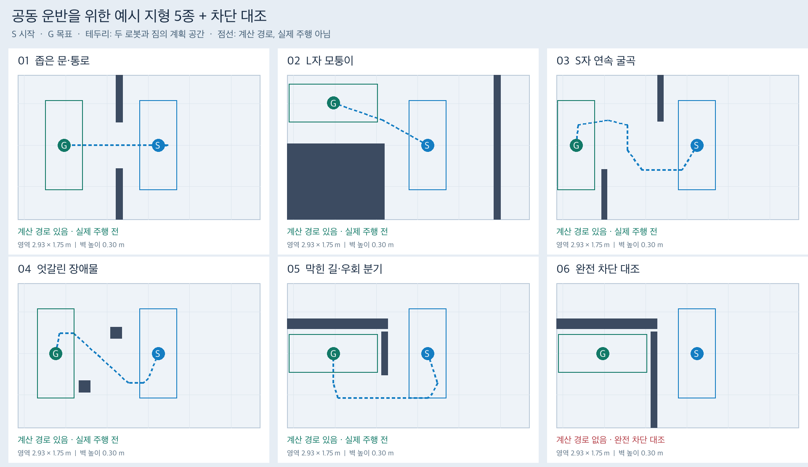

# 실행용 지도 목록

앞서 만든 예시 지형 5종과 완전 차단 대조를 `maps/`에서도 바로 불러올 수 있다.
같은 벽 배치를 기존 단독 주행용과 공동 운반용 형식으로 등록했다.

| 지형 | 단독 주행용 | 공동 운반용 |
| --- | --- | --- |
| 좁은 문·통로 | [narrow-door.json](navigation/narrow-door.json) | [narrow-door.json](pair_navigation/narrow-door.json) |
| L자 모퉁이 | [l-corner.json](navigation/l-corner.json) | [l-corner.json](pair_navigation/l-corner.json) |
| S자 연속 굴곡 | [s-bends.json](navigation/s-bends.json) | [s-bends.json](pair_navigation/s-bends.json) |
| 엇갈린 장애물 | [staggered-obstacles.json](navigation/staggered-obstacles.json) | [staggered-obstacles.json](pair_navigation/staggered-obstacles.json) |
| 막힌 길·우회 분기 | [blocked-branch.json](navigation/blocked-branch.json) | [blocked-branch.json](pair_navigation/blocked-branch.json) |
| 완전 차단 대조 | [fully-blocked.json](navigation/fully-blocked.json) | [fully-blocked.json](pair_navigation/fully-blocked.json) |

기존 단독 지도 [open](navigation/open.json), [slalom](navigation/slalom.json),
[narrow](navigation/narrow.json)도 그대로 사용할 수 있다. 기존 `narrow`는 통과 불가능한
좁은 통로 대조이고, 새 `narrow-door`는 폭 56 cm의 별도 예시다.



## 두 형식의 차이

| 항목 | `navigation/` | `pair_navigation/` |
| --- | --- | --- |
| 실행기 | `scripts/run_known_map_navigation.py` | `scripts/run_pair_navigation.py` |
| 지도 인자 | `--map-file` | `--map` |
| 사용 조건 | 짐 없는 로봇 1대 | 두 로봇과 공동 하중 |
| 계획 공간 | 기존 반경 0.18 m + 여유 0.04 m | 기존 직사각형 0.45 × 1.07 m, 여유 포함 |
| 목표 | 중심에서 반경 0.18 m | 목표 중심과 최종 회전 방향 |

장애물 위치·크기·높이, 경계, 카메라 보정, 시작 구역과 목표 중심은 두 형식에서
같다. 단독 주행용에는 기존 2.5 cm 격자와 원형 footprint를 유지한다.
공동 운반용에는 예시의 6 cm 격자·하중 footprint·목표 방향을 보존한다.
따라서 같은 지형에서도 계산 경로나 회전 방식은 달라질 수 있다.
지형별 실제 통과와 LLM의 경로 선택은 아직 검증하지 않았다.

## 불러오기

저장소 루트에서, 기존 시뮬레이션 환경으로 실행한다. 출력 이름은 매번 새로 정한다.
실행 전 소스와 설정을 커밋한다. worktree에서는 기본 프로젝트 가상환경의 절대 경로를
사용하고, Ubuntu에서는 설치된 환경의 `python`과 기존 headless 렌더 설정을 사용한다.

단독 주행에서 S자 지형을 선택하는 예:

```sh
.venv-sim-worker-mac/bin/python scripts/ugrp_session.py run s-bends-solo-NEW -- \
  .venv-sim-worker-mac/bin/mjpython -m scripts.run_known_map_navigation \
  --map-file maps/navigation/s-bends.json \
  --case-json '{"case_id":"s_bends_solo","robot_id":"r1","start_xy_m":[0.58,-2.0],"start_yaw_deg":0}' \
  --out-dir outputs/s-bends-solo-NEW
```

`case-json`은 평가·초기 배치 전용이며 실행 중 정답 위치 입력이 아니다.
실제 단독 주행과 공동 운반의 시작 장면·표시 방식은 각 기존 실행기를 따른다.

공동 운반의 실행 지도 선택은 다음과 같다. `--grasp-model-dir`은 기존 실행기에서
사용하던 **전체 grasp 모델 폴더**로 지정한다. 정적 갤러리의 `_setup_metadata`는
초기화 JSON만 들어 있으므로 실제 파지 모델 폴더로 사용할 수 없다.

```sh
.venv-sim-worker-mac/bin/python scripts/ugrp_session.py run s-bends-pair-NEW -- \
  .venv-sim-worker-mac/bin/mjpython scripts/run_pair_navigation.py \
  --map maps/pair_navigation/s-bends.json \
  --grasp-model-dir /absolute/path/to/models/grasp \
  --out-dir outputs/s-bends-pair-NEW
```

위 공동 운반 명령은 기존 기본 물리 설정 `impratio=1`을 사용한다. 이 지형들의
실제 운반 성공을 보장하는 명령은 아니며, 이전 비교 실험의 수치 설정을 자동 적용하지 않는다.

## 지도와 정적 장면만 확인하기

[카탈로그](pair_navigation/catalog.json)에 제목·지도 경로·단독 주행 대응 파일·
원본 예시 출처가 있다. 갤러리 생성기는 이제 이 카탈로그를 기본으로 읽는다.

```sh
.venv-sim-worker-mac/bin/python scripts/build_pair_terrain_gallery.py \
  --geometry-only --out-dir outputs/terrain-plans-NEW

.venv-sim-worker-mac/bin/python scripts/verify_terrain_maps.py \
  --out-dir outputs/terrain-map-check-NEW

.venv-sim-worker-mac/bin/python scripts/ugrp_session.py run terrain-map-preview-NEW -- \
  .venv-sim-worker-mac/bin/mjpython scripts/verify_terrain_maps.py \
  --render --out-dir outputs/terrain-map-preview-NEW
```

마지막 명령은 단독 주행용 6개 지도의 초기 정지 장면만 렌더한다. 이동이나 파지는
실행하지 않는다. 공동 운반 정적 장면은 같은 세션 래퍼로
`scripts/build_pair_terrain_gallery.py --out-dir outputs/pair-preview-NEW`를 실행한다.

원본 예시와 당시 검증 기록은 [예시 지형 기록](../experiments/2026-09-14-pair-terrain-examples/README.md)에
보존한다. 공동 운반 등록 지도는 원본과 바이트 단위로 같고, 단독 주행 지도는
그 벽 배치에서 파생했다. 두 버전을 수정할 때 `verify_terrain_maps.py`로 출처·배치
일치를 검사하고, 새 실험 결과는 새 SHA와 함께 기록한다.
